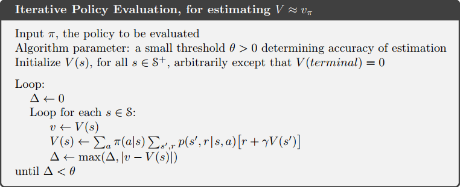
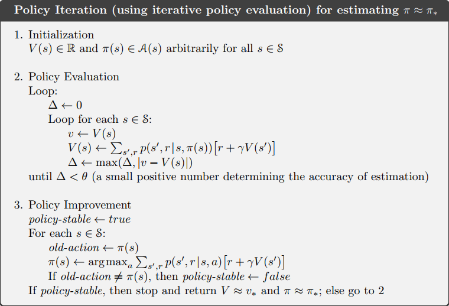
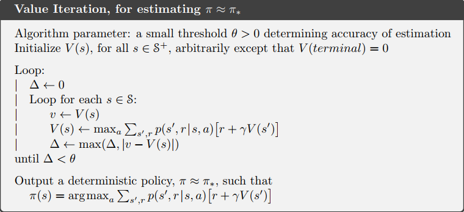
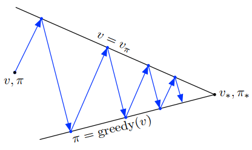

# Dynamic Programming 

- compute optimal policies given a perfect model of the environment as a Markov decision process (MDP) 
- 常用于有限 MDP、$p\left(s^{\prime}, r | s, a\right)$ 已知的情况 full knowledge of the transition and reward models of the MDP 

## Policy Evaluation (Prediction)  策略评估

基于当前的策略把值函数求出来

- compute the state-value function $v_{\pi}$ for policy $\pi$ 

- 只要 $\gamma < 1$ 或者交互序列有限，$v_{\pi}$ 就有唯一解

- $$
  \begin{aligned} v_{k+1}(s) & \doteq \mathbb{E}_{\pi}\left[R_{t+1}+\gamma v_{k}\left(S_{t+1}\right) | S_{t}=s\right] \\ &=\sum_{a} \pi(a | s) \sum_{s^{\prime}, r} p\left(s^{\prime}, r | s, a\right)\left[r+\gamma v_{k}\left(s^{\prime}\right)\right] \end{aligned}
  $$

- $v_0$ 可以随机选取或者全零，Bellman equation 作为更新公式不断迭代，最终收敛到最佳值函数 (**iterative policy evaluation**)

- updates the value of one state based on the values of all possible successor states and their probabilities of occurring 

### pseudocode 

  

  - $v(s)\gets \sum _{a} \pi (a|s) q(s,a)$ 亦可
  - 一个数组 (in place) 操作比两个数组依次更新收敛更快

### 收敛性的证明

$$
\begin{aligned}\left\|T^{\pi}(u) - T^{\pi}(v)\right\| _{\infin}&=\max _{s, a}\left\|\gamma \sum_{a \in A} \pi(a | s) \sum_{s^{\prime} \in S} P_{s s^{\prime}}^{a} u_{\pi}\left(s^{\prime}\right)-\gamma \sum_{a \in A} \pi(a | s) \sum_{s^{\prime} \in S} P_{s s^{\prime}}^{a} v_{\pi}\left(s^{\prime}\right)\right\| \\ 
&\leq \max _{s, a}\left\|\gamma\left(\sum_{s^{\prime} \in S} P_{s s^{\prime}}^{a} u_{\pi}\left(s^{\prime}\right)-\sum_{s^{\prime} \in S} P_{s s^{\prime}}^{a} v_{\pi}\left(s^{\prime}\right)\right)\right\| \\
&\leq \max _{s}\left\|\gamma \max _{s^{\prime} \in S}\left\| u_{\pi}\left(s^{\prime}\right)-v_{\pi}\left(s^{\prime}\right)\right\|\right\| \\
&\leq \gamma \max _{s \in S}\left\|u_{\pi}(s)-v_{\pi}(s)\right\| \end{aligned}
$$

- 证明T是一个压缩映射
- https://zhuanlan.zhihu.com/p/26214408

## Policy Improvement

### policy improvement theorem

- $$
  \begin{aligned}q_{\pi}(s, a) & \doteq \mathbb{E}_{\pi}\left[R_{t+1}+\gamma v_{k}\left(S_{t+1}\right) | S_{t}=s,A_t=a\right]\\
&=\sum_{s^{\prime}, r} p\left(s^{\prime}, r | s, a\right)\left[r+\gamma  v_{\pi}(s^{\prime}) \right]\end{aligned}
  $$

- $\forall s \in \mathcal S,q_{\pi}\left(s, \pi^{\prime}(s)\right) \geq v_{\pi}(s)$，$\pi^{'}$ 不会比 $\pi$ 差，$v_{\pi^{\prime}}(s) \geq v_{\pi}(s)$ 

  在某个状态下，如果不按策略，选择其他的动作，收益更佳。那么更新这个行为，其他不变，作为新策略。新策略的值函数要优于原策略

  it is better to select $a$ once in $s$ and thereafter follow $\pi$ than it would be to follow $\pi$ all the time 

- 不等式证明  
  $$
  \begin{aligned} v_{\pi}(s) & \leq q_{\pi}\left(s, \pi^{\prime}(s)\right) \\ &=\mathbb{E}\left[R_{t+1}+\gamma v_{\pi}\left(S_{t+1}\right) | S_{t}=s, A_{t}=\pi^{\prime}(s)\right] \\ &=\mathbb{E}_{\pi^{\prime}}\left[R_{t+1}+\gamma v_{\pi}\left(S_{t+1}\right) | S_{t}=s\right] \\ & \leq \mathbb{E}_{\pi^{\prime}}\left[R_{t+1}+\gamma q_{\pi}\left(S_{t+1}, \pi^{\prime}\left(S_{t+1}\right)\right) | S_{t}=s\right] \\ &=\mathbb{E}_{\pi^{\prime}}\left[R_{t+1}+\gamma \mathbb{E}_{\pi^{\prime}}\left[R_{t+2}+\gamma v_{\pi}\left(S_{t+2}\right) | S_{t+1}, A_{t+1}=\pi^{\prime}\left(S_{t+1}\right)\right] | S_{t}=s\right] \\ &=\mathbb{E}_{\pi^{\prime}}\left[R_{t+1}+\gamma R_{t+2}+\gamma^{2} v_{\pi}\left(S_{t+2}\right) | S_{t}=s\right] \\ & \leq \mathbb{E}_{\pi^{\prime}}\left[R_{t+1}+\gamma R_{t+2}+\gamma^{2} R_{t+3}+\gamma^{3} v_{\pi}\left(S_{t+3}\right) | S_{t}=s\right] \\ & \leq \mathbb{E}_{\pi}\left[R_{t+1}+\gamma R_{t+2}+\gamma^{2} R_{t+3}+\gamma^{3} R_{t+4}+\cdots | S_{t}=s\right] \\ &=v_{\pi^{\prime}}(s) \end{aligned}
  $$

- 最终 $v_{\pi}(s)=\max _{a \in \mathcal{A}} q_{\pi}(s, a)$，最优值函数

### 贪心策略

#### deterministic policies 

$$
\begin{aligned} \pi^{\prime}(s) & \doteq \underset{a}{\arg \max } q_{\pi}(s, a) \\ &=\underset{a}{\arg \max } \mathbb{E}\left[R_{t+1}+\gamma v_{\pi}\left(S_{t+1}\right) | S_{t}=s, A_{t}=a\right] \\ &=\underset{a}{\arg \max } \sum_{s^{\prime}, r} p\left(s^{\prime}, r | s, a\right)\left[r+\gamma v_{\pi}\left(s^{\prime}\right)\right] \end{aligned}
$$

#### stochastic policy 

- each maximizing action can be given a portion of the probability of being selected in the new greedy policy 
- Any apportioning scheme is allowed as long as all submaximal actions are given zero probability. 

## Policy Iteration

Once a policy $\pi$, has been improved using $v_\pi$ to yield a better policy $\pi^{'}$, we can then compute $v_{\pi^{'}}$ and improve it again to yield an even better $\pi^{''}$. 

- Each policy is guaranteed to be a strict improvement over the previous one (除非已经最优)

- a finite MDP has only a finite number of policies, this process must converge to an optimal policy and optimal value function in a finite number of iterations 

  可能的策略有限，经过有限次迭代，必定可以得到最优
  
- Policy iteration consists of two simultaneous, interacting processes, one making the value function consistent with the current policy (policy evaluation), and the other making the policy greedy with respect to the current value function (policy improvement). 

### pseudocode 

- 针对 deterministic policies 的情况
- Policy Improvement 的大循环中嵌有 Policy Evaluation 的小循环
- $\pi(s)\gets \arg\max _{a} q(s,a)$ 
- Policy iteration often converges in surprisingly few iterations.
- requiring multiple sweeps through the state set (drawback)

## Value Iteration

$$
\begin{aligned} v_{k+1}(s) & \doteq \max _{a} \mathbb{E}\left[R_{t+1}+\gamma v_{k}\left(S_{t+1}\right) | S_{t}=s, A_{t}=a\right] \\ &=\max _{a} \sum_{s^{\prime}, r} p\left(s^{\prime}, r | s, a\right)\left[r+\gamma v_{k}\left(s^{\prime}\right)\right] \end{aligned}
$$

- policy evaluation is stopped after just one sweep (one update of each state) 
- combines the policy improvement and truncated policy evaluation steps 
- turning the Bellman optimality equation into an update rule 
- only a single iteration of policy evaluation is performed in between each policy improvement 

### pseudocode 

## Asynchronous Dynamic Programming 

- in-place iterative DP algorithms that are not organized in terms of systematic sweeps of the state set 
- It is not necessary to perform DP methods in complete sweeps through the state set. 
- allow great flexibility in selecting states to update 
- make it easier to intermix computation with real-time interaction 
- 只依次更新状态序列里的状态（可以是随机的状态），不扫描全部状态

## Generalized Policy Iteration 

We use the term *generalized policy iteration* (GPI) to refer to the general idea of letting policy-evaluation and policy improvement processes interact, independent of the granularity and other details of the two processes. 

- 只要能更新所有状态，最终收敛到的结果都是一样的

- Making the policy greedy with respect to the value function typically makes the value function incorrect for the changed policy, and making the value function consistent with the policy typically causes that policy no longer to be greedy. 

  策略改变，值函数跟着变化，再引起策略更新，循环往复；到达唯一的交点，最佳策略（值函数）

  

- Although each process changes the basis for the other, overall they work together to find a joint solution: a policy and value function that are unchanged by either process and, consequently, are optimal.

## Efficiency of Dynamic Programming 

- DP methods take to find an optimal policy is polynomial in the number of states and actions 
- In practice, DP methods can be used with today’s computers to solve MDPs with millions of states. 
- On problems with large state spaces, asynchronous DP methods are often preferred. 
- All of them update estimates of the values of states based on estimates of the values of successor states. That is, they update estimates on the basis of other estimates. We call this general idea bootstrapping. 