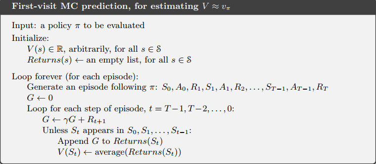
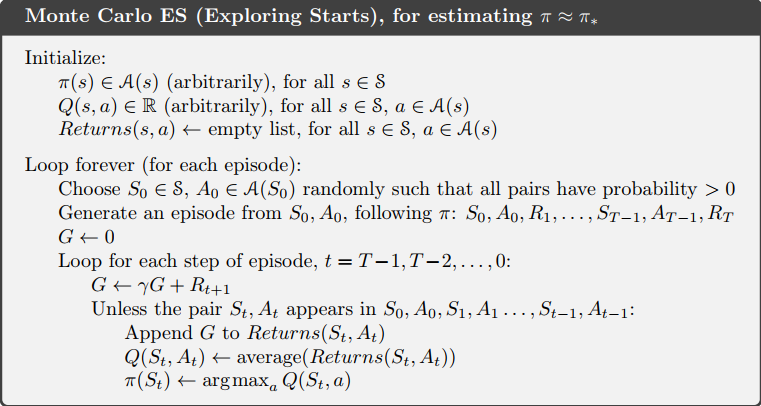
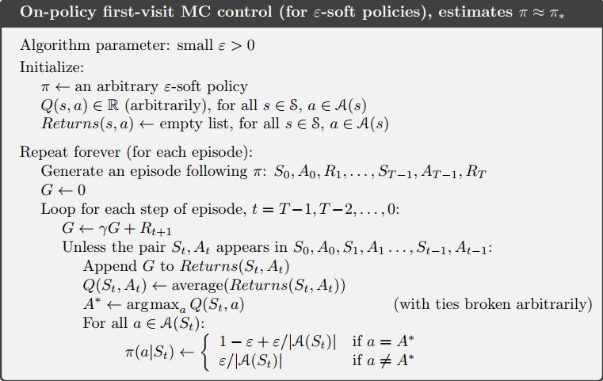
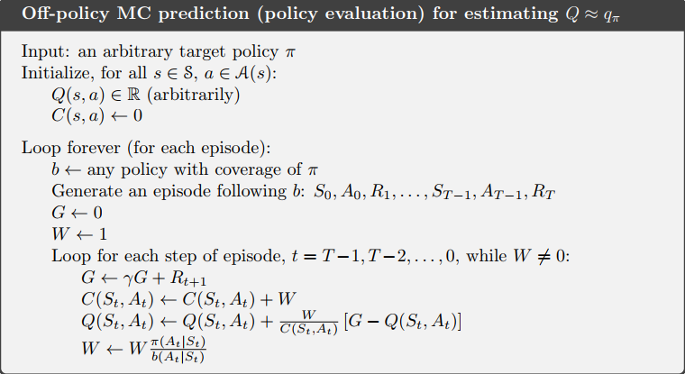
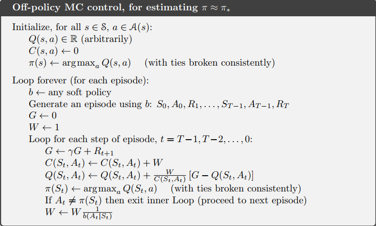

# Monte Carlo Methods

- not assume complete knowledge of the environment, requires no prior knowledge of the environment’s dynamics 
- Monte Carlo methods require only *experience*—sample sequences of states, actions, and rewards from actual or simulated interaction with an environment. 
- applicable only to episodic tasks 
- use empirical mean return rather than expected return 
- no bootstrapping, estimates for each state are independent 

## Monte Carlo Prediction 

- simply to average the returns observed after visits to that state 
- As more returns are observed, the average should converge to the expected value. 
- 正如 DP 的预期收益，它是所有情况的加权平均；现在只有一些样例，自然从这些里面取平均

### First-visit MC 

- given a set of episodes obtained by following $\pi$ and passing through $s$ 

- $s$ may be visited multiple times in the same episode 

- call the first time it is visited in an episode the first visit to $s$ 

- The first-visit MC method estimates $v_{\pi}(s)$ as the average of the returns following first visits to $s$ 

  every-visit MC method averages the returns following all visits to $s$ 

- 

- Both first-visit MC and every-visit MC converge to $v_{\pi}(s)$ as the number of visits (or first visits) to $s$ goes to infinity. 

### 相较于 DP 的优势

- 无需了解环境的 dynamics

- All of the probabilities must be computed before DP can be applied, and such computations are often complex and error-prone. In contrast, generating the sample games required by Monte Carlo methods is easy. 

- estimate for one state does not build upon the estimate of any other state 

  可能只对某些状态感兴趣，将这些状态作为起点，再计算平均回报

## Monte Carlo Estimation of Action Values 

- 与 prediction 类似，talk about visits to a state–action pair rather than to a state 

- many state–action pairs may never be visited 

- To compare alternatives we need to estimate the value of all the actions from each state, not just the one we currently favor. （确定性策略的情况）

- *exploring starts* : the episodes start in a state–action pair, and that every pair has a nonzero probability of being selected as the start 

- alternative approach : policies are stochastic with a nonzero probability of selecting all actions in each state 

  按 exploring starts 的方式探索状态行为对的代替方法，随机性策略

## Monte Carlo Control 

- Policy improvement is done by making the policy greedy with respect to the current value function.
  $$
  \pi(s) \doteq \arg \max _{a} q(s, a)
  $$

  $$
  \begin{aligned} q_{\pi_{k}}\left(s, \pi_{k+1}(s)\right) &=q_{\pi_{k}}\left(s, \underset{a}{\arg \max } q_{\pi_{k}}(s, a)\right) \\ &=\max _{a} q_{\pi_{k}}(s, a) \\ & \geq q_{\pi_{k}}\left(s, \pi_{k}(s)\right) \\ & \geq v_{\pi_{k}}(s) \end{aligned}
  $$

- Monte Carlo methods can be used to find optimal policies given only sample episodes and no other knowledge of the environment’s dynamics. 

### policy evaluation operates on an infinite number of episodes 

#### first approach

- 足够多的 steps 可以保证 policy evaluation 的误差足够小
- 这种方式在面对很简单的问题时，可能需要过多的 episodes 

#### second approach

- 在 policy evaluation 未完成的时候就去 policy improvement
- only one iteration of iterative policy evaluation is performed between each step of policy improvement 
- alternate between improvement and evaluation steps for single states 
- 类似于 value iteration (GPI 的思想)，DP用了全部的信息，MC用部分的信息，更新方式差不多

### Monte Carlo ES

After each episode, the observed returns are used for policy evaluation, and then the policy is improved at all the states visited in the episode. 

- first visit
- 算 Q 平均值，update incrementally 的方式更高效
- all the returns for each state–action pair are accumulated and averaged, irrespective of what policy was in force when they were observed 

## Monte Carlo Control without Exploring Starts

- In on-policy control methods the policy is generally *soft*, meaning that $\forall s \in \mathcal S \;\;a \in \mathcal A(s), \pi (a|s) > 0$, but gradually shifted closer and closer to a deterministic optimal policy.
- $\epsilon$-greedy policies are examples of $\epsilon$-soft policies 

### On-policy first-visit MC control 

- 随机序列

- $\epsilon$-greedy policy

- $$
  \begin{aligned} q_{\pi}\left(s, \pi^{\prime}(s)\right) &=\sum_{a} \pi^{\prime}(a | s) q_{\pi}(s, a) \\ &=\frac{\varepsilon}{|\mathcal{A}(s)|} \sum_{a} q_{\pi}(s, a)+(1-\varepsilon) \max _{a} q_{\pi}(s, a) \\ & \geq \frac{\varepsilon}{|\mathcal{A}(s)|} \sum_{a} q_{\pi}(s, a)+(1-\varepsilon) \sum_{a} \frac{\pi(a | s)-\frac{\varepsilon}{|{\mathcal{A}(s)}|}}{1-\varepsilon} q_{\pi}(s, a) \\ &=\frac{\varepsilon}{|\mathcal{A}(s)|} \sum_{a} q_{\pi}(s, a)-\frac{\varepsilon}{|\mathcal{A}(s)|} \sum_{a} q_{\pi}(s, a)+\sum_{a} \pi(a | s) q_{\pi}(s, a) \\ &=q_{\pi}\left(s, \pi(s)\right) \end{aligned}
  $$

  在 Q 更新过后，原策略选出的动作不一定是 Q 值最大的

- 将随机选取动作的形式移到环境内部，环境以 $\epsilon$ 的概率不按输入的动作执行，等概率随机选取另一个动作；和原环境收敛得到的值函数是一样的

## Off-policy Prediction via Importance Sampling 

### control method dilemma

- 想要学到最优的行为，要执行非最优的行为来探索，以找到最优的行为
- How can they learn about the optimal policy while behaving according to an exploratory policy? 

#### on policy

The on-policy approach in the preceding section is actually a compromise—it learns action values not for the optimal policy, but for a near-optimal policy that still explores. 

如果收敛到了最优，就无法探索了，失去了再次提高的可能

#### off policy

- the policy being learned about is called the *target policy* 

- the policy used to generate behavior is called the *behavior policy* 

- An advantage of this separation is that the target policy may be deterministic (e.g., greedy), while the behavior policy can continue to sample all possible actions.

- learning is from data “off” the target policy 

- often be applied to learn from data generated by a conventional non-learning controller, or from a human expert 

  可以从人类经验中学习策略

- Target policy becomes a deterministic optimal policy while the behavior policy remains stochastic and more exploratory. 

  行为策略可以一直探索，不影响目标策略的收敛

#### contrast

- off-policy methods are often of greater variance and are slower to converge 
- off-policy methods are more powerful and general 
- Off-policy include on-policy methods as the special case in which the target and behavior policies are the same. 

### prediction problem

- estimate $v_\pi$ or $q_{\pi}$, but all we have are episodes following another policy $b$, where $b \neq \pi$ 

- both policies are considered fixed and given 

- the assumption of *coverage* : require that $\pi (a|s) > 0$ implies $b(a|s) > 0$ (every action taken under $\pi$ is also taken, at least occasionally, under b) 

  $\pi$ 中遇到的状态-动作对在 $b$ 中一定可以遇到

### importance sampling

- Given a starting state $S_t$, the probability of the subsequent state–action trajectory, $A_t, S_{t+1}, A_{t+1}, \ldots , S_T$ , occurring under any policy $\pi$ is （在某策略下某个序列出现的概率）
  $$
  \begin{array}{l}{\operatorname{Pr}\left\{A_{t}, S_{t+1}, A_{t+1}, \ldots, S_{T} | S_{t}, A_{t: T-1} \sim \pi\right\}} \\ {\quad=\pi\left(A_{t} | S_{t}\right) p\left(S_{t+1} | S_{t}, A_{t}\right) \pi\left(A_{t+1} | S_{t+1}\right) \cdots p\left(S_{T} | S_{T-1}, A_{T-1}\right)} \\ {\quad=\prod_{k=t}^{T-1} \pi\left(A_{k} | S_{k}\right) p\left(S_{k+1} | S_{k}, A_{k}\right)}\end{array}
  $$

  $p()$ here is the state-transition probability function

- *importance-sampling ratio* : relative probability of their trajectories occurring under the target and behavior policies 
  $$
  \rho_{t: T-1} \doteq \frac{\prod_{k=t}^{T-1} \pi\left(A_{k} | S_{k}\right) p\left(S_{k+1} | S_{k}, A_{k}\right)}{\prod_{k=t}^{T-1} b\left(A_{k} | S_{k}\right) p\left(S_{k+1} | S_{k}, A_{k}\right)}=\prod_{k=t}^{T-1} \frac{\pi\left(A_{k} | S_{k}\right)}{b\left(A_{k} | S_{k}\right)}
  $$

  depending only on the two policies and the sequence, not on the $p()$ (MDP)

- $\mathbb{E}\left[G_{t} | S_{t}=s\right]=v_{b}(s)$ ，$\mathbb{E}\left[\rho_{t: T-1} G_{t} | S_{t}=s\right]=v_{\pi}(s)$ 

### Monte Carlo algorithm 

- the set of all time steps in which state s is visited, denoted $\mathcal J(s)$  (for an every-visit method) 

- $T(t)$ denote the first time of termination following time $t$ 

- $G_t$ denote the return after $t$ up through $T(t)$ 

- *ordinary importance sampling* 
  $$
  V(s) \doteq \frac{\sum_{t \in \mathcal{J}(s)} \rho_{t: T(t)-1} G_{t}}{|\mathcal{J}(s)|}
  $$

  - unbiased for first-visit methods, biased for every-visit methods (the bias falls asymptotically to zero as the number of samples increases) 
  - the variance of ordinary importance sampling is in general unbounded because the variance of the ratios can be unbounded
  
- *weighted importance sampling* 
  $$
  V(s) \doteq \frac{\sum_{t \in \mathcal{J}(s)} \rho_{t: T(t)-1} G_{t}}{\sum_{t \in \mathcal{J}(s)} \rho_{t: T(t)-1}}
  $$

  - both first-visit methods and every-visit methods are biased 
  - the bias converges asymptotically to zero as the number of samples increases 
- the variance of the estimator converges to zero 
  
- In practice, the weighted estimator usually has dramatically lower variance and is strongly preferred. 

- ordinary importance sampling is easier to extend to the approximate methods using function approximation 

- In practice, every-visit methods are often preferred because they remove the need to keep track of which states have been visited and because they are much easier to extend to approximations. 

## Incremental Implementation

$$
V_{n} \doteq \frac{\sum_{k=1}^{n-1} W_{k} G_{k}}{\sum_{k=1}^{n-1} W_{k}}, \quad n \geq 2
$$

$$
V_{n+1} \doteq V_{n}+\frac{W_{n}}{C_{n}}\left[G_{n}-V_{n}\right], \quad n \geq 1
$$

$$
C_{n+1} \doteq C_{n}+W_{n+1},C_0\doteq 0
$$

for the off-policy case (on-policy case, W is always 1)

### Off-policy MC prediction 

$\rho_{t: T-1}$ 就是连乘的形式

## Off-policy Monte Carlo Control 

- based on GPI and weighted importance sampling 

- The target policy $\pi \approx \pi ^*$ is the greedy policy with respect to $Q$, which is an estimate of $q_\pi$ 

- The behavior policy $b$ can be anything, but in order to assure convergence of $\pi$ to the optimal policy, an infinite number of returns must be obtained for each pair of state and action. 

  出现无限多次保证收敛到最优

- A potential problem is that this method learns only from the tails of episodes, when all of the remaining actions in the episode are greedy. If non-greedy actions are common, then learning will be slow, particularly for states appearing in the early portions of long episodes. 

## Discounting-aware Importance Sampling 

- reduce the variance of off-policy estimators 

- *flat partial returns* : $\bar{G}_{t: h} \doteq R_{t+1}+R_{t+2}+\cdots+R_{h}, \quad 0 \leq t<h \leq T$ 

  - “flat” denotes the absence of discounting 
  - “partial” denotes that these returns do not extend all the way to termination but instead stop at $h$, called the *horizon* 
  - $T$ is the time of termination of the episode 

- $$
  \begin{aligned} G_{t} \doteq & R_{t+1}+\gamma R_{t+2}+\gamma^{2} R_{t+3}+\cdots+\gamma^{T-t-1} R_{T} \\=&(1-\gamma) R_{t+1} \\ &+(1-\gamma) \gamma\left(R_{t+1}+R_{t+2}\right) \\ &+(1-\gamma) \gamma^{2}\left(R_{t+1}+R_{t+2}+R_{t+3}\right) \\ &\ldots \\ &+(1-\gamma) \gamma^{T-t-2}\left(R_{t+1}+R_{t+2}+\cdots+R_{T-1}\right) \\ &+\gamma^{T-t-1}\left(R_{t+1}+R_{t+2}+\cdots+R_{T}\right) \\ =&(1-\gamma) \sum_{h=t+1}^{T-1} \gamma^{h-t-1} \bar{G}_{t: h}+\gamma^{T-t-1} \bar{G}_{t: T} \end{aligned}
  $$

- discounting-aware importance sampling estimators (ordinary and weighted)

  $$
V(s) \doteq \frac{\sum_{t \in \mathcal{J}(s)}\left((1-\gamma) \sum_{h=t+1}^{T(t)-1} \gamma^{h-t-1} \rho_{t: h-1} \bar{G}_{t: h}+\gamma^{T(t)-t-1} \rho_{t: T(t)-1} \bar{G}_{t: T(t)}\right)}{|\mathcal{J}(s)|}
  $$

  $$
V(s) \doteq \frac{\sum_{t \in \mathcal{J}(s)}\left((1-\gamma) \sum_{h=t+1}^{T(t)-1} \gamma^{h-t-1} \rho_{t: h-1} \bar{G}_{t: h}+\gamma^{T(t)-t-1} \rho_{t: T(t)-1} \bar{G}_{t: T(t)}\right)}{\sum_{t \in \mathcal{J}(s)}\left((1-\gamma) \sum_{h=t+1}^{T(t)-1} \gamma^{h-t-1} \rho_{t: h-1}+\gamma^{T(t)-t-1} \rho_{t: T(t)-1}\right)}
  $$

- 优化了 $\gamma = 0$ 的情况（详见书）

## Per-decision Importance Sampling 

$$
\begin{aligned} \rho_{t: T-1} G_{t} &=\rho_{t: T-1}\left(R_{t+1}+\gamma R_{t+2}+\cdots+\gamma^{T-t-1} R_{T}\right) \\ &=\rho_{t: T-1} R_{t+1}+\gamma \rho_{t: T-1} R_{t+2}+\cdots+\gamma^{T-t-1} \rho_{t: T-1} R_{T} \end{aligned}
$$

计算 $\rho_{t: T-1} R_{t+1}$ 时，$\frac{\pi(A_{k}) | S_{k}}{b(A_{k}) | S_{k}}$ $(t+1\leq k \leq T-1)$ 其实是无关的，不需要知道后面的情况

$$
\mathbb{E}\left[\frac{\pi\left(A_{k} | S_{k}\right)}{b\left(A_{k} | S_{k}\right)}\right] \doteq \sum_{a} b\left(a | S_{k}\right) \frac{\pi\left(a | S_{k}\right)}{b\left(a | S_{k}\right)}=\sum_{a} \pi\left(a | S_{k}\right)=1
$$

$$
\mathbb{E}\left[\rho_{t: T-1} R_{t+k}\right]=\mathbb{E}\left[\rho_{t: t+k-1} R_{t+k}\right]
$$

$$
\mathbb{E}\left[\rho_{t: T-1} G_{t}\right]=\mathbb{E}\left[\tilde{G}_{t}\right] \\
\tilde{G}_{t}=\rho_{t: t} R_{t+1}+\gamma \rho_{t: t+1} R_{t+2}+\gamma^{2} \rho_{t: t+2} R_{t+3}+\cdots+\gamma^{T-t-1} \rho_{t: T-1} R_{T}
$$

$$
V(s) \doteq \frac{\sum_{t \in \mathcal{T}(s)} \tilde{G}_{t}}{|\mathcal{T}(s)|}
$$

## Summary

- Monte Carlo methods provide an alternative policy evaluation process. Rather than use a model to compute the value of each state, they simply average many returns that start in the state.  
- Despite their conceptual simplicity, off-policy Monte Carlo methods for both prediction and control remain unsettled and are a subject of ongoing research. 