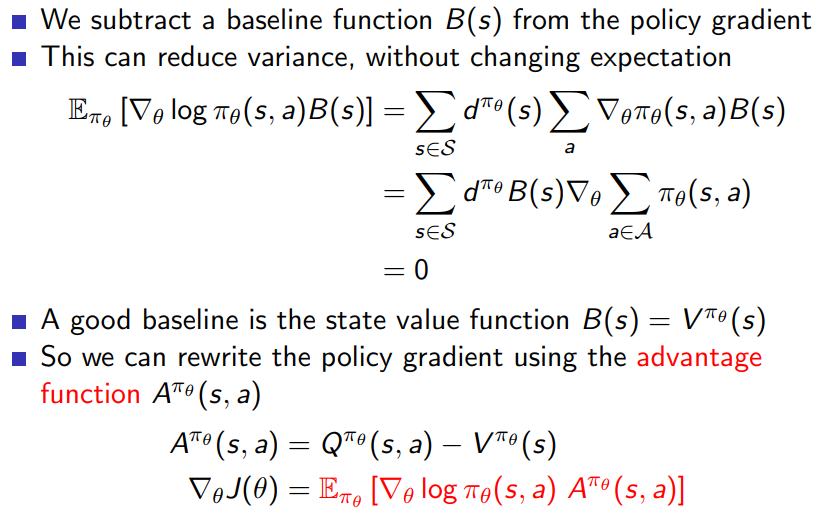

# 策略梯度

## 基于价值的学习的局限

- 基于价值的学习从众多行为中选取一个最大价值的行为，对应的最优策略是确定性策略，而有些问题的最优策略是随机的
- 得到的往往是状态空间向有限集动作空间的映射，无法应对行为空间连续的问题
- 因为个体观测限制或者建模的局限，导致本来不同的两个状态拥有相同的特征描述，基于价值的学习可能得不到最优解

## 基于策略的学习

- 策略 $\pi$ 描述为一个包含参数 $\theta$ 的函数 $\pi_{\theta}(s, a)=\mathbb{P}[a | s, \theta]$ 
- $\pi_{\theta}$ 给出在给定的状态和参数下，采取某一行为的概率
- 应用策略时，可以选择最大概率的行为

## 目标函数（基于一个序列）

- 用![[公式]](https://www.zhihu.com/equation?tex=%5Ctau)表示一组状态-行为序列![[公式]](https://www.zhihu.com/equation?tex=%5C%5B+s_0%2Cu_0%2C%5Ccdots+%2Cs_H%2Cu_H+%5C%5D), 符号![[公式]](https://www.zhihu.com/equation?tex=%5C%5B+R%5Cleft%28%5Ctau%5Cright%29%3D%5Csum_%7Bt%3D0%7D%5EH%7BR%5Cleft%28s_t%2Cu_t%5Cright%29%7D+%5C%5D)，表示轨迹 ![[公式]](https://www.zhihu.com/equation?tex=%5Ctau)的回报，![[公式]](https://www.zhihu.com/equation?tex=P%5Cleft%28%5Ctau+%3B%5Ctheta%5Cright%29) 表示轨迹 ![[公式]](https://www.zhihu.com/equation?tex=%5Ctau) 出现的概率

- $$
  U(\theta)=E\left(\sum_{t=0}^{H} R\left(s_{t}, u_{t}\right) ; \pi_{\theta}\right)=\sum_{\tau} P(\tau ; \theta) R(\tau)
  $$

- 强化学习的目标是找到最优参数 $\theta$ 使得：
  $$
  \max _{\theta} U(\theta)=\max _{\theta} \sum_{\tau} P(\tau ; \theta) R(\tau)
  $$

- $$
  \begin{aligned} \nabla_{\theta} U(\theta)&=\nabla_{\theta} \sum_{\tau} P(\tau ; \theta) R(\tau) \\&=\sum_{\tau} \nabla_{\theta} P(\tau ; \theta) R(\tau) \\&=\sum_{\tau} \frac{P(\tau ; \theta)}{P(\tau ; \theta)} \nabla_{\theta} P(\tau ; \theta) R(\tau) \\&=\sum_{\tau} P(\tau ; \theta) \frac{\nabla_{\theta} P(\tau ; \theta) R(\tau)}{P(\tau ; \theta)} \\&=\sum_{\tau} P(\tau ; \theta) \nabla_{\theta} \log P(\tau ; \theta) R(\tau) \end{aligned}
  $$
  
- 当利用当前策略 $\pi_\theta$ 采样m条轨迹后，可以利用这m条轨迹的经验平均对策略梯度进行逼近：
  $$
  \nabla_{\theta} U(\theta) \approx \hat{g}=\frac{1}{m} \sum_{i=1}^{m} \nabla_{\theta} \log P(\tau ; \theta) R(\tau)
  $$

- $$
  \begin{aligned} \nabla_{\theta} \log P\left(\tau^{(i)} ; \theta\right) &=\nabla_{\theta} \log \left[\prod_{t=0}^{H} P\left(s_{t+1}^{(i)} | s_{t}^{(i)}, u_{t}^{(i)}\right) \cdot \pi_{\theta}\left(u_{t}^{(i)} | s_{t}^{(i)}\right)\right] \\&=\nabla_{\theta}\left[\sum_{t=0}^{H} \log P\left(s_{t+1}^{(i)} | s_{t}^{(i)}, u_{t}^{(i)}\right)+\sum_{t=0}^{H} \log \pi_{\theta}\left(u_{t}^{(i)} | s_{t}^{(i)}\right)\right] \\&= \nabla_{\theta}\left[\sum_{t=0}^{H} \log \pi_{\theta}\left(u_{t}^{(i)} | s_{t}^{(i)}\right)\right] \\ &=\sum_{t=0}^{H} \nabla_{\theta} \log \pi_{\theta}\left(u_{t}^{(i)} | s_{t}^{(i)}\right) \end{aligned}
  $$

- 当回报中引入常数b时，策略梯度不变
  $$
  \begin{aligned} \nabla_{\theta} U(\theta) & \approx \hat{g}=\frac{1}{m} \sum_{i=1}^{m} \nabla_{\theta} \log P\left(\tau^{(i)} ; \theta\right) R\left(\tau^{(i)}\right) \\ &=\frac{1}{m} \sum_{i=1}^{m} \nabla_{\theta} \log P\left(\tau^{(i)} ; \theta\right)\left(R\left(\tau^{(i)}\right)-b\right) \end{aligned}
  $$

  $$
  \begin{aligned} & E\left[\nabla_{\theta} \log P(\tau ; \theta) b\right] \\=& \sum_{\tau} P(\tau ; \theta) \nabla_{\theta} \log P(\tau ; \theta) b \\=& \sum_{\tau} P(\tau ; \theta) \frac{\nabla_{\theta} P(\tau ; \theta) b}{P(\tau ; \theta)} \\=& \sum_{\tau} \nabla_{\theta} P(\tau ; \theta) b \\=& \nabla_{\theta}\left(\sum_{\tau} P(\tau ; \theta) b\right) \\=&\nabla_{\theta} b \\=& 0 \end{aligned}
  $$

- 当前的动作与过去的回报实际上是没有关系的，可以修改回报函数（两种方式）

  - G(PO)MDP *partially observable Markov decision process* 
    $$
    \nabla_{\theta} U(\theta) \approx \frac{1}{m} \sum_{i=1}^{m} \sum_{j=0}^{H-1}\left(\sum_{t=0}^{j} \nabla_{\theta} \log \pi_{\theta}\left(u_{t}^{(i)} | s_{t}^{(i)}\right)\left(r_{j}-b_{j}\right)\right)
    $$

  - 策略梯度理论
    $$
    \nabla_{\theta} U(\theta) \approx \frac{1}{m} \sum_{i=1}^{m} \sum_{t=0}^{H-1} \nabla_{\theta} \log \pi_{\theta}\left(u_{t}^{(i)} | s_{t}^{(i)}\right)\left(\sum_{k=t}^{H-1}\left(R\left(s_{k}^{(i)}\right)-b\right)\right)
    $$

## 策略目标函数

$$
\begin{aligned} 
  J_{1}(\theta) &= V_{\pi _{\theta}}(s_1) = \mathbb E_{\pi _{\theta}}[G_1] \\
  J_{a v V}(\theta) &=\sum_{s} d^{\pi_{\theta}}(s) V_{\pi_{\theta}}(s) \\ 
  J_{a v R}(\theta) &=\sum_{s} d^{\pi_{\theta}}(s) \sum_{a} \pi_{\theta}(s, a) R_{s}^{a} \end{aligned}
$$

- $d^{\pi _{\theta}}(s)$ is stationary distribution of Markov chain for $\pi _\theta$ （静态分布）

- learning the policy parameter based on the gradient of some scalar performance measure $J(\theta)$ with respect to the policy parameter 

- *soft-max in action preferences* 
  $$
  \pi(a | s, \boldsymbol{\theta}) \doteq \frac{e^{h(s, a, \boldsymbol{\theta})}}{\sum_{b} e^{h(s, b, \boldsymbol{\theta})}}
  $$

### 梯度

$$
\begin{aligned} \nabla_{\theta} J(\theta) &=\sum_{s \in S} d(s) \sum_{a \in A} \nabla_{\theta} \pi_{\theta}(s, a) R_{s, a} \\ &=\sum_{s \in S} d(s) \sum_{a \in A} \pi_{\theta}(s, a) \nabla_{\theta} \log \pi_{\theta}(s, a) R_{s, a} \\ &=\mathbb{E}_{\pi_{\theta}}\left[\nabla_{\theta} \log \pi_{\theta}(s, a) r\right] \end{aligned}
$$

### 策略梯度定理

### 形式

$$
\begin{aligned} \nabla_{\theta} J(\theta) &=\mathbb{E}_{\pi_{\theta}}\left[\nabla_{\theta} \log \pi_{\theta}(s, a)\color{red}v_{t}\right] & & \text { REINFORCE } \\ 
&=\mathbb{E}_{\pi_{\theta}}\left[\nabla_{\theta} \log \pi_{\theta}(s, a) \color{red}Q^{w}(s, a)\right] & & \text { Q Actor-Critic } \\ &=\mathbb{E}_{\pi_{\theta}}\left[\nabla_{\theta} \log \pi_{\theta}(s, a) \color{red}A^{w}(s, a)\right] & & \text { Actor-Critic } \\ 
&=\mathbb{E}_{\pi_{\theta}}\left[\nabla_{\theta} \log \pi_{\theta}(s, a) \color{red}\delta\right] & & \text { TD Actor-Critic } \\ 
&=\mathbb{E}_{\pi_{\theta}}\left[\nabla_{\theta} \log \pi_{\theta}(s, a) \color{red}\delta e\right] & & \operatorname{TD}(\lambda) \text { Actor-Critic } \end{aligned}
$$

## 算法

### Monte-Carlo Policy Gradient

### Action-Value Actor-Critic 

- 基于价值行为Q的Actor-Critic
- Actor产生行为与环境交互，Critic评估策略

- learn approximations to both policy and value functions 

### Reducing Variance Using a Baseline

仅基于状态的基准函数，不改变期望

优势函数记录了在状态s时采取动作a比停留在s状态多出来的价值，是一个增量

#### 更新公式

##### Critics at Different Time-Scales 

##### Actors at Different Time-Scales 

##### Policy Gradient with Eligibility Traces 

## 参考

- https://zhuanlan.zhihu.com/p/26174099
- https://zhuanlan.zhihu.com/p/28348110
- http://www0.cs.ucl.ac.uk/staff/d.silver/web/Teaching_files/
