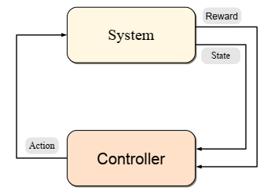
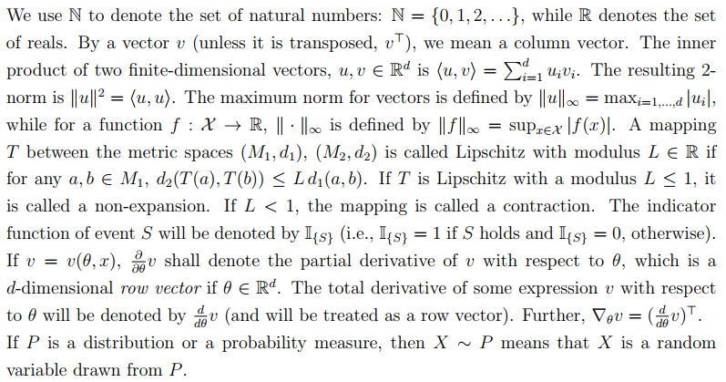

# Algorithms for Reinforcement Learning

## Abstract

- 强化学习是控制系统，使得最大化（数值表示的）性能度量，是一个长期目标
  - Reinforcement learning is a learning paradigm concerned with learning to control a system so as to maximize a numerical performance measure that expresses a long-term objective. 
  - learning to control a system so as to maximize some numerical value which represents a long-term objective
- What distinguishes reinforcement learning from supervised learning is that only partial feedback is given to the learner about the learner’s predictions. 
  关于学习者的预测，只得到部分回馈，可能该预测是具有长期作用的；时间是重要的元素
- A controller receives the controlled system’s state and a reward associated with the last state transition. It then calculates an action which is sent back to the system. In response, the system makes a transition to a new state and the cycle is repeated. 

- 假定系统具有随机性，且已知状态参数如何获取
  - We assume that the system that we wish to control is stochastic.
  - Further, we assume that the measurements available on the system’s state are detailed enough so that the the controller can avoid reasoning about how to collect information about the state.

  The RL algorithms that we discuss here can be thought of as a way of  turning the infeasible dynamic programming methods into practical algorithms so that they can be applied to large-scale problems. 

- 两种解决方式

  - 用一些样例代表系统
    use samples to compactly represent the dynamics of the control problem 
  - 拟合值函数
    use powerful function approximation methods to compactly represent value functions 

## Markov Decision Processes

### Preliminaries

  偏导数是行向量

### MDP

- A countable MDP is defined as a triplet $\mathcal M = \left(\mathcal X; \mathcal A; \mathcal P_0\right)$ , countable non-empty set of states, countable non-empty set of actions, *transition probability kernel* 

- The semantics of $\mathcal P_0$ is the following: For $U \subset \mathcal X \times \mathbb R$ , $\mathcal P_0\left(U \mid x, a\right)$ gives the probability that the next state and the associated reward belongs to the set $U$ provided that the current state is $x$ and the action taken is $a$. 
  在当前的状态和动作下，给出转移到其他所有状态的概率及其回报
  
- *状态转移概率  state transition probability kernel* $\mathcal P$ , for any $(x, a, y) \in \mathcal X \times \mathcal A \times \mathcal X$ triplet gives the probability of moving from state $x$ to some other state $y$ provided that action $a$ was chosen in state $x$ 
  $$
  \mathcal{P}(x, a, y)=\mathcal{P}_{0}(\{y\} \times \mathbb{R} | x, a)
  $$

- *立即回报函数 immediate reward function* $r$ , $\mathcal X \times \mathcal A \to \mathbb R$ , which gives the expected immediate reward received when action $a$ is chosen in state $x$ 
  $$
  if\quad \left(Y_{(x, a)}, R_{(x, a)}\right) \sim \mathcal{P}_{0}(\cdot | x, a)\quad then\quad r(s,a)=\mathbb E[R_{(x, a)}]
  $$

  assume that the rewards are bounded by some quantity $\mathcal R > 0$ , $\forall (x,a) \in \mathcal X \times \mathcal A,\; \lvert R(x,a)\rvert ≤ \mathcal R$ , 回报值设一个上界

- An MDP is called *finite* if both $\mathcal X$ and $\mathcal A$ are finite. 

- Markov Decision Processes are a tool for modeling sequential decision-making problems where a decision maker interacts with a system in a sequential fashion.
  适用于序列性的决策问题

-  给定初始状态和动作，转移过程如下

  - $X_{t}\in\mathcal X,\ A_t\in \mathcal A$ denote the random state of the system and the action chosen by the decision maker at time $t$ . Once the action is selected, it is sent to the system, which makes a transition:  

  $$
  \left(X_{t+1}, R_{t+1}\right) \sim \mathcal{P}_{0}\left(\cdot | X_{t}, A_{t}\right)
  \\\mathbb{P}\left(X_{t+1}=y | X_{t}=x, A_{t}=a\right)=\mathcal{P}(x, a, y)\quad \forall x,y\in \mathcal X,a\in \mathcal A
  \\\mathbb{E}\left[R_{t+1} | X_{t}, A_{t}\right]=r\left(X_{t}, A_{t}\right)
  $$

  - The decision maker then observes the next state $X_{t+1}$ and reward $R_{t+1}$ , chooses a new action $A_{t+1} \in \mathcal A$ and the process is repeated. 
  
- 动作选取的规则即*行为* 
  The decision maker can select its actions at any stage based on the observed history. A rule describing the way the actions are selected is called a *behavior*.
  
- 行为和初始状态共同定义了*状态-动作-回报* 序列

  - A behavior of the decision maker and some initial random state $X_0$ together define a random *state-action-reward* sequence $((X_t, A_t, R_{t+1}); t ≥ 0)$ .

  - $A_t$ is the action prescribed by the behavior based on the history $X_0, A_0, R_1; \ldots; X_{t-1},A_{t-1}, R_t; X_t$ . 

- The *return* underlying a behavior is defined as the total discounted sum of the rewards incurred: 
  $$
  \mathcal{R}=\sum_{t=0}^{\infty} \gamma^{t} R_{t+1}
  $$

  某个行为的回报，累计，衰减
  
  An MDP when the return is defined by this formula is called a *discounted reward* MDP. When $γ = 1$ , the MDP is called *undiscounted*. 
  
- 目标是找到选取动作的方式使得累计回报最大
  The goal of the decision maker is to come up with a way of choosing the actions so as to maximize the expected total discounted reward, irrespectively of how the process is started. Such a maximizing behavior is said to be *optimal*.

- In some problems, not all actions are meaningful in all states. 

- An MDP with *terminal* or *absorbing states* which has no reward is called *episodic*. 
  In an episodic MDP, we often consider undiscounted rewards, i.e., when $γ = 1$. 

- 

# Reinforcement Learning An Introduction (second edition)

## Finite Markov Decision Processes

### The Agent–Environment Interface 

#### 智能体和环境

- The learner and decision maker is called the *agent*. 

- The thing it interacts with, comprising everything outside the agent, is called the *environment*. 
  与智能体交互的事情，构成了其外部的所有
  
- These interact continually, the agent selecting actions and the environment responding to these actions and presenting new situations to the agent.

- The environment also gives rise to rewards, special numerical values that the agent seeks to maximize over time through its choice of actions.

- 

#### 交互过程

- The agent and environment interact at each of a sequence of discrete time steps.
  智能体和环境的交互是一个离散的时间序列

- At each time step t, the agent receives some representation of the environment’s state, $S_t \in \mathcal S$, and on that basis selects an action, $A_t \in \mathcal A(s)$.
  每个时间点，智能体得到环境的一个表示，基于此选择一个动作
  
- One time step later, in part as a consequence of its action, the agent receives a numerical reward, $R_{t+1}\in \mathcal R \subset \mathbb R$, and finds itself in a new state, $S_{t+1}$. 
  到达下一个时间点，由于上一个时间点的动作，智能体得到一个数值回报，并且到达新状态
#### 无后效性

- In a finite MDP, the sets of states, actions, and rewards $(\mathcal{S}, \mathcal{A}, \text { and } \mathcal{R})$ all have a finite number of elements. In this case, the random variables $R_t$ and $S_t$ have well defined discrete probability distributions dependent only on the preceding state and action.
  对于有限MDP，针对前一个动作和状态，它转移到随机的状态和得到随机的回报值，都对应一个离散的概率
  
- for particular values of these random variables, $s^{\prime}\in\mathcal S$ and $r\in \mathcal R$, there is a probability of those values occurring at time t, given particular values of the preceding state and action
  只依赖于前一个状态和动作
  $$
  p\left(s^{\prime}, r | s, a\right) \doteq \operatorname{Pr}\left\{S_{t}=s^{\prime}, R_{t}=r | S_{t-1}=s, A_{t-1}=a\right\}
  $$

- The dynamics function $p : S \times R \times S \times A \to [0, 1]$ is an ordinary deterministic function of four arguments. 
  具有四个参数的确定函数，值域为[0, 1]
  
- 条件概率
  $$
  \sum_{s^{\prime} \in \mathcal{S}} \sum_{r \in \mathcal{R}} p\left(s^{\prime}, r | s, a\right)=1, \text { for all } s \in \mathcal{S}, a \in \mathcal{A}(s)
  $$

- In a Markov decision process, the probabilities given by p completely characterize the environment’s dynamics. 

  该概率函数完全刻画了环境的动态性

- the probability of each possible value for $S_t$ and $R_t$ depends only on the immediately preceding state $S_{t-1}$ and action $A_{t-1}$  

  限制不在于决策过程，而是状态

- The state must include information about all aspects of the past agent–environment interaction that make a difference for the future. If it does, then the state is said to have the *Markov property*.  

  状态包含了所有对未来起作用的历史交互信息

- *state-transition probabilities* 

$$
p\left(s^{\prime} | s, a\right) \doteq \operatorname{Pr}\left\{S_{t}=s^{\prime} | S_{t-1}=s, A_{t-1}=a\right\}=\sum_{r \in \mathcal{R}} p\left(s^{\prime}, r | s, a\right)\\
p: \mathcal{S} \times \mathcal{S} \times \mathcal{A} \rightarrow[0,1])
$$

- expected rewards for state-action pairs
  $$
  r(s, a) \doteq \mathbb{E}\left[R_{t} | S_{t-1}=s, A_{t-1}=a\right]=\sum_{r \in \mathcal{R}} r \sum_{s^{\prime} \in \mathcal{S}} p\left(s^{\prime}, r | s, a\right)\\
  r:\mathcal S \times \mathcal A \to \mathbb R
  $$

- expected rewards for state-action-next state triples
  $$
  r\left(s, a, s^{\prime}\right) \doteq \mathbb{E}\left[R_{t} | S_{t-1}=s, A_{t-1}=a, S_{t}=s^{\prime}\right]=\sum_{r \in \mathcal{R}} r \frac{p\left(s^{\prime}, r | s, a\right)}{p\left(s^{\prime} | s, a\right)}\\
  r:\mathcal S \times \mathcal A \times \mathcal S \to \mathbb R
  $$

#### MDP 框架

- time step 不一定是固定时长的真实时间，可以是一系列连续的阶段

  The time steps need not refer to fixed intervals of real time; they can refer to arbitrary successive stages of decision making and acting. 

- 动作可大可小，可宏观可微观

  - The actions can be low-level controls, such as the voltages applied to the motors of a robot arm, or high-level decisions, such as whether or not to have lunch or to go to graduate school. 
  - some actions might be totally mental or computational 
  - some actions might control what an agent chooses to think about, or where it focuses its attention 

- 状态也具有多种形式，可主观可客观

  - They can be completely determined by low-level sensations, such as direct sensor readings, or they can be more high-level and abstract, such as symbolic descriptions of objects in a room.
  - Some of what makes up a state could be based on memory of past sensations or even be entirely mental or subjective.  
  - An agent could be in the state of not being sure where an object is, or of having just been surprised in some clearly defined sense.  

- In general, actions can be any decisions we want to learn how to make, and the states can be anything we can know that might be useful in making them. 

- The MDP framework is a considerable abstraction of the problem of goal-directed learning from interaction. 

  目的导向的问题抽象

- Any problem of learning goal-directed behavior can be reduced to three signals passing back and forth between an agent and its environment: one signal to represent the choices made by the agent (the actions), one signal to represent the basis on which the choices are made (the states), and one signal to define the agent’s goal (the rewards).  

  所有目的导向的问题都可以转化为MDP（选择，选择的基础，目标）

- 最佳效果的状态和动作的表示，暂时没有一种科学的方法去构建

  such representational choices are at present more art than science 

#### 智能体和环境的界限

- anything that cannot be changed arbitrarily by the agent is considered to be outside of it and thus part of its environment 
  - 机器人的传感器属于外部环境，人的骨骼、肌肉属于外部环境
  - 对于智能体来说环境中的事物不都是未知的，即使知道了所有环境，面对的问题可能也很难
  - 智能体不能任意改变的事务就是它外部的
- The agent–environment boundary represents the limit of the agent’s *absolute control*, not of its knowledge. 

### Goals and Rewards 

- the purpose or goal of the agent is formalized in terms of a special signal, called the *reward*, passing from the environment to the agent 

- It is thus critical that the rewards we set up truly indicate what we want accomplished.

- The reward signal is your way of communicating to the robot what you want it to achieve, not how you want it achieved.  

  设置回报的目的是告诉智能体我想达到什么目标，而不是怎么样达到

### Returns and Episodes

#### Returns

- the agent’s goal is to maximize the cumulative reward it receives in the long run 

- $$
  G_{t} \doteq R_{t+1}+ R_{t+2}+ R_{t+3}+\cdots+R_T\\
  G_{t} \doteq R_{t+1}+\gamma R_{t+2}+\gamma^{2} R_{t+3}+\cdots=\sum_{k=0}^{\infty} \gamma^{k} R_{t+k+1}
  $$

  - $\gamma$ is a parameter, $0 \leq \gamma \leq 1$, called the *discount rate* 
  - If $\gamma < 1$, the infinite sum in has a finite value 
  - If $\gamma = 0$, the agent is “myopic” in being concerned only with maximizing immediate rewards 
  - As $\gamma$ approaches 1, the return objective takes future rewards into account more strongly; the agent becomes more farsighted. 
  
- $$
  \begin{aligned} G_{t} & \doteq R_{t+1}+\gamma R_{t+2}+\gamma^{2} R_{t+3}+\gamma^{3} R_{t+4}+\cdots \\ &=R_{t+1}+\gamma\left(R_{t+2}+\gamma R_{t+3}+\gamma^{2} R_{t+4}+\cdots\right) \\ &=R_{t+1}+\gamma G_{t+1} \end{aligned}
  $$

#### Episodes

##### episodic tasks

- when the agent–environment interaction breaks naturally into subsequences, which we call *episodes* 

  在交互过程中自然停止，称为一段 episode 或者 trial

- Each episode ends in a special state called the *terminal state*, followed by a reset to a starting state.
- the next episode begins independently of how the previous one ended 

##### continuing tasks

- in many cases the agent–environment interaction does not break naturally into identifiable episodes, but goes on continually without limit 

### Unified Notation for Episodic and Continuing Tasks 

- *absorbing state* that transitions only to itself and that generates only rewards of zero 

### Policies and Value Functions 

- functions of states (or of state–action pairs) that estimate how good it is for the agent to be in a given state (or how good it is to perform a given action in a given state).

- particular ways of acting, called policies 

- a *policy* is a mapping from states to probabilities of selecting each possible action. 

- If the agent is following policy $\pi$ at time t, then $\pi (a|s)$ is the probability that $A_t = a \ \text {if}\  S_t = s$. 

- The value function of a state s under a policy $\pi$, denoted $v_{\pi}(s)$, *state-value function for policy $\pi$* 
  
  The value of taking action a in state s under a policy $\pi$, denoted $q_{\pi}(s, a)$, *action-value function for policy $\pi$* 
  $$
  v_{\pi}(s) \doteq \mathbb{E}_{\pi}\left[G_{t} | S_{t}=s, \right] = \mathbb{E}_{\pi}\left[\sum_{k=0}^{\infty} \gamma^{k} R_{t+k+1} | S_{t}=s\right],\quad \forall s\in \mathcal S\\
q_{\pi}(s, a) \doteq \mathbb{E}_{\pi}\left[G_{t} | S_{t}=s, A_{t}=a\right]=\mathbb{E}_{\pi}\left[\sum_{k=0}^{\infty} \gamma^{k} R_{t+k+1} | S_{t}=s, A_{t}=a\right]
  $$
  
- the value of s and the value of its possible successor states
  $$
  \begin{aligned} v_{\pi}(s) & \doteq \mathbb{E}_{\pi}\left[G_{t} | S_{t}=s\right] \\ &=\mathbb{E}_{\pi}\left[R_{t+1}+\gamma G_{t+1} | S_{t}=s\right] \\ &=\sum_{a} \pi(a | s) \sum_{s^{\prime}} \sum_{r} p\left(s^{\prime}, r | s, a\right)\left[r+\gamma \mathbb{E}_{\pi}\left[G_{t+1} | S_{t+1}=s^{\prime}\right]\right] \\ &=\sum_{a} \pi(a | s) \sum_{s^{\prime}, r} p\left(s^{\prime}, r | s, a\right)\left[r+\gamma v_{\pi}\left(s^{\prime}\right)\right], \quad \text { for all } s \in \mathcal{S} \end{aligned}
  $$

### Optimal Policies and Optimal Value Functions 

