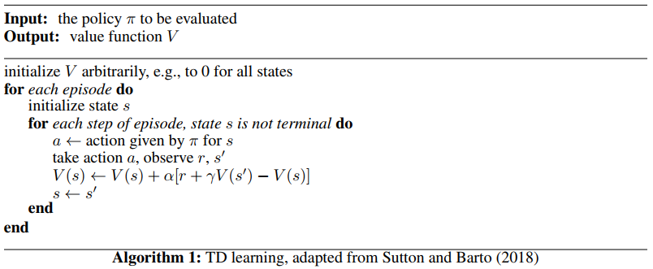
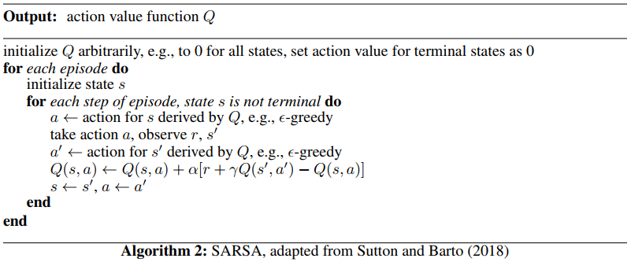
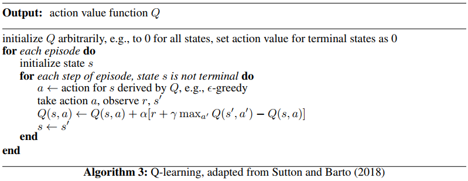

# Temporal Difference Learning

- TD learning is a combination of Monte Carlo ideas and dynamic programming (DP) ideas. 
- TD methods can learn directly from raw experience without a model of the environment’s dynamics. 
- Both TD and Monte Carlo methods use experience to solve the prediction problem.  
- TD learns from incomplete episodes, by bootstrapping

## TD Prediction 

- TD methods need to wait only until the next time step.  

- At time $t + 1$ they immediately form a target and make a useful update using the observed reward $R_{t+1}$ and the estimate $V (S_{t+1})$. 

- $V\left(S_{t}\right) \leftarrow V\left(S_{t}\right)+\alpha\left[R_{t+1}+\gamma V\left(S_{t+1}\right)-V\left(S_{t}\right)\right]$ 

- TD(0), one-step TD 

  .png)

- 利用下一个状态的值函数预测值更新一个状态的值函数，bootstrapping 

- TD methods combine the sampling of Monte Carlo with the bootstrapping of DP. 

- refer to TD and Monte Carlo updates as *sample updates* 

  根据 successor 的值函数和 reward 去更新原始的状态的值函数，基于采样的序列

- *TD error* 

  - measuring the difference between the estimated value of $S_t$ and the better estimate $R_{t+1}+\gamma V\left(S_{t+1}\right)$ 
  - $\delta _t \doteq R_{t+1}+\gamma V\left(S_{t+1}\right)-V\left(S_{t}\right)$ 
  - $\delta_t$ is the error in $V (S_t)$, available at time $t + 1$ 

- Monte Carlo error can be written as a sum of TD errors 
  $$
  \begin{aligned} G_{t}-V\left(S_{t}\right) &=R_{t+1}+\gamma G_{t+1}-V\left(S_{t}\right)+\gamma V\left(S_{t+1}\right)-\gamma V\left(S_{t+1}\right) \\ &=\delta_{t}+\gamma\left(G_{t+1}-V\left(S_{t+1}\right)\right) \\ &=\delta_{t}+\gamma \delta_{t+1}+\gamma^{2}\left(G_{t+2}-V\left(S_{t+2}\right)\right) \\ &=\delta_{t}+\gamma \delta_{t+1}+\gamma^{2} \delta_{t+2}+\cdots+\gamma^{T-t-1} \delta_{T-1}+\gamma^{T-t}\left(G_{T}-V\left(S_{T}\right)\right) \\ &=\delta_{t}+\gamma \delta_{t+1}+\gamma^{2} \delta_{t+2}+\cdots+\gamma^{T-t-1} \delta_{T-1}+\gamma^{T-t}(0-0) \\ &=\sum_{k=t}^{T-1} \gamma^{k-t} \delta_{k} \end{aligned}
  $$

- 

## TD MC 的对比

- TD can learn before knowing the final outcome 
- TD can learn without the final outcome
  - TD can learn from incomplete sequences
  - TD works in continuing (non-terminating) environments 
- Return $G_t$ is unbiased estimate of $v_\pi(S_t)$; TD target $R_{t+1}+\gamma V\left(S_{t+1}\right)$ is biased estimate of $v_\pi(S_t)$ 
- MC has high variance, zero bias; TD has low variance, some bias 
- TD(1) is roughly equivalent to every-visit Monte-Carlo

