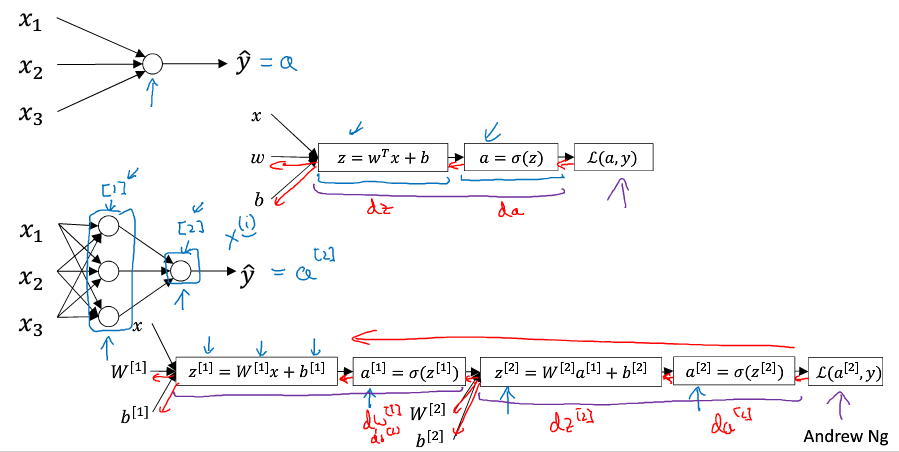
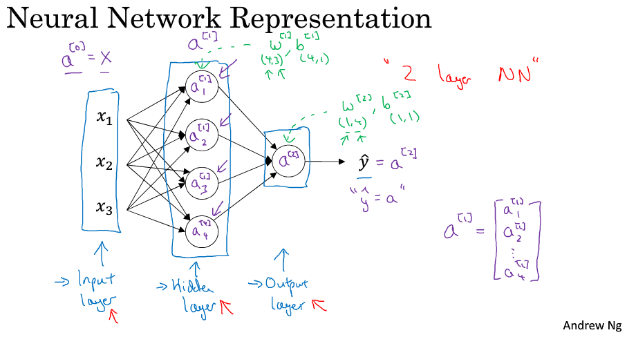
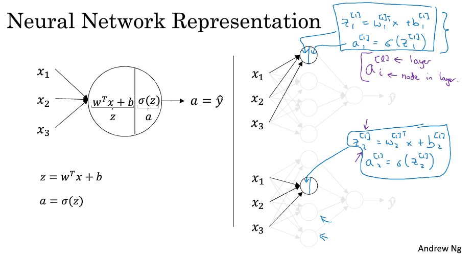
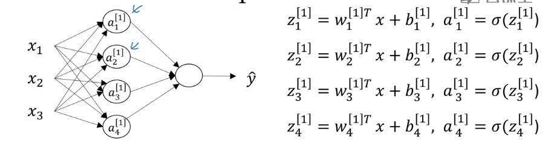
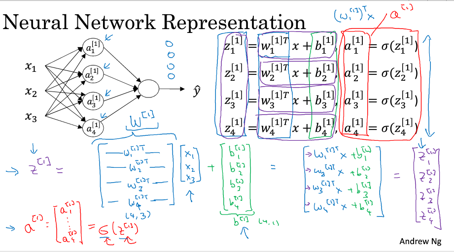
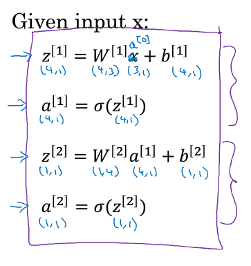
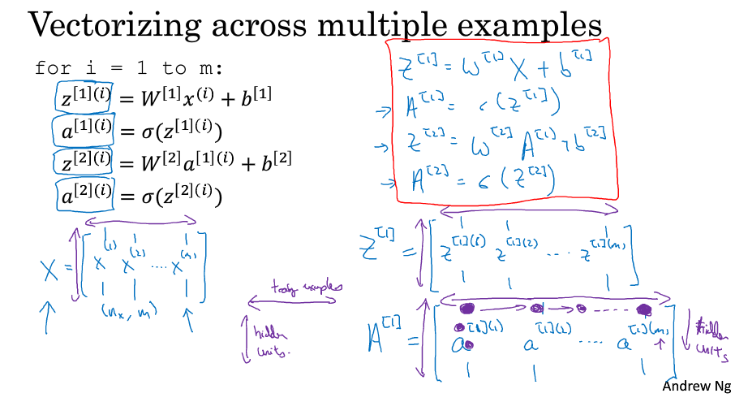
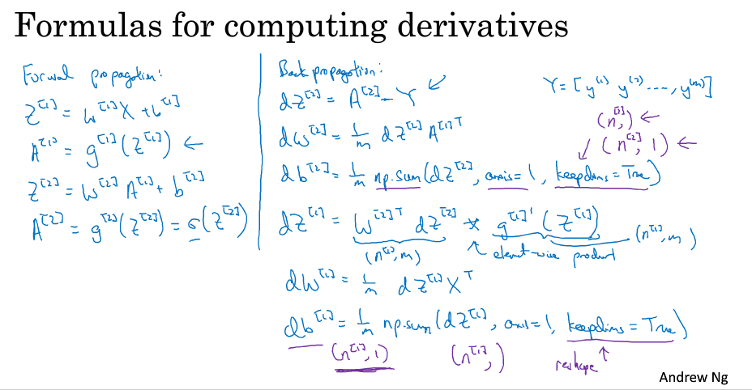
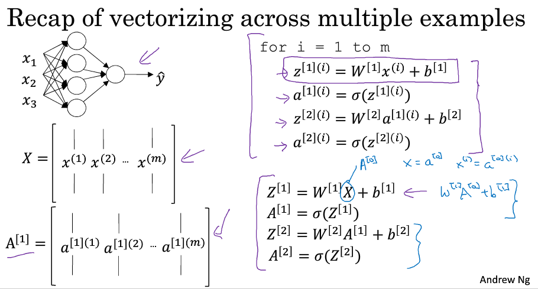
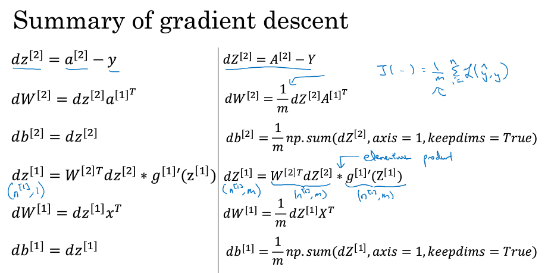

> [神经网络和深度学习](http://mooc.study.163.com/course/deeplearning_ai-2001281002)
> 吴恩达 Andrew Ng

## 浅层神经网络

### 神经网络概览

### 神经网络表示

- 输入层$a^{[0]}$、隐藏层$a^{[1]}$、输出层$a^{[2]}$ 

- 多个逻辑回归的叠加

- 计算神经网络的输出 

  

    

- 将各个元素竖向叠加起来构成一个大矩阵

- 向量化计算 

  

- 各个矩阵的大小 

  

### 多个样本的向量化

- 圆括号表示样本，方括号表示层数
- Horizontal(横向), the matrix A goes over different training examples. Vertically(竖向), the different hidden unit.
-  

  

   

### 激活函数 (Activation Function)

- $\sigma(z)$ 常用于二元分类问题
- $tanh(z)=\frac{e^z-e^{-z}}{e^z+e^{-z}}$ （效果常常比 $\sigma(z)$ 好）
- z 很大或者很小时，$tanh(z)、\sigma(z)$ 的斜率接近于0，会拖慢梯度下降法（梯度弥散）
- 不同层的激活函数可以不同
- $ReLU(z)=max(0,z)$ 
  - 在 0 处不可导，但在实验中 z 极少取到 0
  - 负数区域时神经元不会训练，$Leaky\ ReLU()$ 可避免这一问题
  - 通常学习速度优于前两个激活函数
  - $Leaky\ ReLU(z)=max(0.01z,z)$ （系数可以自定义）
- identity activation function 恒等激活函数 $g(z)=z$ 
- If using linear activation functions, then the neural network is just outputting a linear function of the input. 
- No matter how many layers your neural network has, it is just computing a linear activation function. There is no need to have the hidden layers.
- 两个线性函数的组合仍然是线性函数
- 线性函数通常只在输出层使用，隐藏层几乎都使用非线性函数

### 梯度下降法 (Gradient Descent)

- 给定随机的初始值而不是全零

- 公式

  

- 注意维度匹配

- 

### 随机初始化 (Random Initialization)

- symmetric, computing the same function
- 如果初始化为0，隐藏单元做的是相同的计算，无论迭代多少次
- initialize parameters(w) randomly `w = np.random.randn((2,2))*0.01` 
- 偏置量 b 可以初始化为0
- 初值一般小一些，如果很大，可能落在激活函数斜率平缓的部分，会降低学习速率

