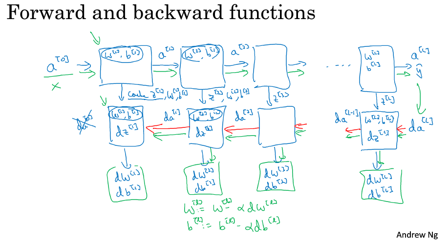
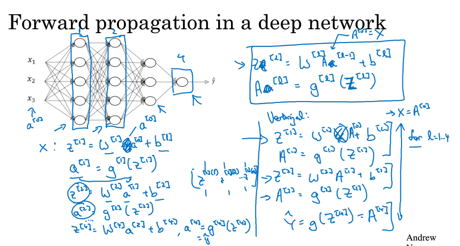
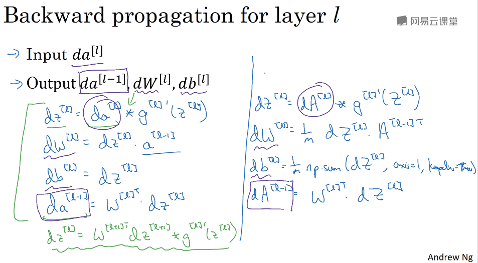
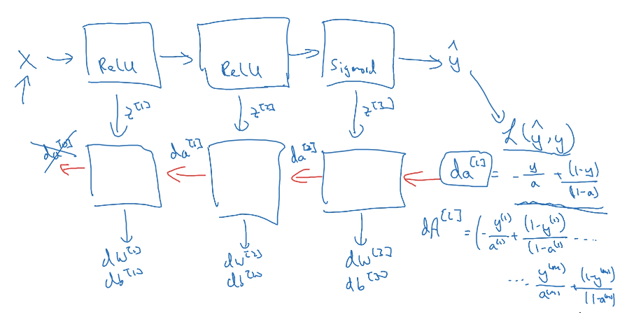
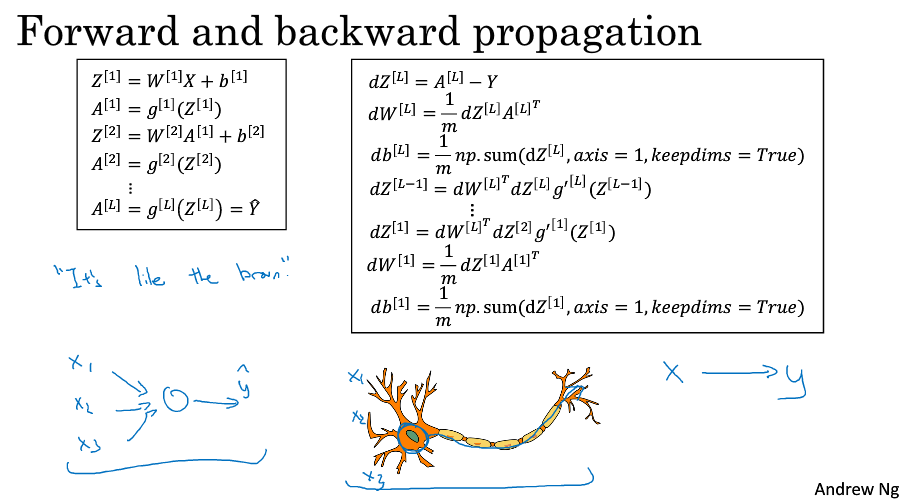

> [神经网络和深度学习](http://mooc.study.163.com/course/deeplearning_ai-2001281002)
> 吴恩达 Andrew Ng

## 深层神经网络(Deep Neural Networks)

### Deep L-layer Neural Networks

- 有一个隐藏层的神经网络，就是一个两层神经网络
- 算神经网络的层数时，只算隐藏层和输出层，输入层看作第0层
- 有一些函数浅层的网络学习不了

### Getting your matrix dimensions right

- $W^{[l]}:(n^{[l]},n^{[l-]})\quad b^{[l]}:(n^{[l]},1)$ 
- $A^{[l]}:(n^{[l]},m)\qquad Z^{[l]}:(n^{[l]},m)$ 
- 确保前后矩阵一致

### Why deep representations?

- 登堂入室
- 边缘探测器针对小区域
- put together simpler things that has detected in order to detect more complex things
- Circuit theory (电路理论)
- There are some functions that you can compute with a L-layer deep neural network while shallower networks require exponentially more hidden units to compute.
- 对于有些函数深层网络更合适

### Forward and backward functions

- Forward propagation in a deep network

  

- backward propagation 

  

- summary 

  

- lots of complexity of your learning algorithm comes from the data rather than your code

### Parameters and Hyper parameters

- parameters(参数): W, b
- hyper parameters(超参数) (determines the parameters)
  - learning rate
  - the number of iterations of gradient descent
  - the number of hidden layers
  - choice of activation function
- 不断实验，找到合适的超参数 cycle of (Idea, Code, Experiment)
- just try a few values for the hyper parameters and double check 

### Deep learning and the human brain

- Today even neuroscientists have almost no idea what even a single neuron is doing.
- 

