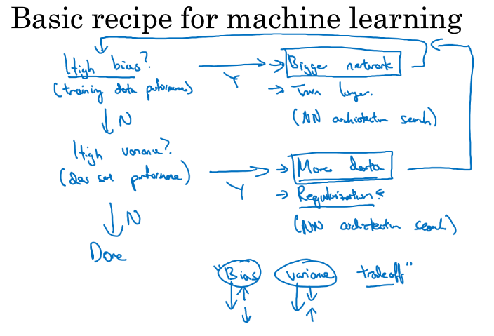
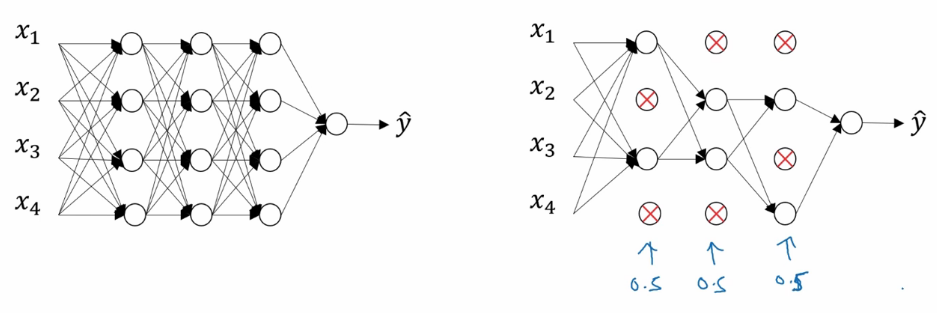
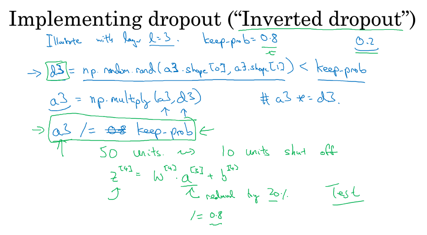
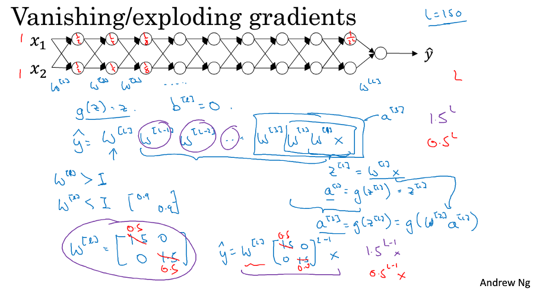
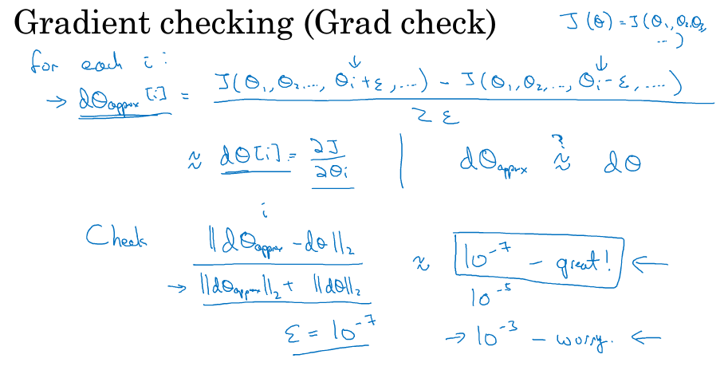

> [改善深层神经网络：超参数调试、正则化以及优化](http://mooc.study.163.com/course/2001281003)
> 吴恩达 Andrew Ng

# 深度学习的实用层面

Setting up your ML application

## Train/dev/test sets (训练、开发、测试集)

- the goal of the dev set is to test different algorithms on it and see which algorithm works better
- test set is going to give you a pretty confident estimate of how well it's doing
- 数据量越大，训练集所占比例就越大
- **Make sure dev set and test set come from the same distribution** 
- cross-validation 交叉验证 (dev set)

## Bias(偏差) and Variance(方差)

- high bias: under fitting (high train set error)
- high variance: over fitting (low train set error but high dev set error)
- high bias and high variance: high train set error and higher dev set error
- optimal error (Bayes error) 最优误差也被称作贝叶斯误差

## Basic "recipe" for machine learning

- 网络规模大往往可以避免高偏差，延长训练时间可能有用可能没用
- 更多的数据和正则化可以减小方差
- trade off between bias and variance

## Regularization (正则化)

### Logistic Regression

$\lambda$ is regularization parameter (正则化参数), use **lambd** to represent teh lambda regularization parameter in code

#### L~2~ Regularization

- $J(w,b)=\frac{1}{m}\sum^m_{i=1}\mathcal L(\hat y^{(i)},y^{(i)})+\frac{\lambda }{2m}\|w\|^2_2$ 
- $\|w\|^2_2=\sum^{n_x}_{j=1}w_j^2=w^Tw$  
- 测试不同的 $\lambda$ 

#### L~1~ regularization

-  $\frac{\lambda }{2m}\|w\|_1=\frac{\lambda }{2m}\sum^{n_x}_{j=1}|w_j|$ 
-  $w$ vector will have a lot of zeros in it, so make your model sparse

### Neural Network

- $\frac{\lambda }{2m}\sum^L_{l=1}\|w^{[l]}\|^2_F$ 

- $\|w^{[l]}\|^2=\sum^{n^{[l-1]}}_{i=1}\sum^{n^{[l]}}_{j=1}(w^{[l]}_{ij})^2$ (所有元素的平方和)

- Frobenius Norm (弗罗贝尼乌斯范数)

- $dw^{[l]}=(back\; propagation)+\frac{\lambda}{m}w^{[l]}$ 

  $w^{[l]}=w^{[l]}-\alpha dw^{[l]}$ (weight decay)

- L~2~ 范数正则化也称为权重衰减

## Regularization reduces over fitting

- $\lambda$ 足够大时，$\mathbf w$ 会接近于 0 
- reduce the impact of a lot of hidden units, so end up with a simper network
- 例如激活函数是$\tanh (z)$ ，$\mathbf w$ 较小时，$\mathbf z$ 也相对小
  - 函数几乎呈线性关系
  - every layer will be roughly linear, just like a linear regression
  - if every layer is linear, then the whole network is just a linear network

## Dropout Regularization

- have a $p$ chance of keeping each node and $(1-p)$ chance of removing each node 
- eliminate some nodes, and remove all the ingoing outgoing lines form that node
- end up with a smaller and diminished network
- No dropout during test set

### inverted dropout (反向随机失活)

- `keep_prob` 保留某个结点的概率
- by dividing by the keep-prob, it ensures that the expected value of $a^{[3]}$ remains the same
- 每一次迭代都使随机的一些结点置零，无论正向反向

## Understanding Dropout

- on every iteration, working with a smaller neural network
- can't rely on any one feature, any one of its inputs could go away at random
- 收缩权重的平方范数 shrink the squared norm of the weights
- 参数多的层 `keep_prob` 设置的小一点，防止过拟合
- 通常不在输入层应用 dropout
- dropout is very frequently used by computer vision
- cost function J is no longer well-defined, hard to calculated
- 先不用 dropout，网络的 cost 是递减的，且发生了过拟合，再打开 dropout

## Other Regularization Methods

### Date augmentation (数据扩增)

- flip horizontally 水平翻转
- random crops of the image 随机裁剪
- rotate 旋转

### Early stopping

- 验证集的错误通常开始时下降， 某个点后上升
- 在那个点停止训练 stop the training of neural network earlier
- 参数刚开始是比较小的，随着训练越来越大
- 提前停止训练，cost function 可能不够小

## Normalizing Inputs (归一化输入)

- zero out the mean (零均值化): just move the training set until it has 0 mean
- normalize the variances (归一化方差)，使方差为1，伸缩变换
- after normalizing features, cost function will on average look more symmetric(对称)
- 如果特征值的范围相差不大，归一化也就没多重要
- 应该可以加速神经网络的训练

## Vanishing / Exploding Gradients (梯度消失/爆炸)

- activations end up increasing/decreasing exponentially
- 线性激活函数的例子
  
- 激活函数的输入特征被零均值和标准方差化，方差是 1， 𝑧 也会调整到相似范围，可以减少梯度爆炸和消失

### Single Neuron Example

- 激活函数用 ReLU(z)，初始化 $W^{[l]} = np.random.randn(shape) * np.sqrt(2 / n^{[l-1]} )$ 
- 若使用 $\tanh(z)$，系数使用$np.sqrt(2 / n^{[l-1]} )$ 更好 (Xavier 初始化)

## Gradient Checking (梯度检验)

### Numerical approximation of gradients

- two-sided difference is more accurate than one-sided difference
- $\frac{f(x+\epsilon)-f(x-\epsilon)}{2\epsilon}=\frac{1}{2}(\frac{f(x+\epsilon)-f(x)}{\epsilon}+\frac{f(x)-f(x-\epsilon)}{\epsilon})$ 

### Grad check

- take $W^{[1]},b^{[1]},...,W^{[L]},b^{[L]}$ and reshape to a big vector $\theta$ 
- take $dW^{[1]},db^{[1]},...,dW^{[L]},db^{[L]}$ and reshape to a big vector $d\theta$ 
- 

### Implementation notes

- Don't use in training, only to debug
- Look at components to try to identify bug
- Remember to include regularization
- Doesn't work with dropout

