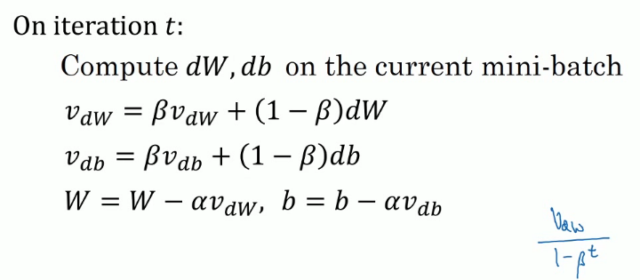
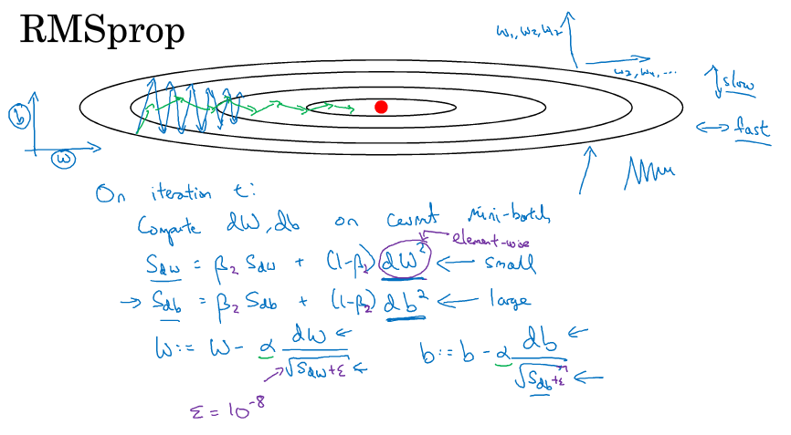

> [改善深层神经网络：超参数调试、正则化以及优化](http://mooc.study.163.com/course/2001281003)
> 吴恩达 Andrew Ng

# 优化算法 (Optimization Algorithms)

## Mini-batch 梯度下降法

- 把巨大的数据集分成一个一个的小部分

- 5000000 examples, 1000 × 5000, $X^{\{1\}}...X^{\{5000\}}$ , $Y^{\{1\}}...Y^{\{5000\}}$ 

- epoch means a single pass through the training set

- Batch gradient descent's cost decrease on every iteration

- Mini-batch gradient descent may **not** decrease on every iteration. It **trends** downwards, but it's going to be a little bit noisier.

- mini-batch size = m: Batch gradient descent

- mini-batch size = 1: Stochastic gradient descent (随机梯度下降法)

  不会收敛，最终在最小值处波动

- 一般 mini-batch 大小为 64、128、256、512

- Shuffling and Partitioning are the two steps required to build mini-batches

## Exponentially weighted averages (指数加权平均)

- $V_t=\beta V_{t-1}+(1-\beta)\theta_t$ 
- $V_t$ approximately average over $\frac{1}{1-\beta}$ items
- 迭代几次公式，展开递推式
- 初始化 $V_0=0$ 
- As for computation and memory efficiency, it's a good choice.

### Bias correction in exponentially weighted average

- during initial phase of estimating, make it more accurate
- $\frac{V_t}{1-\beta ^{\, t}}$ 
- oscillations 震荡，波动

## Momentum (动量梯度下降法)

- ball rolling down a bowl
- 
- usually $\beta = 0.9$ 
- Momentum takes past gradients into account to smooth out the steps of gradient descent.

## RMSprop

root mean square prop

## Adam optimization algorithm

Adaptive Moment Estimation

- 结合 Momentum 和 RMSprop

- 适用性广泛

- Hyperparameters:

  $\alpha :$ needs to be tuned, $\beta _1:0.9$ , $\beta _2:0.999$ , $\epsilon:10^{-8}$ 

## Learning rate decay

随着迭代的增加，渐渐减小学习率

- $\alpha = \frac{1}{1+decay_rate\times iteration}\alpha_0$ 
- $\alpha=0.95^{\, epoch\_num}\alpha_0$ 
- $\alpha=\frac{k}{\sqrt{epoch\_num}}\alpha_0$ 
- discrete staircase
- manually controlling alpha (small model)

## The problem of local optima

- saddle point 马鞍点
- 许多低维空间里的直觉在高维空间中并不适用，高维空间极少出现局部最优点
- 平稳区域(plateaus)会降低学习效率