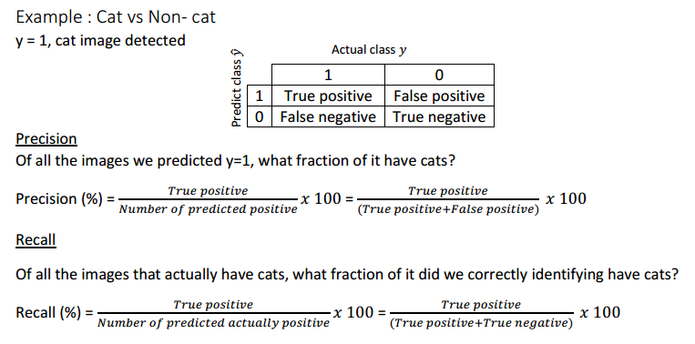
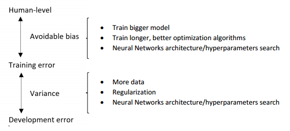

> [结构化机器学习项目](http://mooc.study.163.com/course/2001280004)
> 吴恩达 Andrew Ng

# 机器学习策略 (1)

## Orthogonalization 正交化

- 各个参数的功能尽量独立，就像正交，相互垂直

- Orthogonalization or orthogonality is a system design property that assures that modifying an instruction or a component of an algorithm will not create or propagate **side effects** to other components of the
  system.

1. Fit training set well in cost function

  If it doesn’t fit well, the use of a bigger neural network or switching to a better optimization
  algorithm might help.

2. Fit development set well on cost function

  If it doesn’t fit well, regularization or using bigger training set might help.

3. Fit test set well on cost function
   If it doesn’t fit well, the use of a bigger development set might help

4. Performs well in real world
   If it doesn’t perform well, the development test set is not set correctly or the cost function is not evaluating the right thing.

## Single number evaluation metric 单一数字评估指标

- precision 查准率，预测为真的例子中多少是实际为真的

- recall 查全率，实际为真的例子中多少预测为真

- Recall = True Positive / (True Positive + False Negative)

  

- there's often a tradeoff between precision and recall

- F1 Score: harmonic mean(调和平均) of precision P and recall R

- 判断哪一个模型更优

## Satisficing and optimizing metrics

- optimizing metrics, as accurately as possible 尽可能好
- satisficing metrics, meet expectation set 满足一定指标即可

## Some advices

- choose the development and test sets from the same distribution and it must be taken randomly from all the data
- optimize the evaluation metric
- Bayes optimal error 理论上的最优误差
- Machine learning progresses slowly when it surpasses human-level performance
- Human-level error as a proxy for Bayes error
- If the difference between human-level error and the training error is bigger than the difference between the training error and the development error. The focus should be on bias reduction technique 
- If the difference between training error and the development error is bigger than the difference between the human-level error and the training error. The focus should be on variance reduction technique

## Summary

