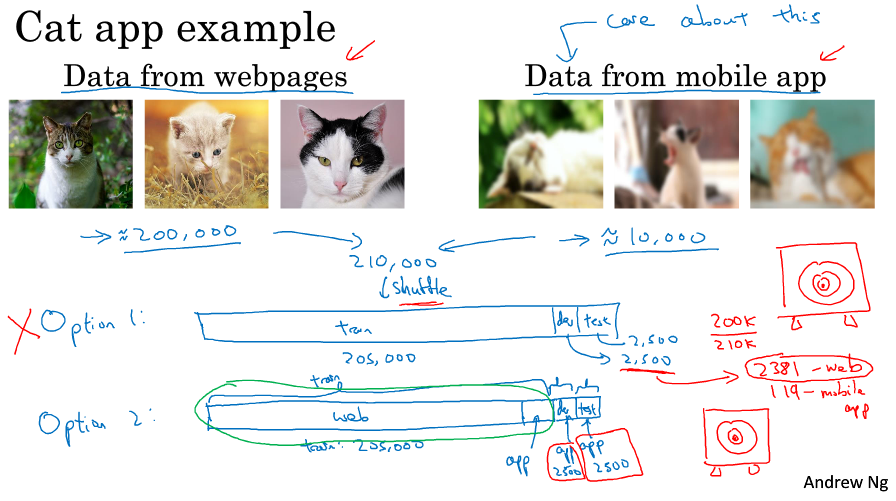
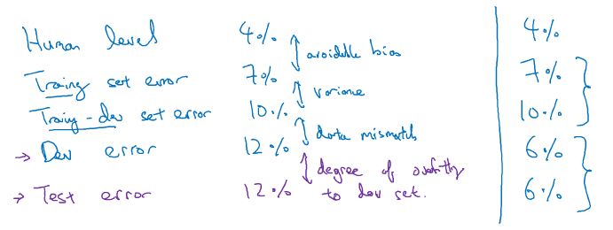
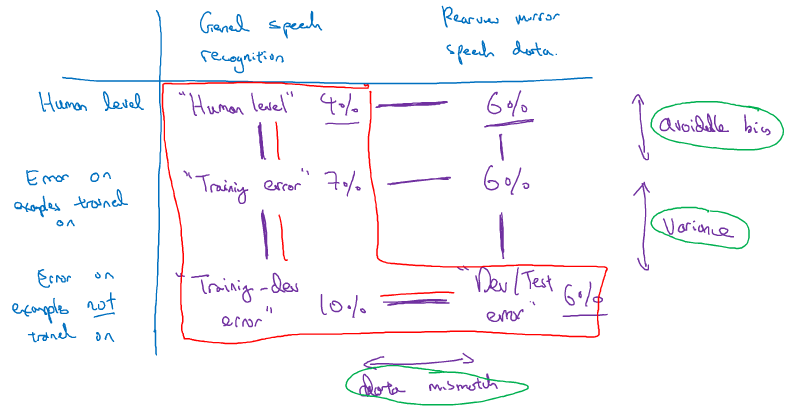
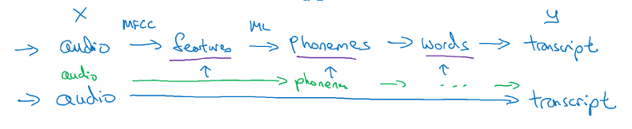

> [结构化机器学习项目](http://mooc.study.163.com/course/2001280004)
> 吴恩达 Andrew Ng

# 机器学习策略 (2)

## Error Analysis

### Carrying out error analysis 误差分析

- look at dev examples to evaluate ideas
- evaluate multiple ideas in parallel

### Cleaning up incorrectly labeled data

- If the errors are reasonably random, it's okay to leave the errors as they are
- DL algorithms are quite robust to random errors in the training set
- whether a significant difference to your ability

### Build your first system quickly, then iterate

- Set up dev/test set and metric
- Build initial system quickly
- Use Bias/Variance analysis & Error analysis to prioritize next steps

## Mismatched training and dev/test set

### Training and testing on different distributions

- 混合数据，使其分布统一，但缺少了针对性

- 开发集和测试集都用测试的图片，训练集加入极少的测试图片

- Cat app example 

  

### Bias and Variance with mismatched data distributions

- Training-dev set

  Same distribution as training set, but not used for training

- carve out a piece of the training set to be the training-dev set

- Human level, Training error, Training-dev error, Dev error, Test error 

  

- Rearview example 

  

### Addressing data mismatch

- Carry out manual error analysis to try to understand difference
  between training and dev/test sets
- Make training data more similar; or collect more data similar to
  dev/test sets
- artificial data synthesis 人工合成
- 躬亲

## Learning from multiple tasks

### Transfer learning

- pre-training (预训练), fine tuning (微调)
- 从已有的经过大量数据训练的模型迁移到小数据的训练上
- transfer A to B
  - Task A and B have the same input x.
  - You have a lot more data for Task A than Task B.
  - Low level features from A could be helpful for learning B.

### Multi-task learning

- 一张图可以有多个标签
- Training on a set of tasks that could benefit from having shared lower-level features.
- Usually: Amount of data you have for each task is quite similar.
- Can train a big enough neural network to do well on all the tasks.

## End-to-end deep learning (端到端)

### What is end-to-end deep learning?

- 直接从输入到输出

- traditional pipeline approach actually works as well when you have small amount of data

- Speech recognition example 

  

### Whether to use end-to-end deep learning

- hand-designed components tend to help more when training on a small data set

- sufficient date to learn a function for the complexity needed to map **x** to **y** 

#### Pros

- Let the data speak
- Less hand-designing of components needed

#### Cons

- May need large amount of data
- Excludes potentially useful hand-designed components 缺少了可能有用的人工干预