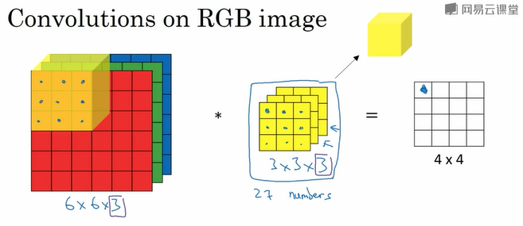
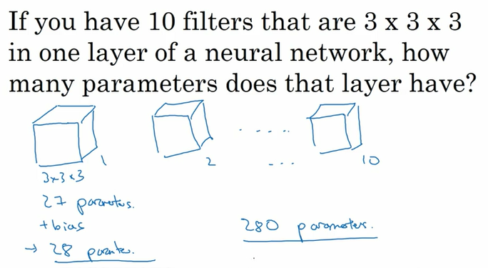
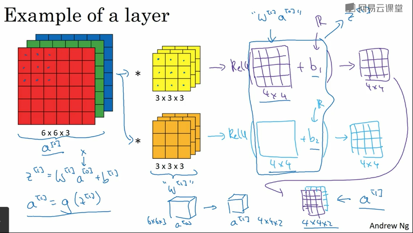
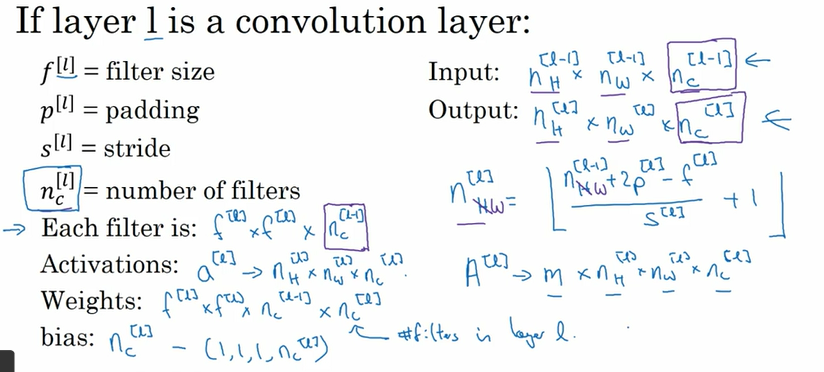
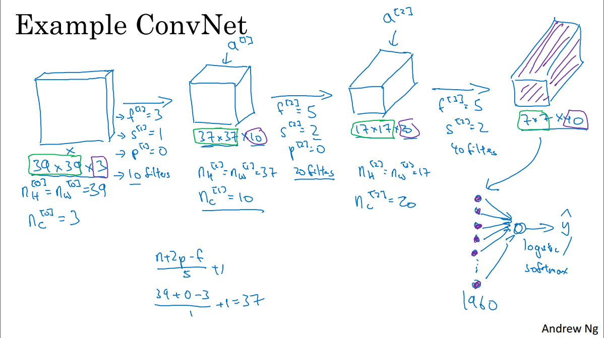
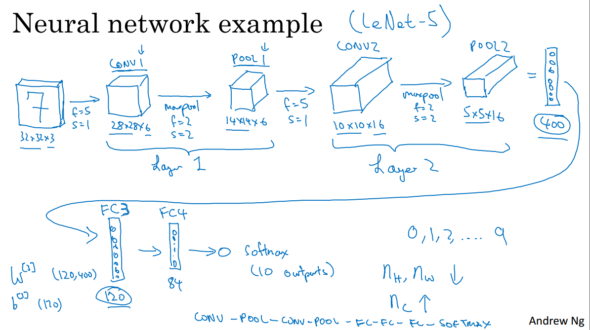
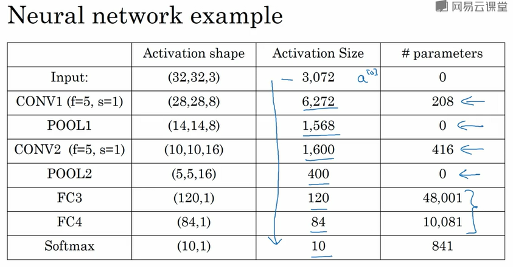

> [卷积神经网络](http://mooc.study.163.com/course/2001281004)
> 吴恩达 Andrew Ng

### Computer Vision Problems

- Image Classification
- Object Detection
- Neural Style Transfer

### Vertical edge detection

- filter (过滤器、卷积核) (通常是奇数阶)

  $\left( \begin{array}{ccc}1 & 0 & -1 \\1& 0& -1 \\1 & 0 & -1\end{array} \right)$ 垂直边缘检测

- convolution operation `*`

- bright pixels on the left and dark pixels on the right

### Padding

- $(n\times n)*(f\times f) = (n-f+1)\times (n-f+1)$ 
  - output will shrink
  - pixels in the corner are used only once, so we loss information near the edge of the image
- 解决上述两个问题的方法 —— Pad
  - with an additional border of one pixel all around the edges
  - pad with zeros by convention
  - so the output will be $(n+2p-f+1)\times (n+2p-f+1)$ 
- Valid Convolution: No paddings (p = 0)
- Same Convolution: Pad so that output size is the same as the input size
- f  通常是奇数
  - 便于 Same Convolution 的操作
  - 存在中心点 central pixel

### Strided Convolution

- 卷积步长 (stride)：每次移动的格子数
- output: $(\lfloor \frac{n-f}{s}\rfloor+1)\times (\lfloor\frac{n-f}{s}\rfloor+1)$ 
- the filter must entirely lies in the image (plus padding region)

### Cross-correlation VS. Convolution

- in mathematic, (convolution) before calculation the filter needs a flipping operation (沿副对角线的镜面翻转)
- 互相关
- in ML we usually do not use flipping operation, actually it should be cross-correlation, but by convention we call this convolution
- 卷积满足结合律

### Convolution on RGB images

- height, width, channels(depth)

- 图片和过滤器的**通道数必须相等** 

- 

- $n\times n\times n_c*f\times f\times n_c \rightarrow (n-f+1)\times (n-f+1)\times n'_c$ 

  $n_c$: number of channels;  $n'_c$: number of filters 

- detect $n'_c$ features (不同的滤波器得到不同的输出)

### Example of a layer

- add a bias (偏差) to the output, and then apply a real non-linearity (非线性激活函数)

- 参数个数的例子

  

- less prone to over fitting (避免过拟合)

- 上一层的输出作为这一层的输入

- 和普通的神经网络单层前向传播的过程类似，先输入和权重作运算，加上偏置再把得到的结果输入激活函数中，得到输出

  

- notation

  

### A simple convolution network example

- 

- Convolutional Layer (Conv) 卷积层

  Pooling Layer (Pool) 池化层

  Fully Connected Layer (FC) 全连接层

### Pooling layer

- reduce the size of representation to speed up computation and make some of the features it detects a bit more robust
- **no parameters to learn**, just a fixed function, has no weights
- 最后将池化的结果平整化为一个列向量

#### Max pooling 

- break into different regions 
- 输出每一个区域的最大值
- 最大池化的**超级参数(hyper-parameters)**：$f=2,s=2$ (often)
- usually does not use any padding
- 在某个区域提取到的特征保存在输出里
- if this feature is detected anywhere in this filter, then keep a high number
- 每个信道独立执行最大池化的计算

#### Average pooling

- 每个区域取平均得到输出
- 最大池化比平均池化更常用

### Neural network example

识别数字

- $f=2,s=2$ 使输入的高和宽减少一半

- 两类卷积的形式

  一个卷积层和一个池化层一起作为一层；或者分为单独的两层

- 一般计算网络层数时，只看具有权重的层

- 池化后的结果和全连接层的单元作笛卡尔连接？？

- not to invent your own settings of hyper parameters, but to look in the literature 

- 随着层数的增加，高度和宽度都会减少，信道数会增加

- 

- 

  参数计算有误，CONV1，应该是 (5×5×3+1)×8=608，[参考](https://www.coursera.org/learn/convolutional-neural-networks/discussions/weeks/1/threads/2ktjJuEBEee3rxJsRA6mag/replies/HSe9hwa5EeietRKRz1yqig)

  卷积层的参数较少；输出结果逐渐变少​

### Why convolution

- parameter sharing (参数共享) and sparsity of connections (稀疏连接)
- feature detector (特征检测器) 适用于整张图片
- 某一个输出之和一部分输入相关
- good at capturing translation invariance (捕捉平移不变)
- 即使移动几个像素，图片依然具有与原图相似的特征

