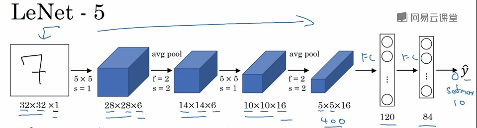
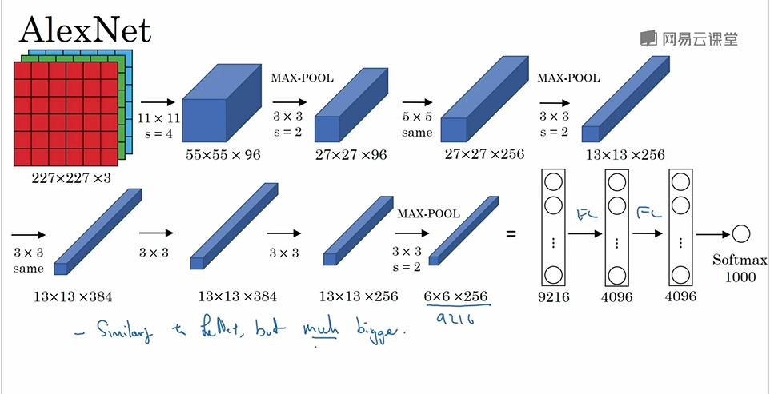
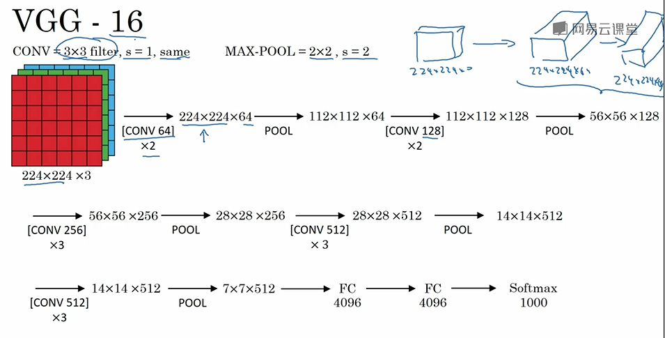
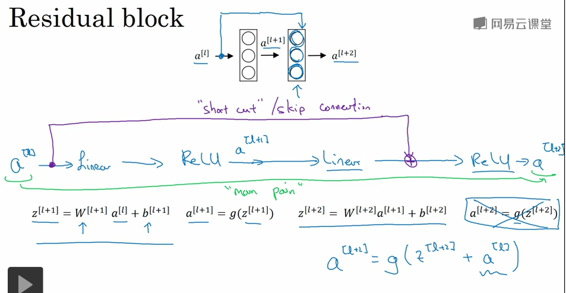
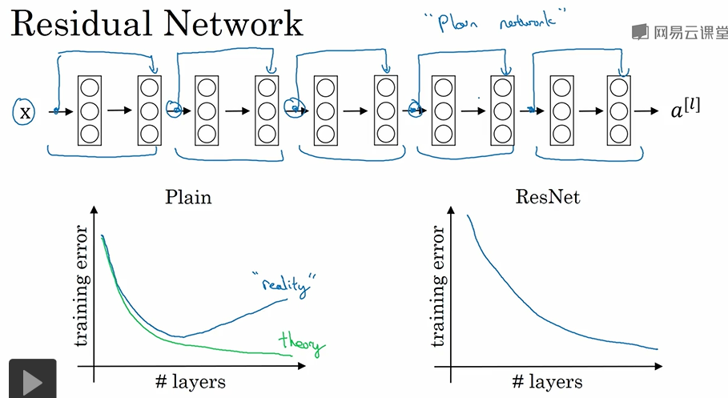
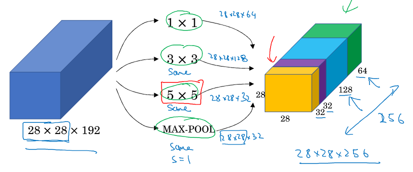
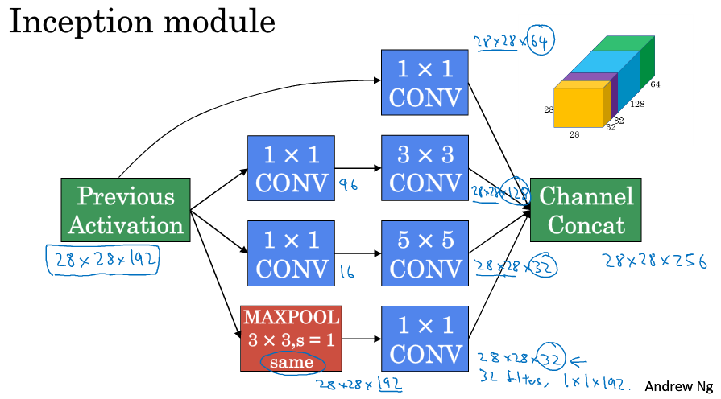
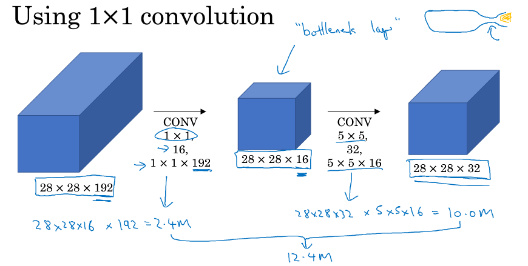

> [卷积神经网络](http://mooc.study.163.com/course/2001281004)
> 吴恩达 Andrew Ng

## 深度卷积网络：实例探究

### LeNet - 5

- Conv → Pool → Conv → Pool → FC → FC → Output 
- [LeCun et al., 1998. Gradient-based learning applied to document recognition](http://ieeexplore.ieee.org/document/726791/?reload=true&arnumber=726791) 

### AlexNet

- [Krizhevsky et al., 2012 ImageNet classification with deep convolutional neural networks](http://papers.nips.cc/paper/4824-imagenet-classification-with-deep-convolutional-neural-networks) 
- Multiple GPUs, Local Response Normalization

### VGG - 16

- 一共16 层（不算池化层）
- [Simonyan & Zisserman 2015. Very deep convolutional networks for large-scale image recognition](https://arxiv.org/abs/1409.1556) 

### ResNet 残差网络

[He et al., 2015. Deep residual networks for image recognition](https://arxiv.org/abs/1512.03385) 

#### Residual block

- shortcut/skip connection (跳远连接)

#### Residual Network

- 信息传递到更深层的网络

- 当网络层数达到一定的数目以后，网络的性能就会饱和，再增加网络的性能就会开始退化，但是这种退化并不是由过拟合引起的，因为实验发现训练精度和测试精度都在下降，这说明当**网络变得很深以后，深度网络就变得难以训练了** 

  The main benefit of a very deep network is that it can represent very complex functions. It can also learn features at many different levels of abstraction, from edges (at the lower layers) to very complex features (at the deeper layers). However, using a deeper network doesn't always help. A huge barrier to training them is vanishing gradients: very deep networks often have a gradient signal that goes to zero quickly, thus making gradient descent unbearably slow. More specifically, during gradient descent, as you backprop from the final layer back to the first layer, you are multiplying by the weight matrix on each step, and thus the gradient can decrease exponentially quickly to zero (or, in rare cases, grow exponentially quickly and "explode" to take very large values).

- 有利于解决梯度消失和梯度爆炸 (vanish and explode gradient)

- 多用于训练深度网络

#### Why do residual networks work?

- 残差块学习恒等函数 (identity function) 很容易，不会降低网络效率
- same convolution ($z^{[l+2]}+a^{[l]}$ make sense)

### 1×1 convolution

- the number of channel
- Network in Network
- 降低信道数量 (shrink $n_c$)，或者增加、不变
- 给网络添加了一个非线性函数

### Inception Network

- inception module

  

- 由网络决定使用多大的过滤器，怎样的组合

- computational cost

- bottleneck layer 瓶颈层

  

- Szegedy et al., 2014, Going Deeper with Convolutions

- GooLeNet

### Transfer Learning 迁移学习

- use someone else's pre-trained weighs
- freeze all of the earlier layers' weight
- more data, the smaller layers you freeze

### Data Augmentation

- Morroring operation (镜像对称)
- Random Cropping (随机裁剪)
- Color Shifting (颜色变换)
- PCA Color Augmentation

### The State of Computer Vision

- less data, more hand-engineering 

- lots of data, simple algorithms and little hand-engineering

- Two sources of knowledge: Labeled data, Hand engineered features/network architecture/other components

- Tips

  - Train several networks independently and average their outputs
  - Run classifier on multiple versions of test images and average results (10-crop)
  - Use architectures of networks published in the literature,  open source implementations, pretrained models

  

