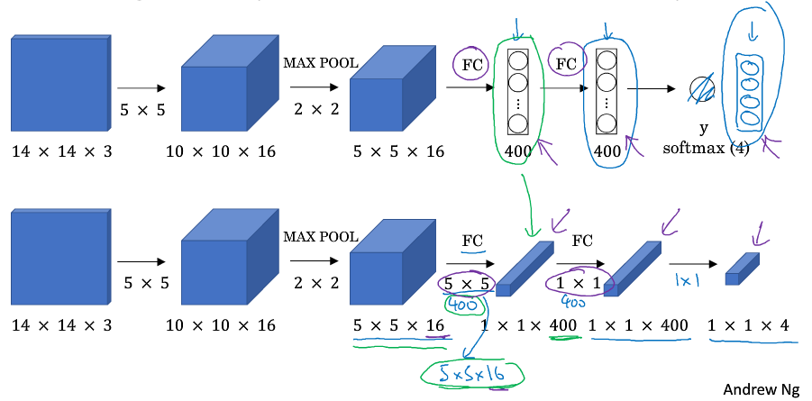

> [卷积神经网络](http://mooc.study.163.com/course/2001281004)
> 吴恩达 Andrew Ng

# 目标检测 Detection algorithms

## 目标定位 Object Localization

- Classification with localization 分类并且确定目标位置（一个物体）

  

- Detection 定位（多个物体）

- target label y 

  

## 特征点检测 Landmark Detection

- 设置特征点坐标值作为输出
- 所有标签在图片中保持一致 labels are consistent across different images

## 目标检测 Object Detection

- Sliding windows detection 滑动窗口检测
  - 固定步幅，滑动窗口，遍历图像的每个区域
  - 裁剪后的图像输入卷积网络，对每个位置进行分类
  - 卷积网络进行单个分类的计算成本很高
- granularity 粒度，stride 步幅

## Convolutional Implementation of Sliding Windows

- Turing FC layer into convolutional layers 

  

- Convolution implementation of sliding windows 

  

- [OverFeat: Integrated Recognition, Localization and Detection using Convolutional Networks](https://arxiv.org/abs/1312.6229) 

## Bounding Box Predictions

- YOLO algorithm (You Only Look Once), more accuracy bounding box
- assign an object to grid cell which contains the mid point of the object
- [You Only Look Once: Unified, Real-Time Object Detection](https://arxiv.org/abs/1506.02640)

## 交并比 Intersection Over Union 

- 衡量定位精确度的一种方式 
- 交集除以并集
- a measure of the overlap between two bounding boxes

## 非极大值抑制 Non-max Suppression

- output maximal probabilities classifications
- suppress closed and non-maximal ones
- 把其他与最大概率的边界框有高交并比的边界框抑制掉
- 

## Anchor Boxes

- 一个格子中检测两个物体
- Each object in training image is assigned to grid cell that contains object's midpoint and anchor box for the grid cell with highest IoU
- 两个物体的中心的位于同一个格子概率很小
- 人工选择 Anchor Box 的形状来配合需要检测的物体
- 通过 k-means algorithm 聚类，选择合适的形状

## YOLO Algorithm

### Training 

### Making predictions 

### Output the non-max supressed outputs 

## 候选区域 Region Proposals

- Regions with Convolutional Neural Network **[R-CNN](https://arxiv.org/abs/1311.2524)** 
- 选出一些格子，在其上运行卷积网络
- segmentation algorithm 分割算法，选出色块
- [Fast R-CNN](https://arxiv.org/abs/1504.08083)、[Faster R-CNN](https://arxiv.org/abs/1506.01497) 