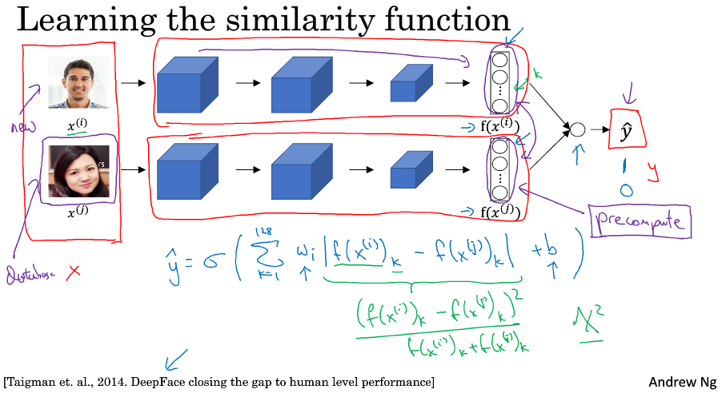
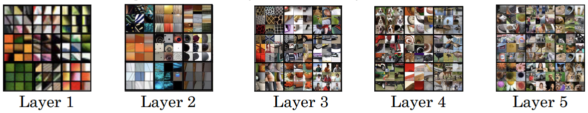
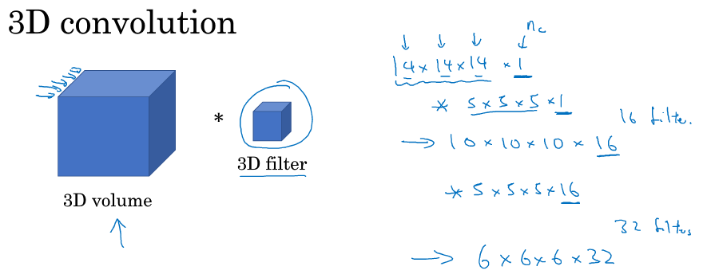

> [卷积神经网络](http://mooc.study.163.com/course/2001281004)
> 吴恩达 Andrew Ng

# 人脸识别和神经风格转换 Face recognition & Neural style transfer

## Face Recognition

### What is face recognition?

#### Verification 验证

- Input image, name/ID
- Output whether the input image is that of the claimed person
- "is this the claimed person?"

#### Recognition 识别

- Has a database of K persons
- Get an input image
- Output ID if the image is any of the K persons (or “not recognized”)
- "who is this person?"

### One Shot Learning

- learn from one example to recognize the person again
- 一个类别只有一个样本供学习
- learn a similarity function, 输入两张照片，判断其相似度

### Siamese Network

- 图片输入一个卷积网络，输出一个特征向量，作为该图片的编码

- parameters of neural network define an encoding $f(x^{(i)})$ 

- DeepFace: Closing the Gap to Human-Level Performance in Face Verification

- [FaceNet: A Unified Embedding for Face Recognition and Clustering](https://arxiv.org/abs/1503.03832)

  FaceNet learns a neural network that encodes a face image into a vector of 128 numbers.

### Triplet Loss

- anchor (原图)，positive image(同一个人)，negative image(不同的人)

- margin 间隔

  - 防止学习到的参数为全零
  - 使得 A和P、A和N 的差距变大

- triplet loss function is defined on triples of images

- $\mathcal L(A,P,N)=max(\Vert f(A)-f(P)\Vert ^2-\Vert f(A)-f(N)\Vert ^2+\alpha,0)$ 

  $\mathcal J=\sum \mathcal L(A^{(i)},P^{(i)},N^{(i)})$ 

- if A, P, N are chosen randomly, $d(A,P)+\alpha \leq d(A,N)$ 

- 一般情况下不同人的照片差距就比同一人照片的大

### Face Verification and Binary Classification

-  两个图片一组，输出0/1，表示不相同/相同
-  预先计算 encoding 的值，下次需要比对时不必再通过卷积网络计算
-  

## Neural Style Transfer

### What is neural style transfer?

- 神经风格转换
- **C**ontent, **S**tyle, **G**enerated image

### What are deep ConvNets learning?

Visualizing deep layers

- 第一层的隐藏单元通常会找一些简单的特征，比如边缘、颜色、阴影等
- 第二层似乎检测到更复杂的形状和模式
- 第三层明显检测到更复杂的模式
- 第四层检测到的模式和特征更加复杂

### Cost Function

- $J(G)=\alpha J_{Content}(C,G)+\beta J_{Style}(S,G)$ 
- Initiate G randomly 
- Use gradient descent to minimize J(G)

### Content Cost Function

- use hidden layer l to compute content cost
- let $a^{[l](C)}$ and $a^{[l](G)}$ be the actication of layer l on the images 
- if $a^{[l](C)}$ and $a^{[l](G)}$ are similar, both images have similar content
- $J_{Content}(C,G)=\Vert a^{[l](C)}-a^{[l](G)}\Vert ^2$ 

### Style Cost Function

- $G^{[l]}_{kk^{'}}=\sum ^{n_{H}^{[l]}}_{i=1}\sum ^{n_{W}^{[l]}}_{j=1} a^{[l]}_{i,j,k} a^{[l]}_{i,j,k^{'}}$ 
- $J^{[l]}_{Style}(S,G)=\sum ^{n_{C}^{[l]}}_{k=1}\sum ^{n_{C}^{[l]}}_{k^{'}=1}(G^{[l](S)}_{kk^{'}}-G^{[l](G)}_{kk^{'}})$ 
- $J_{Style}(S,G)=\sum _l \lambda ^{[l]}J^{[l]}_{Style}(S,G)$ 

### 1D and 3D Generalizations

3D Convolution 

