> [序列模型](http://mooc.study.163.com/course/2001280005)
> 吴恩达 Andrew Ng

# Recurrent Neural Networks

## Why sequence models

**Examples** 

Speech recognition, Music generation, Sentiment classification, DNA sequence analysis, Machine translation, Video activity recognition, Name entity recognition

## Notation

- $X^{(i)<t>}:$ 第i个输入样本的第t个元素
- $T^{(i)}_X:$ 第i个输入样本的长度
- 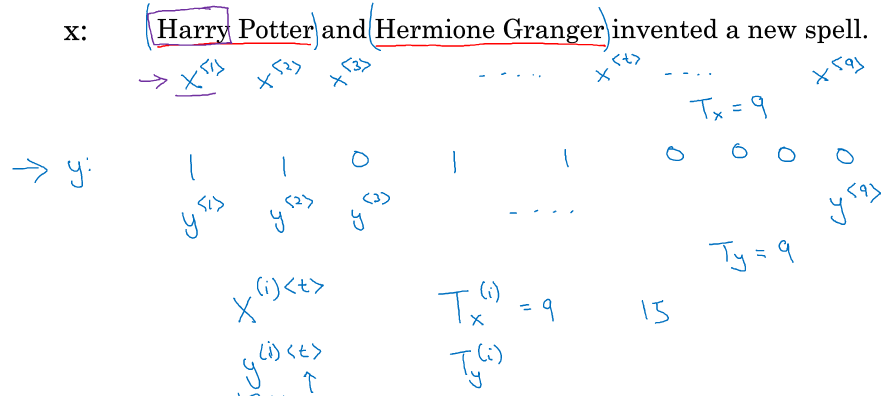
- 建立字典（单词的列向量），使用one-hot表示单词位置
- UNK: unknown word, 表示不在字典里的词
- 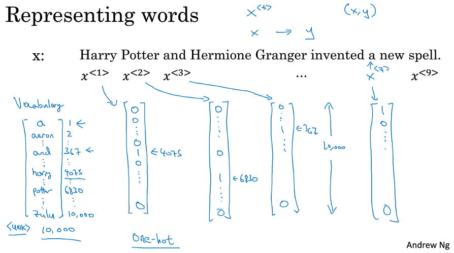

## Recurrent Neural Network Model

- Inputs and outputs can be different lengths in different examples

  每个样本的输入输出维度不固定

- at each time-step, RNN passes on activation to the next time-step

- 从左到右依次扫描参数

- 每个时间步采用的是相同的参数$W_{ax},W_{aa},W_{ya}$ 

- 只使用了之前的信息来做出预测

- BRNN，双向循环神经网络

- $a^{<0>}=\bf 0$ , $a^{<1>}=g_1(W_{aa}a^{<0>}+W_{ax}x^{<1>}+b_a)$ , $\hat y^{<1>}=g_2(W_{ya}a^{<1>}+b_y)$ 

- 激活函数 $g_1$常用 $tanh$ ，$g_2$常用 $sigmoid, softmax$ 

- 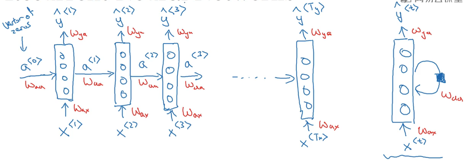

  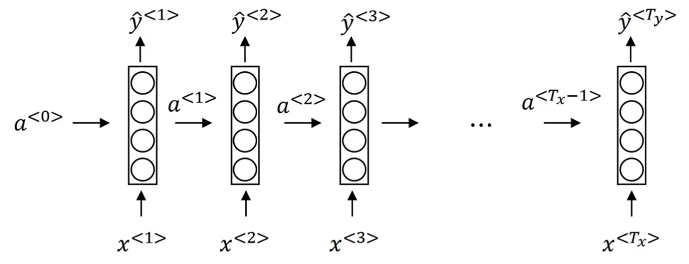

## Backpropagation through time

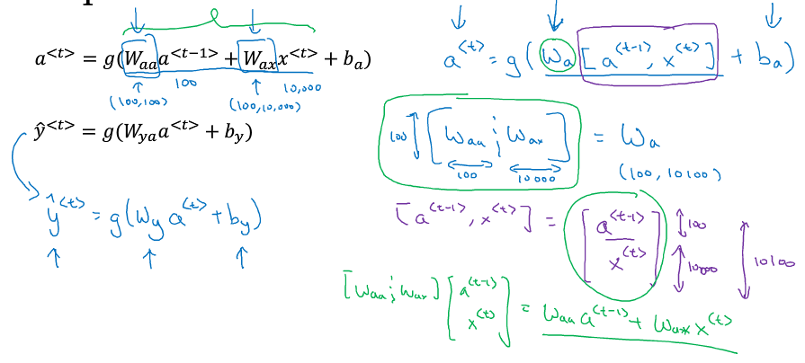

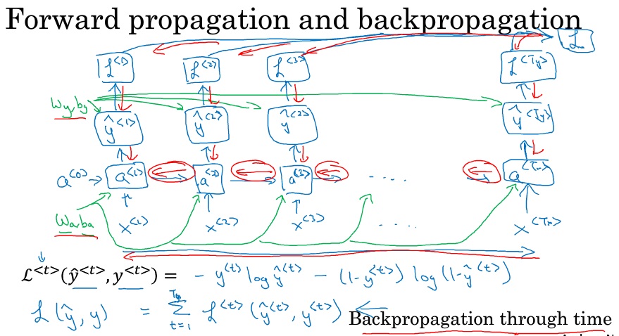

## Different types of RNNs

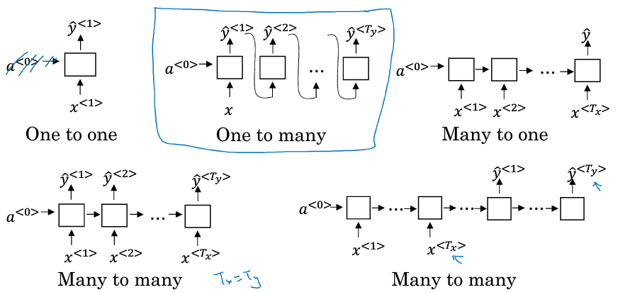

## Language model and sequence generation

- corpus 语料库、tokenize 标记、End Of Sentence

- $\hat y^{<1>}$ 输出第一个词是XX的概率

  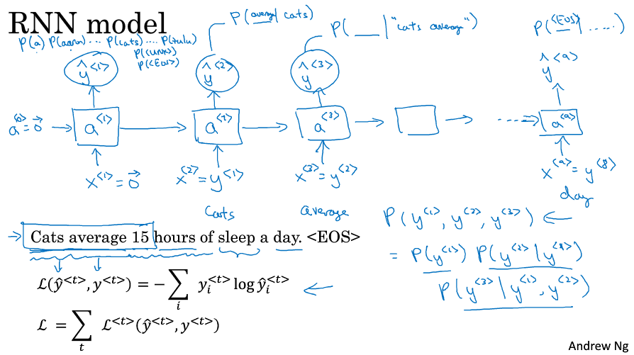

- 给定前面的词，预测下一个词是什么

## Sampling novel sequences 新序列采样

- 训练一个序列模型之后，要想了解到这个模型学到了什么，一种非正式的方法就是进行一次新序列采样

- character language model, word level language model

- 基于词汇的语言模型可以捕捉长范围的关系，基于字符的语言模型略逊一筹，并且训练成本比较高昂

- 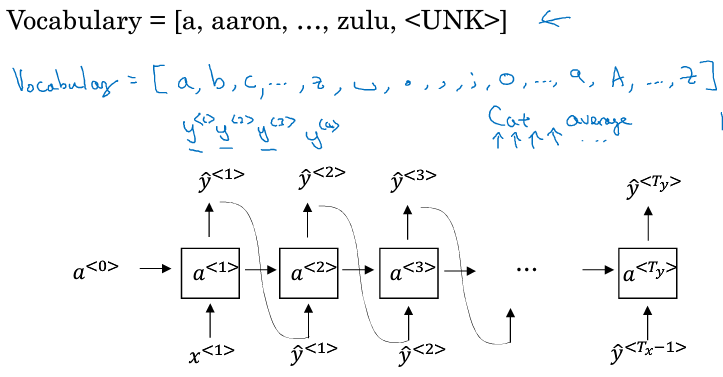

  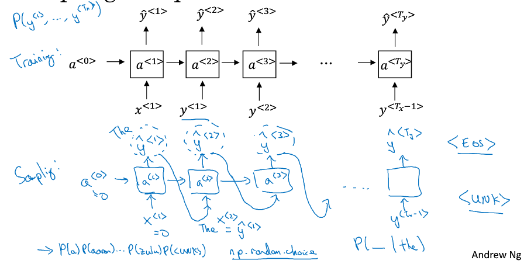

## Vanishing gradients with RNNs

- The basic RNN models are not good at capturing very long-term dependency.
- local influences 局部影响
- gradient clipping 梯度修剪，用于解决梯度爆炸，大于某个值时就进行缩放

## Gated Recurrent Unit (GRU) 门控循环单元

- c, memory cell, $\tilde c^{<t>}=\tanh (W_c [c^{<t-1>},x^{<t>}]+b_c)$ , $c^{<t>}=x^{<t>}$ 

- $\Gamma _u=\sigma (W_u [c^{<t-1>},x^{<t>}]+b_u)$ , update gate, this gate value is between 0 and 1

- gate decides when to update c, $c^{<t>}=\Gamma _u * \tilde c^{<t>}+ (1-\Gamma _u)*c^{<t-1>}$ , element-wise multiplication

- 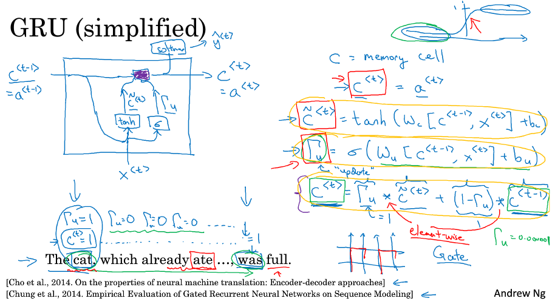

  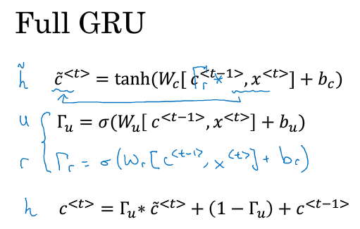

  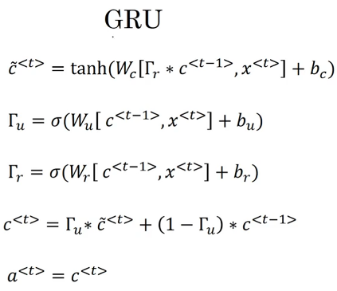

## Long Short Term Memory (LSTM) 长短期记忆

- update, forget, output

  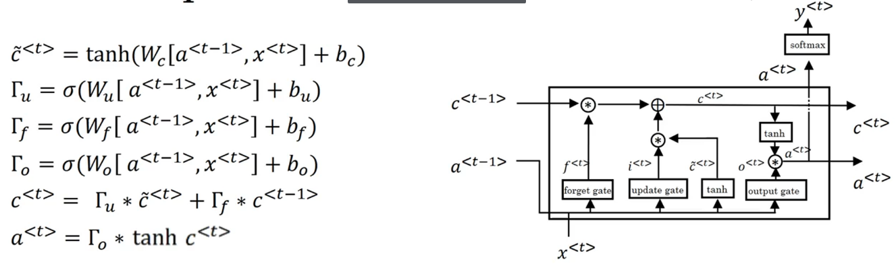

- peephole connection 窥探孔连接

  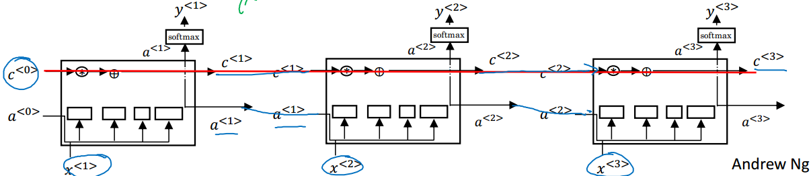

## Bidirectional RNN

- combine information from the past, the present and the future

- 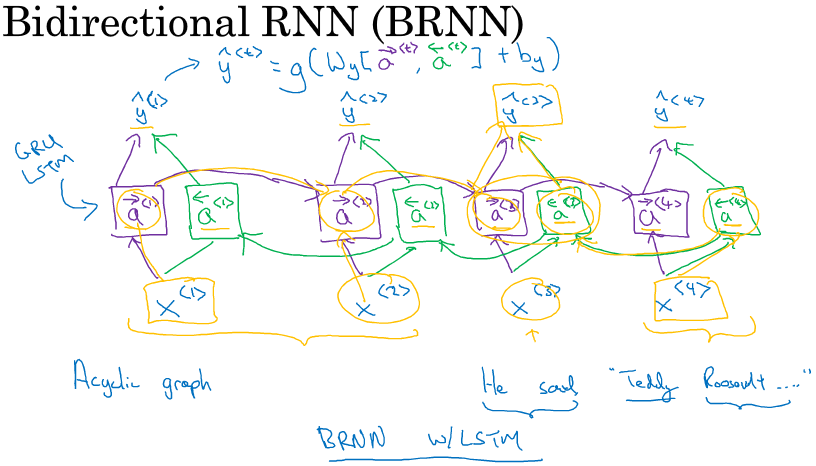

  图中的前向传播一部分计算是从左到右，一部分计算是从右到左

- 对于大量自然语言处理问题，LSTM 单元的双向 RNN 模型是用的最多的

- need the entire sequence of data before making predictions

## Deep RNNs

$a^{[l]<t>}:$ layer l, at time t, activation value

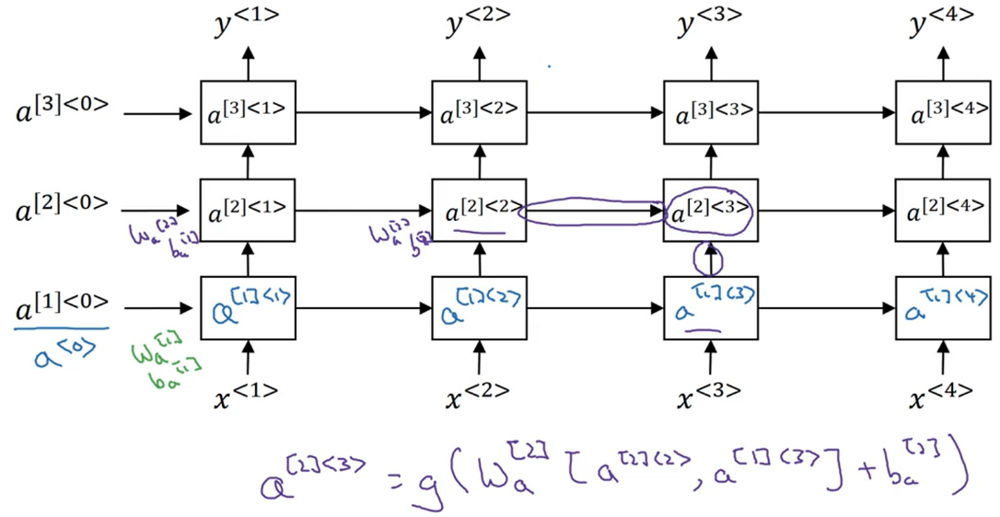