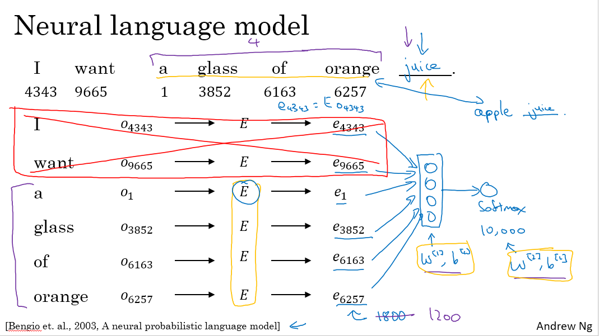
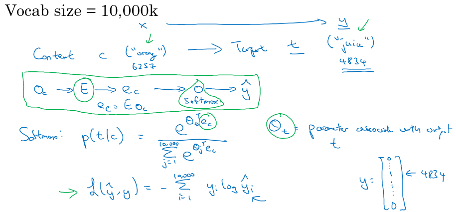
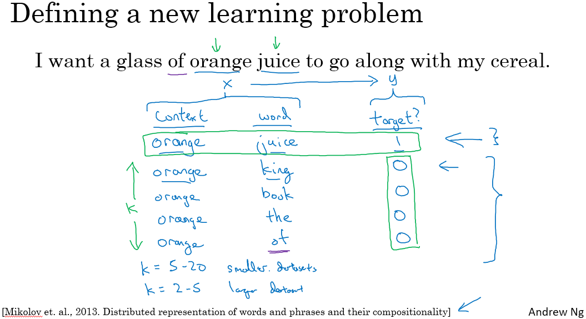
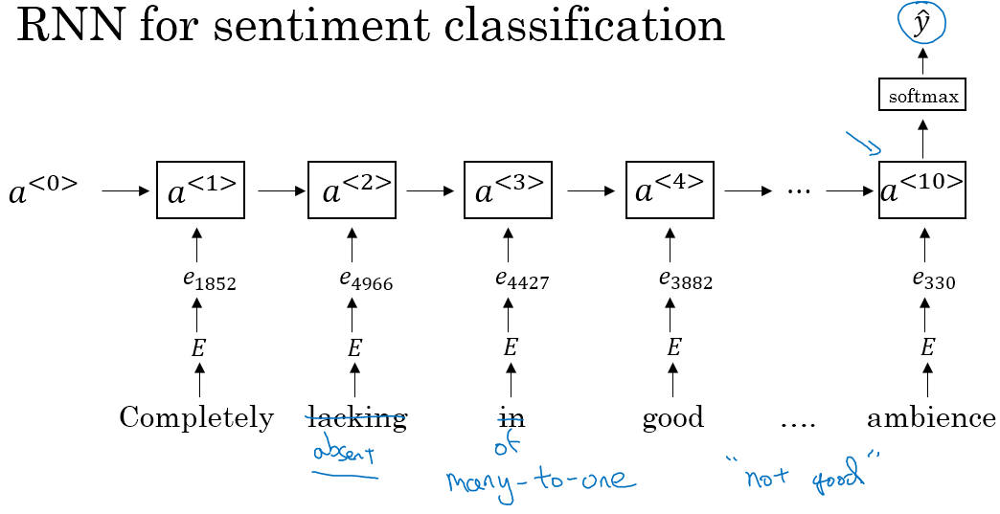

> [序列模型](http://mooc.study.163.com/course/2001280005)
> 吴恩达 Andrew Ng

# Natural Language Processing & Word Embeddings

## Introduction to Word Embeddings

### Word Representation 词汇表征

- 1-hot representation
  - 词是孤立的，之间没有关联
  - 任意两个词向量的内积为0
  - 相关词的泛化能力不强
- fearurized representation - word embedding 词嵌入
  - 一个单词用多个特征组成的向量来表示 more dense vector
  - t-SNE算法用于可视化，把高维向量映射到低维空间

### Using word embeddings

- Learn word embeddings from large text corpus.
- Transfer embedding to new task with smaller training set.
- Continue to finetune the word embeddings with new data. (optional)
- 每一个词汇表的单词的固定嵌入，学习一个固定的编码
- 人脸识别中的算法可能涉及到海量的人脸照片，而自然语言处理有一个固定的词汇表，一些没有出现过的单词记为未知单词

### Properties of word embeddings

- analogies using word vector 类比
- 余弦相似度 cosine similarity, $sim({\bf u}, {\bf v})=\frac{\bf u^T \bf v}{\Vert \bf u\Vert _2\Vert\bf v\Vert _2}$ 
- 需要足够大的语料库

### Embedding matrix

- $E \cdot o_i = e_i$ 可提取某一单词的嵌入向量
- 在实践中使用一个专门的函数来单独查找矩阵𝐸的某列，而不是用通常的矩阵乘法来做

## Learning Word Embeddings: Word2vec & GloVe

### Learning word embeddings

- fixed historical window 只看前n个单词来预测下一个

- netural language model

  

### Word2Vec

- skip-gram: 根据 context word 预测 target word

  

  $\theta_t:$ parameter associate with output t

- 用附近的一个单词作为上下文

- hierarchical softmax classifier 分级softmax分类器，加速分类

- 目标词分布并不是单纯的在训练集语料库上均匀且随机的采样得到的，而是采用了不同的分级，来平衡常见的词和不常见的词

- CBOW 连续词袋模型(Continuous Bag-Of-Words Model)是从原始语句推测目标字词；Skip-Gram 正好相反，是从目标字词推测出原始语句

### Negative Sampling 负采样

- context word, target word, label

- 从字典中随机选取其他的词，标记为负样本

  

- 转换为二分类问题

### GloVe word vectors

- global vectors for word representation
- $X_{ij}$ is a count that captures how often do words i and j appear close to each other
- 

## Applications using Word Embeddings

### Sentiment Classification 情感分类

- 取平均就忽略了语序

  

- RNN

  

### Debiasing word embeddings 词嵌入除偏

- SVD singular value decomposition 奇异值分解