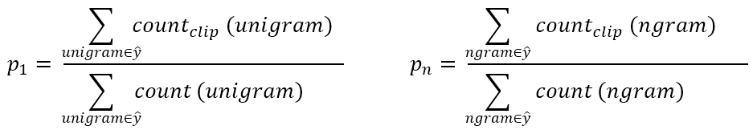

> [序列模型](http://mooc.study.163.com/course/2001280005)
> 吴恩达 Andrew Ng

# Sequence models & Attention mechanism

## Various sequence to sequence architectures

### Basic Models

- sequence to sequence model

  

- image captioning 图像描述

  

### Picking the most likely sentence

- condition language model

  

- just pick one word at a time (greedy search) is not always optimal

- approximate search algorithm

### Beam Search 集束搜索

- coalition 编码，decodlition 解码

- beam width (B)集束宽，候选词的个数

- record top B possiblities of sentences

- 步骤

  

  

  

### Refinements to Beam Search

- $ \frac{1}{T_y^\alpha}\sum^{T_y}_{y=1}\log P(y^{<t>}\vert x,y^{<1>},\cdots,y^{<t-1>})$ 

  - length normalization 长度归一化

    

  - numerical underflow 数值下溢，rounding error 四舍五入的误差

  - $\alpha$ 是超参数

  - normalized log likelihood objective 归一化的对数似然目标函数

- large B: better result but computationally slower

- small B: worse result but faster

- Beam Search is not guaranteed to find exact maximum for $arg \max _y P(y\vert x)$ 

### Bleu Score (optional)

- give a score to measure how good is the machine translation

- Bleu score on unigrams (一元词组), bigrams (二元词组)

- BP: brevity penalty 简短惩罚

  

- single real number evaluation metric 单一实数评估指标

  

### Attention Model Intuition （注意力模型）

- 神经网络很难记忆长句子
- 一部分一部分来机器翻译
- 

### Attention Model

## Speech recognition - Audio data

### Speech recognition

- false blank outputs 伪空白输出

- phonemes, hand-engineered basic units of cells

- end-to-end network, input an audio clip and directly output a transcript

- Connectionist Temporal Classification cost function

  collapse repeated characters not separated by "blank"

### Trigger Word Detection 触发字检测

label

## Conclusion

### Conclusion and thank you

Make the world a better place.