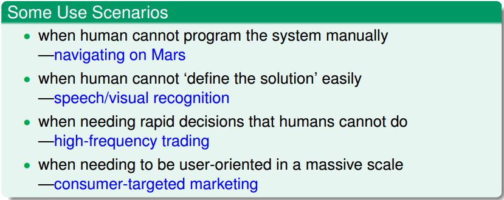
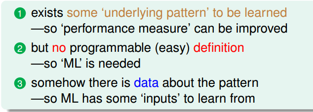
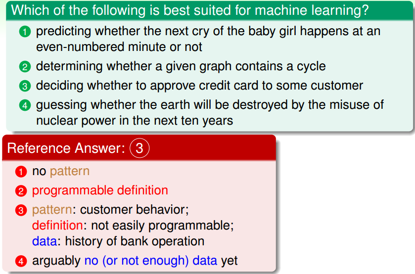
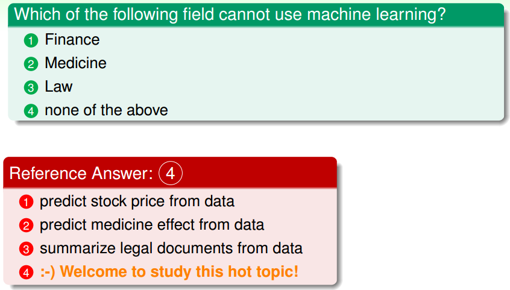
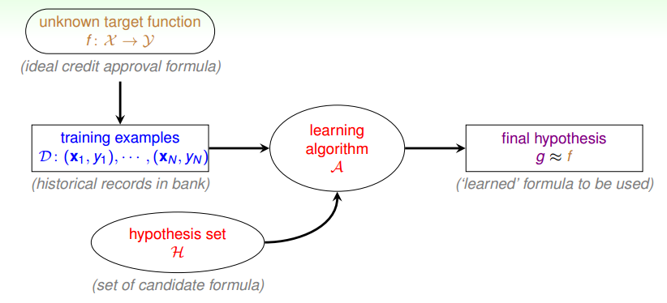

> [机器学习基石上](https://www.coursera.org/learn/ntumlone-mathematicalfoundations) (Machine Learning Foundations)---Mathematical Foundations
> [Hsuan-Tien Lin, 林轩田](https://www.coursera.org/instructor/htlin)，副教授 (Associate Professor)，资讯工程学系 (Computer Science and Information Engineering)

## What Is Machine Learning

- observation → learning → skill
- data → ML → skill
- skill ↔ improve some **performance measure**
- machine learning: improve some **performance measure** with experience **computed** from **data**
- ML: an alternative route to build complicated system
  - some use scenarios 
    

### Key Essence of Machine Learning

- 具有潜在的模式
- 不能简单的编写出来程序
- 大量的数据

  

### Examples

## Applications of Machine Learning

- Food, Housing, Transport. Clothes. Education, Entertainment
- Learn our performances
- Examples
  

## Components of Machine Learning

- input: $x\in \mathcal X$ 

- output: $y\in \mathcal Y$ 

- unknown pattern to be learnt (target function): $f:\mathcal X \rightarrow \mathcal Y$ 

- data (training examples): $\mathcal D=\{(x_1,y_1),(x_2,y_2),...,(x_N,y_N) \}$ 

- hypothesis (skill with hopefully good performance): $g:\mathcal X \rightarrow \mathcal Y$ 

- $\{(x_n,y_n) \} \ from\ f \rightarrow ML \rightarrow g$ , $f$ 是真正的模式，但学不到，$g$ 是学习之后给出的模式

- 学习过程

  

  - $f$ is unknown (no programmable definition)
  - 希望 $g$ 和 $f$ 尽量接近（假设函数和目标函数）
  - assume $g\in \mathcal H = \{h_k \}$, hypothesis set $\mathcal H$ can contain **good or bad** hypotheses
  - learning algorithm $\mathcal A$ to pick the 'best' one as $g$ 

- machine learning: use **data** to compute **hypothesis $g$** that approximates **target $f$** 

## Machine Learning and Other Fields

### Machine Learning and Data Mining

- 资料勘探即数据挖掘 (Data Mining)

  use huge data to find property that is interesting

- if 'interesting  property' **same as** 'hypothesis that approximate target' —— **ML = DM** 

- if 'interesting  property' **related to** 'hypothesis that approximate target' —— **DM can help ML, and vice versa** (but not always)

- traditional DM also focuses on **efficient computation in large database** 

### Machine Learning and Artificial Intelligence

- 人工智能 (Artificial Intelligence)

  compute **something** that shows **intelligent behavior** 

- ML is **one possible route** to realize AI (机器学习是实现人工智能的一种方法)

- $g\approx f$ is something that shows intelligent behavior 

### Machine Learning and Statistics

- 统计学 (Statistics)

  use data to make **inference(推断)** about an unknown process

- $g$ is an inference outcome while $f$ is something unknown

- statistics can be used to achieve ML (统计是实现机器学习的一种方法)

- traditional statistics also focus on provable results with **math assumptions** (侧重数学上的推论), and care less about computation

- In statistics, there are many useful **tools** for ML