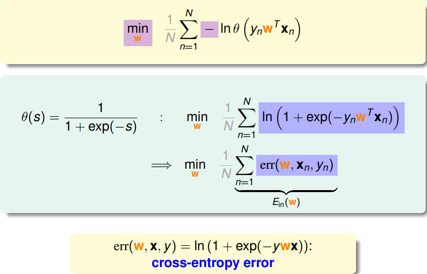

> [机器学习基石下](https://www.coursera.org/learn/ntumlone-algorithmicfoundations) (Machine Learning Foundations)---Mathematical Foundations
> [Hsuan-Tien Lin, 林轩田](https://www.coursera.org/instructor/htlin)，副教授 (Associate Professor)，资讯工程学系 (Computer Science and Information Engineering)

# Logistic Regression

## Logistic Regression Problem

- logistic hypothesis: $h(\mathbf x)=\theta (\mathbf w^T \mathbf x)$ 

- logistic function $\theta (s)=\frac{1}{1+e^{-s}}$ 

- $sign(h(\mathbf x)-0.5)=sign(\mathbf w^T \mathbf x)$ 

## Logistic Regression Error

- Likelihood of Logistic Hypothesis

  

  极大似然

- cross-entropy error

  

  在极大似然估计下，logistic方程的误差函数

## Gradient of Logistic Regression Error

- Minimizing $E_{in}(\mathbf w)$ 

  

- PLA Revisited: Iterative Optimization

  

## Gradient Descent

- Linear Approximation

  

- Simple Heuristic for Changing $\eta$ 

  

- Logistic Regression Algorithm

  