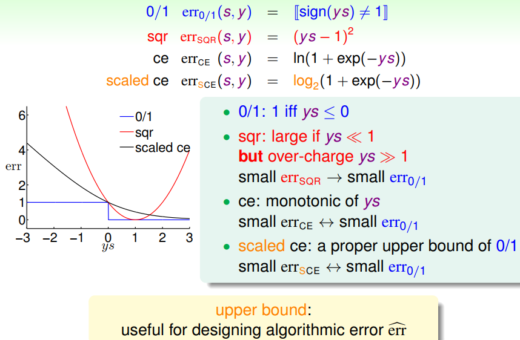
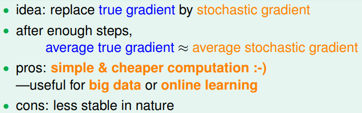
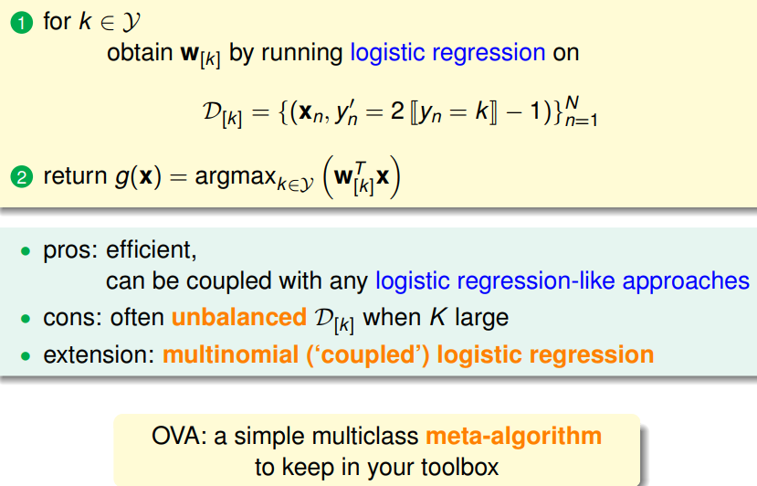
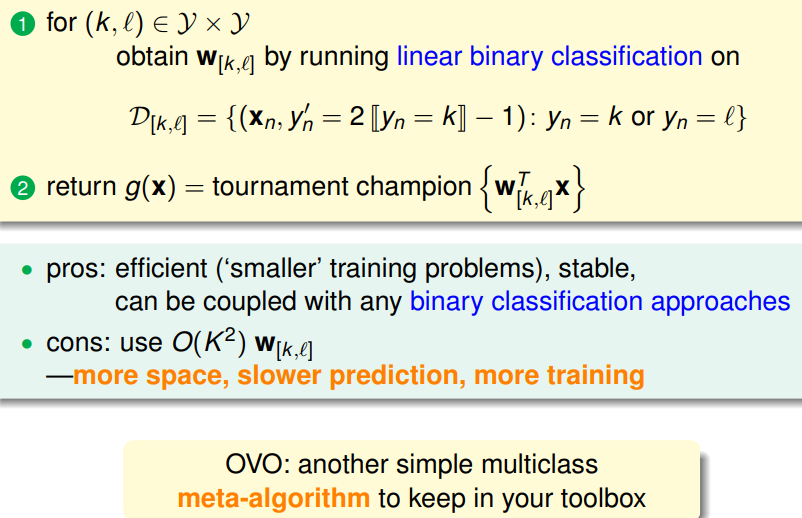

> [机器学习基石下](https://www.coursera.org/learn/ntumlone-algorithmicfoundations) (Machine Learning Foundations)---Mathematical Foundations
> [Hsuan-Tien Lin, 林轩田](https://www.coursera.org/instructor/htlin)，副教授 (Associate Professor)，资讯工程学系 (Computer Science and Information Engineering)

# Linear Models for Classification

## Linear Models for Binary Classification

- $ys$: classification correctness score 分类正确性分数

- Visualizing Error Functions

  

- $small\ E^{CE}_{in} (\mathbf w) \Rightarrow  small\ E_{out}^{0/1}(\mathbf w)$ 

  logistic/linear reg. for linear classification

- linear regression sometimes used to set $\mathbf w_0$ for PLA/pocket/logistic regression

- logistic regression often preferred over pocket

## Stochastic Gradient Descent

- stochastic gradient = true gradient + zero-mean ‘noise’ directions
- 
- two practical rule-of-thumb:
  - stopping condition? t large enough
  - $η$? 0.1 when x in proper range

## Multiclass via Logistic Regression

- One Class at a Time Softly 属于某个类别的概率

- One-Versus-All (OVA) Decomposition

  

## Multiclass via Binary Classification

One-versus-one (OVO) Decomposition

voting of classifiers