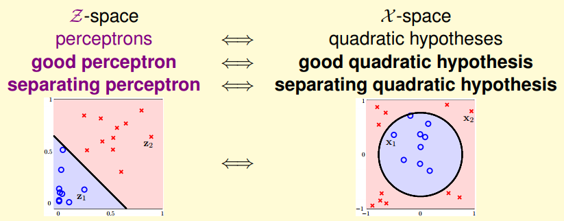
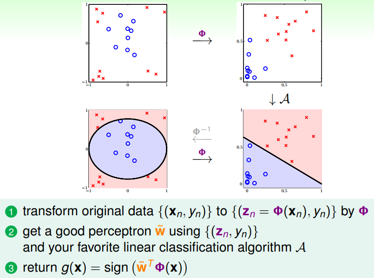
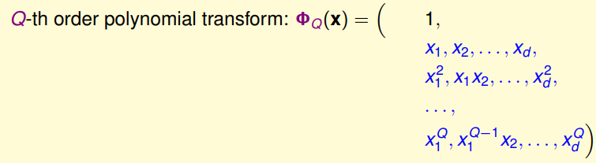
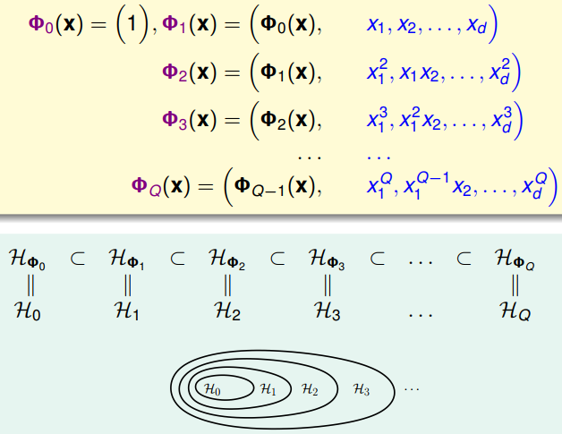
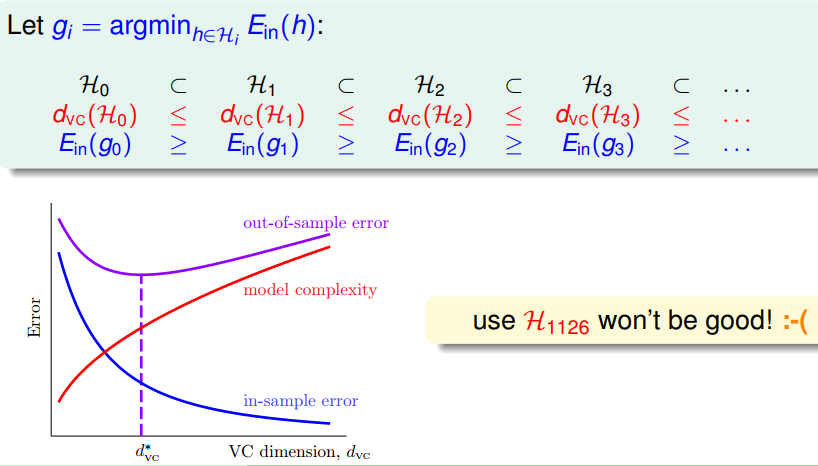
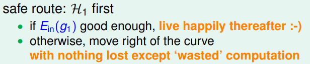

> [机器学习基石下](https://www.coursera.org/learn/ntumlone-algorithmicfoundations) (Machine Learning Foundations)---Mathematical Foundations
> [Hsuan-Tien Lin, 林轩田](https://www.coursera.org/instructor/htlin)，副教授 (Associate Professor)，资讯工程学系 (Computer Science and Information Engineering)

# Nonlinear Transformation

## Quadratic Hypotheses

- circular separable 圆圈可分

- feature transform

  

- perceptrons  in $\mathcal Z$-space $\Longleftrightarrow$ quadratic hypotheses in $\mathcal X$-space

## Nonlinear Transform

- The Nonlinear Transform Steps

  

- linear model $\mathcal A$ , not just binary classification

## Price of Nonlinear Transform

- Q次多项式转换

  

- d维数据，转换的Q次项有$C_{Q+d}^d$个

  - Q次项的数量级最大，小于Q次的项达不到这个量级
  - $x_1+x_2+...+x_d=Q$，非负数解的个数
  - 变换后自由度变的很大

- careful about your brain’s ‘model complexity’ 

  human learning 加到模型上去，造成模型不错的错觉

## Structured Hypothesis Sets

- structure: nested $\mathcal H_i$ 

  

- Structured Hypothesis Sets

  

- safe route

  

- linear model: simple, efficient, safe, and workable!