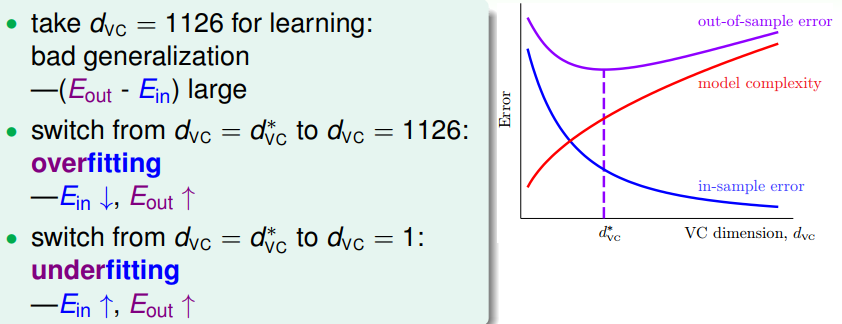
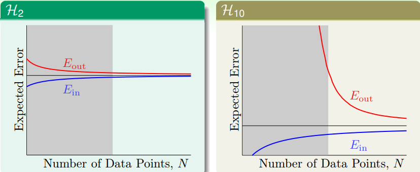
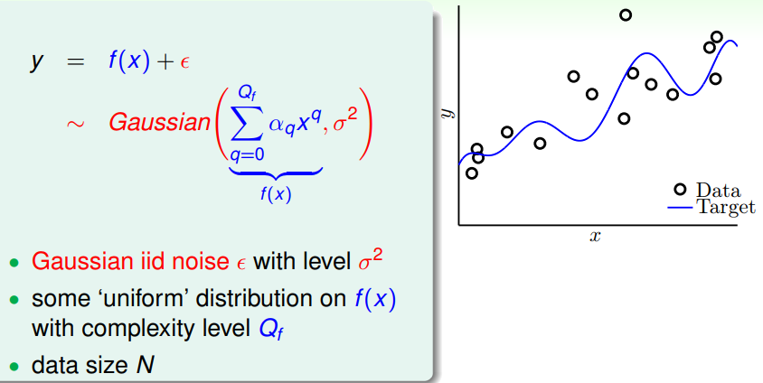
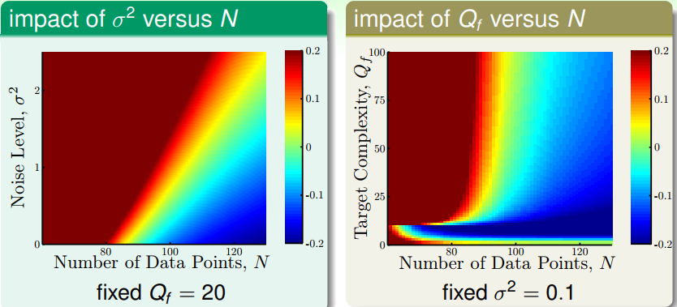
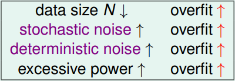
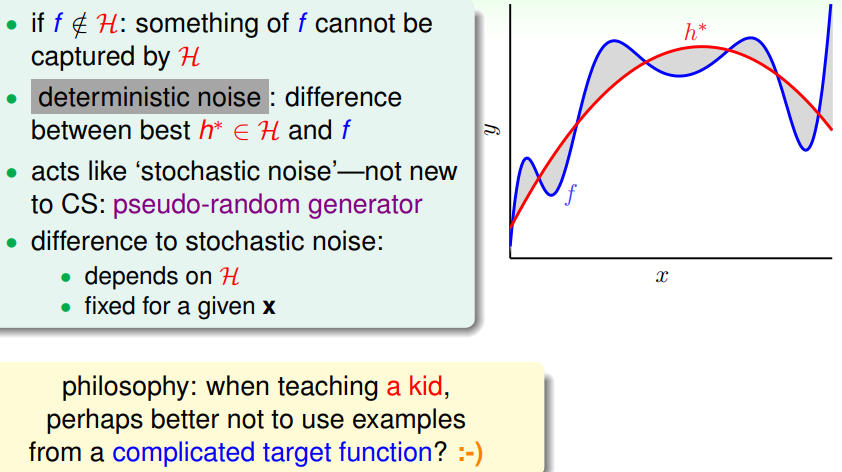
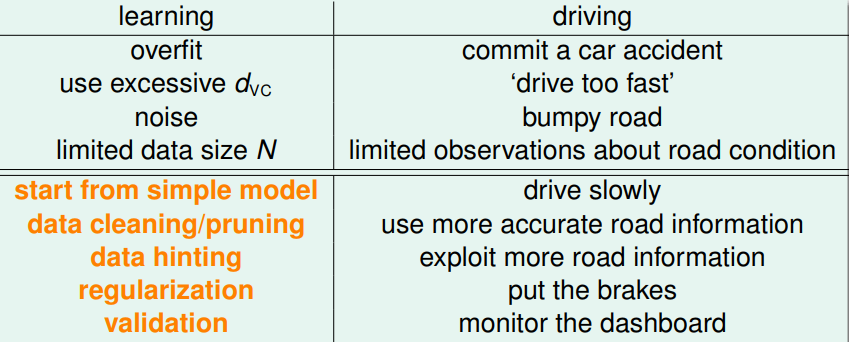

> [机器学习基石下](https://www.coursera.org/learn/ntumlone-algorithmicfoundations) (Machine Learning Foundations)---Mathematical Foundations
> [Hsuan-Tien Lin, 林轩田](https://www.coursera.org/instructor/htlin)，副教授 (Associate Professor)，资讯工程学系 (Computer Science and Information Engineering)

# Hazard of Overfitting

## What is Overfitting?

- bad generalization: low $E_{in}$, high $E_{out}$ 

- example

  

- Cause of Overfitting

  - excessive $d_{VC}$ 
  - noise
  - limited data size

## The Role of Noise and Data Size

- concession for advantage

- Learning Curves Revisited

  

- ‘target complexity’ acts like noise

## Deterministic Noise

- A Detailed Experiment

  

- The Results

  

  - impact of $σ^2$ versus N: stochastic noise
  - impact of $Q_f$ versus N: deterministic noise

- four reasons of serious overfitting

  

  overfitting ‘easily’ happens

- Deterministic Noise

  

  pseudo-random generator 伪随机数发生器

## Dealing with Overfitting

Driving Analogy Revisited

- correct the label (data cleaning)
- remove the example (data pruning)
- add virtual examples by shifting/rotating the given digits (data hinting)

possibly helps, but effect varies (改变数据的分布)