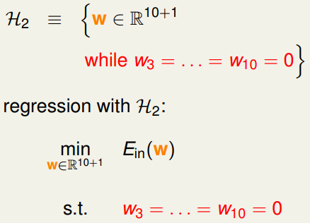

> [机器学习基石下](https://www.coursera.org/learn/ntumlone-algorithmicfoundations) (Machine Learning Foundations)---Mathematical Foundations
> [Hsuan-Tien Lin, 林轩田](https://www.coursera.org/instructor/htlin)，副教授 (Associate Professor)，资讯工程学系 (Computer Science and Information Engineering)

# Regularization

## Regularized Hypothesis Set

- step back = constrained optimization of $E_{in}$ 

- Constraint

  

  

  

  

  

## Weight Decay Regularization

- The Lagrange Multiplier

  

- Augmented Error

  

  

- weight-decay regularization

  

- Legendre Polynomials 勒让德多项式

  其正交性是任意两个式子相乘，在[-1, 1]上的积分为0

## Regularization and VC Theory

- 不懂啊

## General Regularizers

- 几种方法

  

- L2 and L1 Regularizer

  

- The Optimal $λ$ 

  

