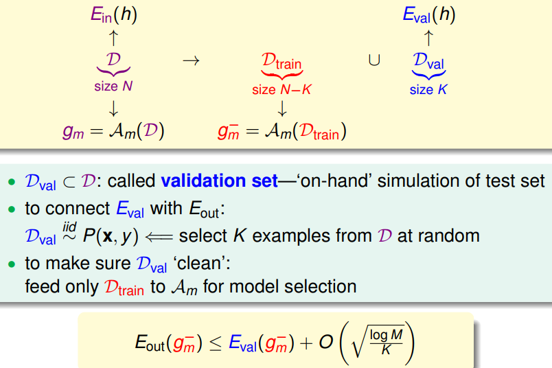
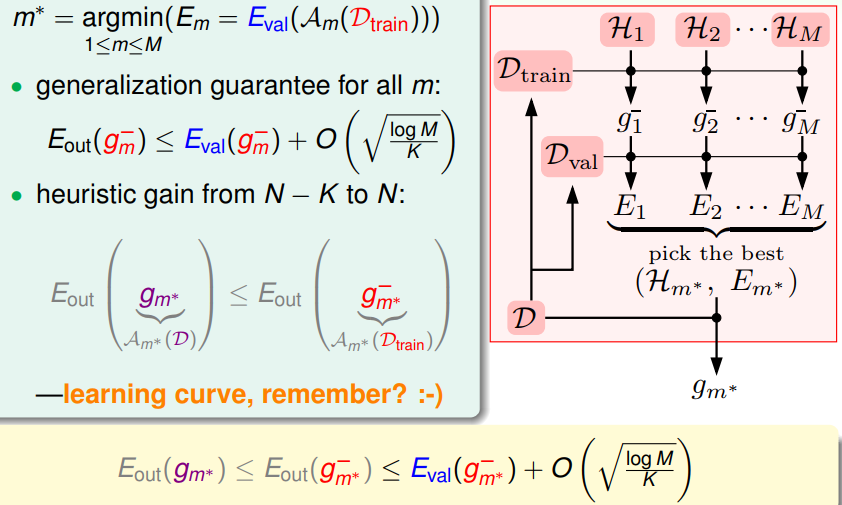
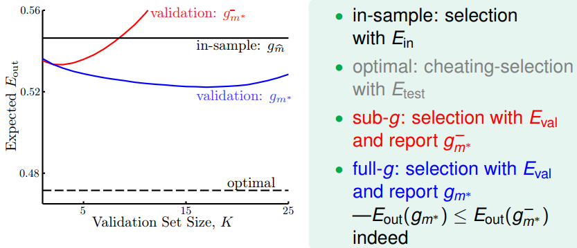
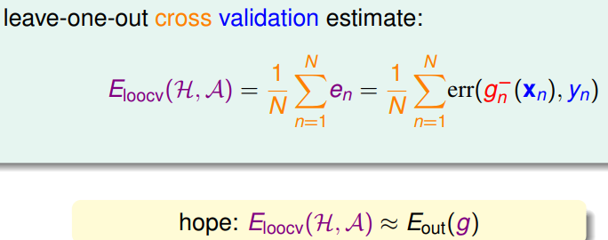
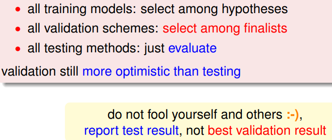

> [机器学习基石下](https://www.coursera.org/learn/ntumlone-algorithmicfoundations) (Machine Learning Foundations)---Mathematical Foundations
> [Hsuan-Tien Lin, 林轩田](https://www.coursera.org/instructor/htlin)，副教授 (Associate Professor)，资讯工程学系 (Computer Science and Information Engineering)

# Validation

## Model Selection Problem

## Validation

- Validation Set 

  

- Model Selection by Best $E_{val}$ 

  

- Validation in Practice

  

- practical rule of thumb: $K=\frac{N}{5}$ 

- [参考笔记链接](http://redstonewill.com/255/) 

## Leave-One-Out Cross Validation

$E_{loocv}$ much better than $E_{in}$ 

## V-Fold Cross Validation

- random-partition of D to V equal parts, take V − 1 for training and 1 for validation orderly

- practical rule of thumb: V = 10

- training\~初赛，validation\~复赛

- Nature of Validation

  

