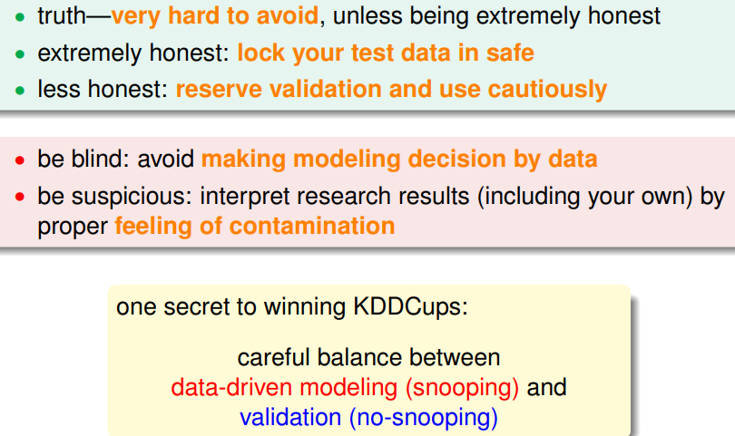

> [机器学习基石下](https://www.coursera.org/learn/ntumlone-algorithmicfoundations) (Machine Learning Foundations)---Mathematical Foundations
> [Hsuan-Tien Lin, 林轩田](https://www.coursera.org/instructor/htlin)，副教授 (Associate Professor)，资讯工程学系 (Computer Science and Information Engineering)

# Three Learning Principles

## Occam’s Razor

- entities must not be multiplied beyond necessity
- trim down unnecessary explanation
- simple: small hypothesis/model complexity
- direct action: linear first; always ask whether data over-modeled
- **simple is good** 

## Sampling Bias

- If the data is sampled in a biased way, learning will produce a similarly biased outcome.
- match test scenario as much as possible 测试的环境和训练的环境尽可能接近

## Data Snooping

- your brain’s 'model complexity'
- data snooping by shift-scale all values
- later author snooped data by reading earlier papers
- 

## Power of Three