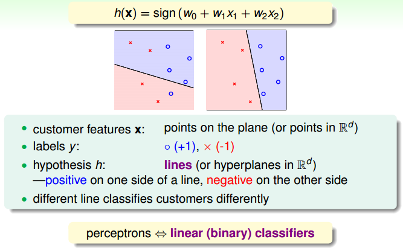
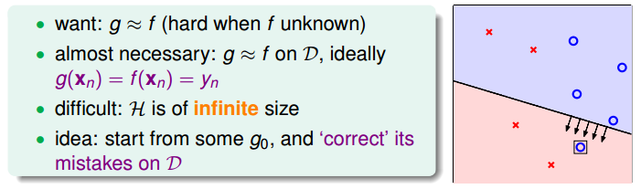
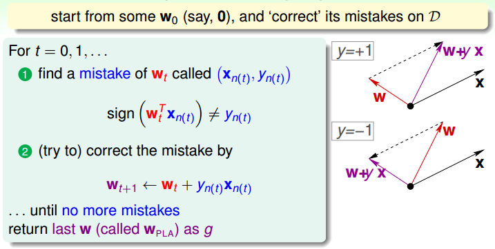
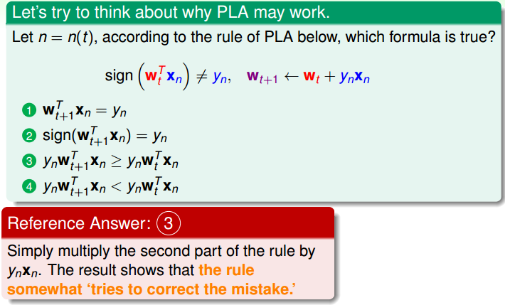
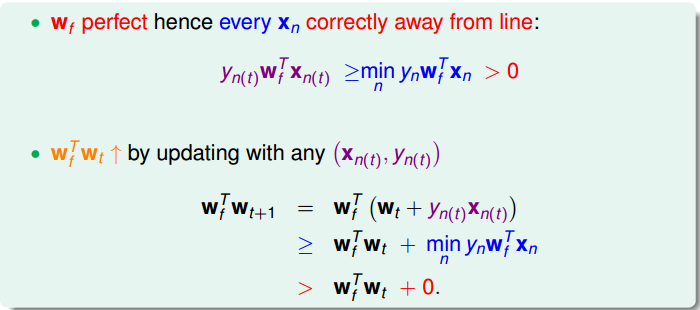
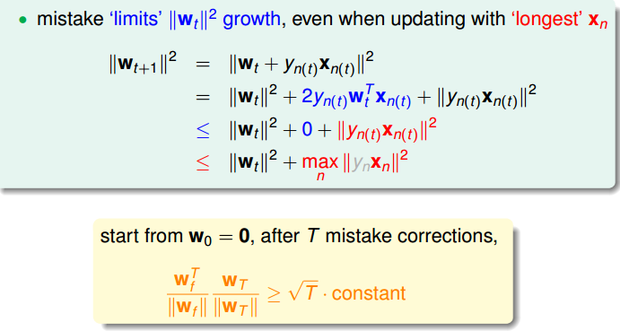
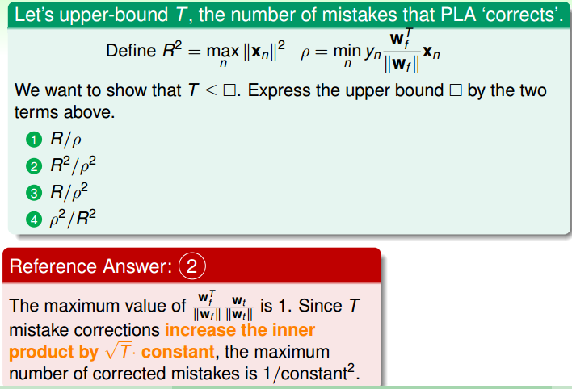
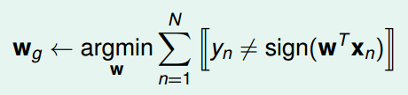
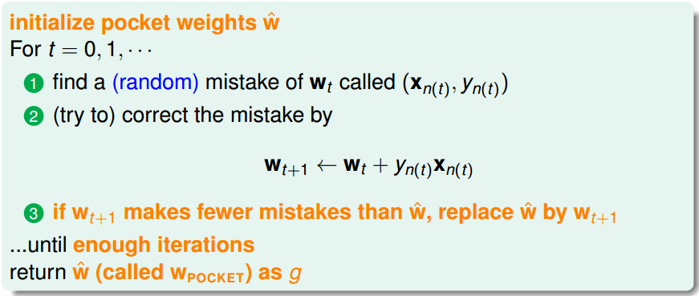
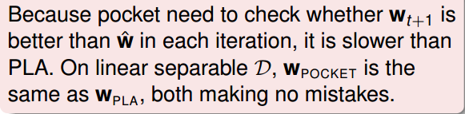

> [机器学习基石上](https://www.coursera.org/learn/ntumlone-mathematicalfoundations) (Machine Learning Foundations)---Mathematical Foundations
> [Hsuan-Tien Lin, 林轩田](https://www.coursera.org/instructor/htlin)，副教授 (Associate Professor)，资讯工程学系 (Computer Science and Information Engineering)

# Learning to Answer Yes/No

$\mathcal A$ takes $\mathcal D$ and $\mathcal H$ to get $g$ 

## Perceptron(感知器) Hypothesis Set

- 综合各个参数来得出一个分数
- $\textbf x=(x_1,x_2,\cdots ,x_d)$ —— features of customer
- 各个参数（维度）乘上相应的权重再相加
  - approve credit if $\sum_{i=1}^d w_ix_i>threshold$ 
  - deny credit if $\sum_{i=1}^d w_ix_i<threshold$ 
- $\mathcal Y:\{+1(good),-1(bad) \}$，(0 - ignored)
- linear formula $h\in \mathcal H$ is ${\color{red}{h}}(\mathbf x)=sign((\sum_{i=1}^d {\color{red}{w_i}}x_i)-{\color{red}{threshold}})$ 
  - 简化一些：令 $w_0 = -threshold,x_0=1$ 
  - $h(\mathbf x)=sign(\sum_{i=0}^d w_ix_i)=sign(\mathbf w^T\mathbf x)$ (向量内积)
  - each $\mathbf w$ represents a hypothesis $h$，不同的参数对应不同的函数
- Perceptron in $\mathbb R^2$ 
  - 二维感受器

    

  - 不同的分类（参数）有不同的效果

  - 令 $h=0$，得到的几何图形是一条线，线性分类器

## Perceptron Learning Algorithm (PLA)

- $\mathcal H$ includes all possible perceptrons (**infinite**), how to select $g$ ?

- want、necessary、difficult、idea

  

  - what we want: $g\approx f$ (hard when $f$ is unknown)
  - 可行的是在已知的数据里，理想情况下使得 $g(\mathbf x_n)=f(\mathbf x_n)=y_n$ 
  - 先有一条线 $g_0$，再慢慢改进修正参数 $\mathbf w_0$ 

- 步骤

  

  - 向量内积的正负可以通过夹角判断
  - 修正向量，改变夹角
  - A fault confessed is half redressed. (知错能改善莫大焉)

- Cyclic PLA

  - a full cycle of not encountering mistakes
  - ‘correct’ mistakes on $\mathcal D$ **until no mistakes**
  - find the next mistake: follow naive cycle or precomputed random cycle

- 存在的问题

  - 循环一定会中止吗
  - 得到的 $g$ 和所设想的 $f$ 究竟接近吗
  - 数据之外的表现如何

- 小测验 

  

  注意第二个选项

## Guarantee of PLA

- if PLA halts (no more mistakes)
  - (**necessary condition**) $\mathcal D$ allows some $\mathbf w$ to make no mistake
  - call such $\mathcal D$ linear separable (线性可分)

- linear separable $\mathcal D$ ⇔ exists perfect $\mathbf w_f$ such that $y_n = sign(\mathbf w^T_f \mathbf x_n)$ 
  - 初步证明

    

  - **向量内积的操作是通过矩阵乘法实现的**

  - $\mathbf w_t$ gets more aligned with $\mathbf w_f$ (因为内积变大)

- 已知式

  
  - 进一步证明

    

  - $\mathbf w_t$ does not grow too fast (长度增量有上界)

  - $\mathbf w_t$ 和 $\mathbf w_f$ 的夹角会越来越小，存在下界 0 度

  - $\mathbf w_T\geqslant T \cdot min(y_n \mathbf x_n)$ ，$constant = \frac{\mathbf w_f^T}{||\mathbf w_f^T||}\cdot \frac{min(y_n \mathbf x_n)}{max||\mathbf x_n||}$ 

- 思考题2

  

## Non-Separable Data

- **linear separable**: inner product of $\mathbf w_f$ and $\mathbf w_t$ grows fast (二者越来越接近)
- **correct by mistake**: length of $\mathbf w_t$ grows slowly (缓慢增长)
- PLA ‘lines’ are more and more aligned with $\mathbf w_f$ ⇒ halts
- Pros: simple to implement, fast, works in any dimension
- Cons
  - **‘assumes’** linear separable $\mathcal D$ to halt (只是假设线性可分)
  - not fully sure how long halting takes (何时停止不知道)

### Learning with Noisy Data

- 找一条犯错误最少的线 

  - 公式

    

  - 括号代表boolean运算

  - `argmin f(x)` 是指使得函数 f(x) 取得其最小值的所有自变量 x 的集合

  - **NP-hard to solve**

- Pocket Algorithm

  - modify PLA algorithm (black lines) by **keeping best weights in pocket** (总是取当前情况下最好的)

  - 具体算法

    

  - a simple modification of PLA to find(somewhat) ‘best’ weights

- 在线性可分的数据集上使用 Pocket 也能找到最优解，但会比 PLA 慢

  

