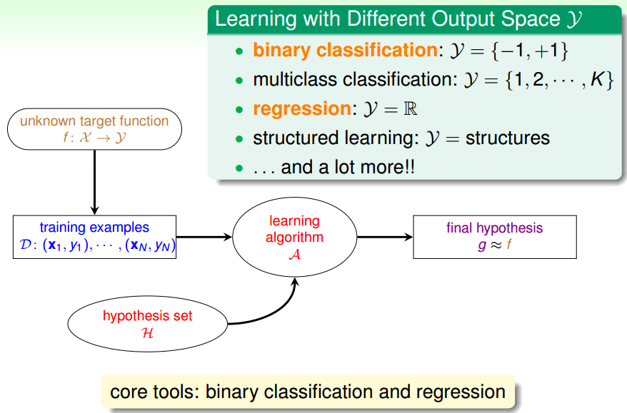
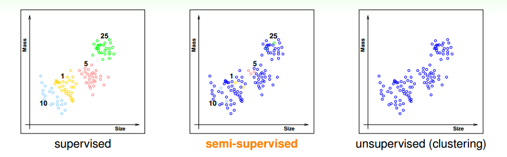
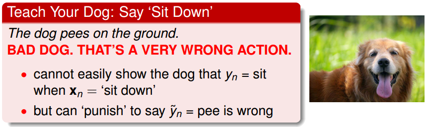
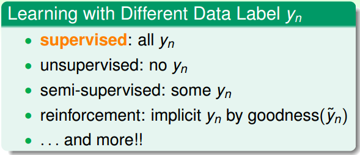
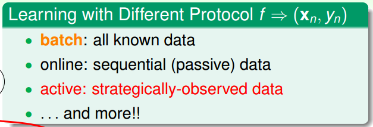

> [机器学习基石上](https://www.coursera.org/learn/ntumlone-mathematicalfoundations) (Machine Learning Foundations)---Mathematical Foundations
> [Hsuan-Tien Lin, 林轩田](https://www.coursera.org/instructor/htlin)，副教授 (Associate Professor)，资讯工程学系 (Computer Science and Information Engineering)

## Types of Learning

### Learning with Different Output Space

- **Binary Classification** (二元分类)
- Multiclass Classification 输出多个类别 （是非题变为选择题）
- **Regression** (回归分析): deeply studied in statistics
- Structured Learning 结构化学习 (huge multiclass classification problem)
- 

### Learning with Different Data Label $y_n$

#### 关于监督学习和非监督学习

- Multiclass Classification 下的几种情况
  

- Supervised Learning: every $\mathbf x_n$ comes with corresponding $y_n$ 
  每个输入都知道对应的正确输出

- Unsupervised: Learning without $y_n$ 
  - clustering (聚类)
  - density estimation (密度分析)
  - outlier detection (离群点分析)

- Semi-supervised: Learn with some $y_n$ 
  - leverage unlabeled data to avoid 'expensive' labeling
  - 标记的代价可能很大，只能做一部分

#### Reinforcement Learning (增强学习)

- a very different but natural way of learning
- 惩罚错误的行为，奖励正确的行为
- 例子
- learn with partial/implicit information (often sequentially) (一个一个的来学习)

### Learning with Different Protocol $f\Rightarrow (\mathbf x_n,y_n)$ 

和机器的沟通方式

- Batch Learning: 喂给机器一批一批的数据 (duck feeding)

  监督学习、非监督学习

- Online Learning: 一个一个的来 (sequentially)

  PLA、增强学习

- Active Learning: 主动的去学习 (ask questions)

  - query the $y_n$ of the chosen $\mathbf x_n$ 
  - improve hypothesis with fewer labels (hopefully) by asking questions **strategically**
  - 机器无法识别时，让机器自己来问，需要标记的可能就少一些

- 总结

  

### Learning with Different Input Space $\mathcal X$ 

#### Concrete Features

- each dimension of $\mathcal X \subseteq \mathbb R^d$ represents sophisticated physical meaning 
- 具体的东西，可以计算，预先有人类智慧的加工
- the easy ones for ML

#### Raw Features

- 更为抽象，包含很多细节 simple physical meaning
- like image pixels, speech signal, etc.
- often need human or machines to convert to concrete ones 
- feature engineer (特征工程) 提取出哪些特征给机器比较好

#### Abstract Features

- 需要机器自己去学到特征
- no physical meaning
- need feature conversion/extraction/construction
- 例如只有一些编号的对应关系

### 思考题

focus: **binary classification **or **regression **from a **batch **of **supervised **data with **concrete **features

