> [机器学习基石上](https://www.coursera.org/learn/ntumlone-mathematicalfoundations) (Machine Learning Foundations)---Mathematical Foundations
> [Hsuan-Tien Lin, 林轩田](https://www.coursera.org/instructor/htlin)，副教授 (Associate Professor)，资讯工程学系 (Computer Science and Information Engineering)

## Feasibility of Learning

### Learning is Impossible?

- Two Controversial Answers  多种合理的方式得到不同的答案
- no-free-lunch problems

### Probability to the Rescue

- Inferring Something Unknown → sample
- 样本(in-sample)的概率与整体(out-of-sample)的概率大概是接近的
- Hoeffding's Inequality 
  - 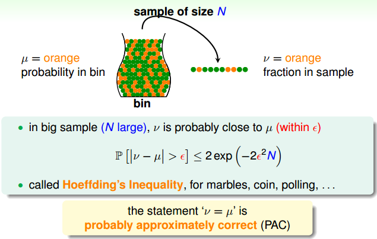
  - 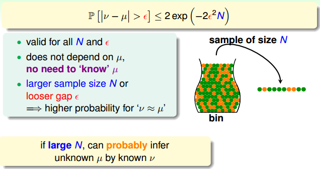

### Connection to Learning

- 抓弹珠类比学习

  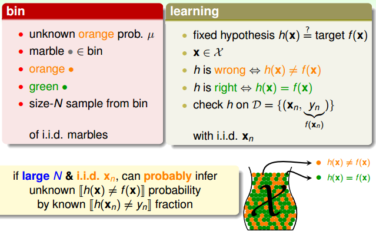

  - 抓的一把弹珠是已知数据
  - 橙色的代表错误
  - 抽样测试，测试集上的正确率

- 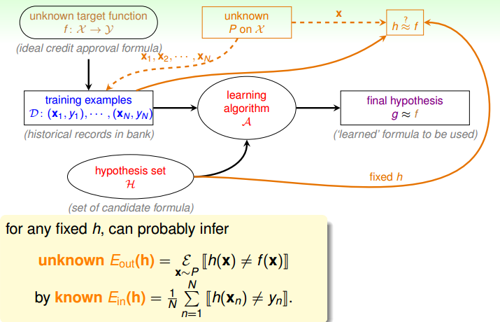

- 公式表述

  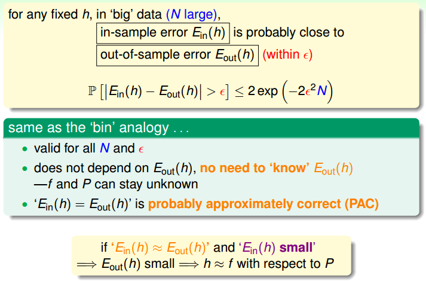

- Verification

  - Verification of One h 

    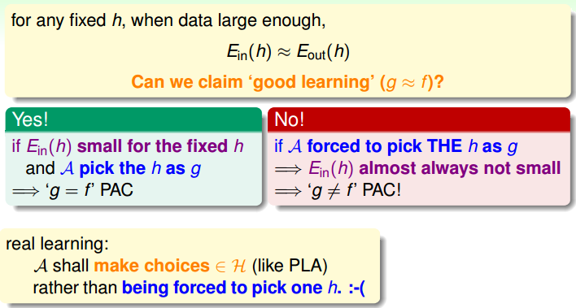

  - The Verification Flow 

    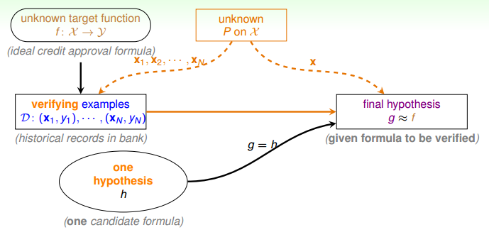

### Connection to Real Learning

- BAD sample: $E_{in}$ and $E_{out}$ far away (can get worse when involving choice)

- BAD Data for One h: $E_{in}(h)$ and $E_{out}(h)$ far away

  - 不好的几率很小
  - 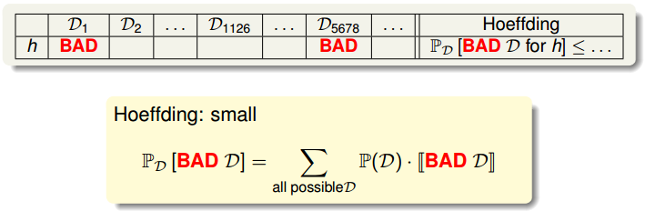

- BAD Data for Many h 

  - 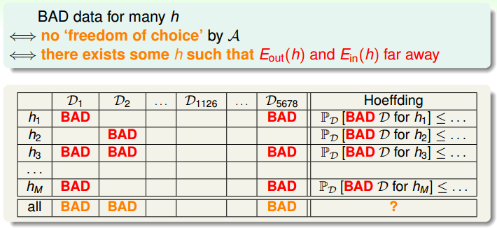

  - for $M$ hypotheses, bound of $\mathbb P_{\mathcal D}[{\color{orange}{BAD}} \;\mathcal D]$ 

    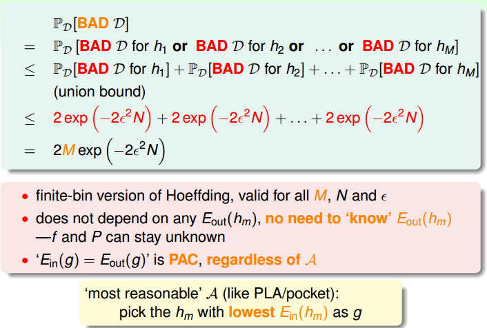

- The Statistical Learning Flow

  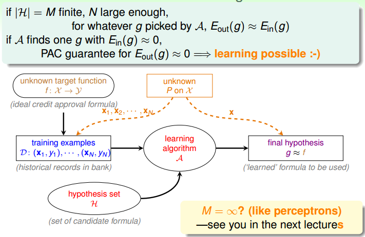

learning possible if $|\mathcal H|$ finite and $E_{in}(g)$ small

