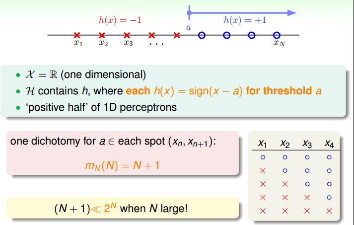

> [机器学习基石上](https://www.coursera.org/learn/ntumlone-mathematicalfoundations) (Machine Learning Foundations)---Mathematical Foundations
> [Hsuan-Tien Lin, 林轩田](https://www.coursera.org/instructor/htlin)，副教授 (Associate Professor)，资讯工程学系 (Computer Science and Information Engineering)

## Training versus Testing

### Recap and Preview

#### the Statistical Learning Flow

#### Two Central Questions

- 

- Tradeoff(权衡) on  $M\ (or\ |\mathcal H|)$ 

  

- $M$ can't be $\infty$ 

### Effective Number of Lines

- 假设条件会有重叠的情况，除去 overlap，剩下多少种？

  

- must $\leq 2^N$ 

- $a_n=2+n(n-1)$ 

  - 化为平面上任意三点不共线的$n$个点，用一条直线去划分，有多少种情况这个问题
  - 直线把点分成两份，$(0,n)\ (1,n-1)\ (2,n-2)\cdots $，分奇偶来证明
  - 有递推式 $a_n=a_{n-1}+(n-1)$，设想新加的点和原来的一个点是一体的，有了 $a_{n-1}$，再用新点构造其他类别

- finite grouping of infinitely-many lines $\in \mathcal H$ ($\mathcal H$ 中的线的种类是有限的)

### Effective Number of Hypotheses

- dichotomies(mini-hypothesis) implemented by $\mathcal H$ 

  

- dichotomy 数量的最大值 $m_{\mathcal H}(N)$ 来取代$M$，growth function

  

- Growth Function 不同类型

  - Positive Rays 

    

  - Positive Interval 

    

  - Convex Sets 

    

### Break Point

- polynomial(多项式的)，exponential(指数的)

- conjecture(猜想)

  

