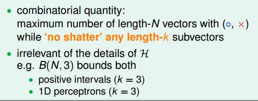
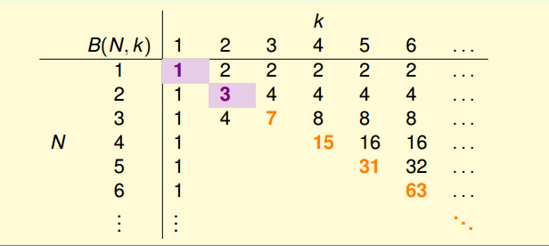
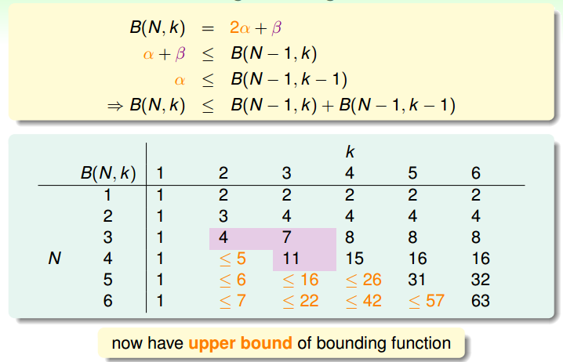
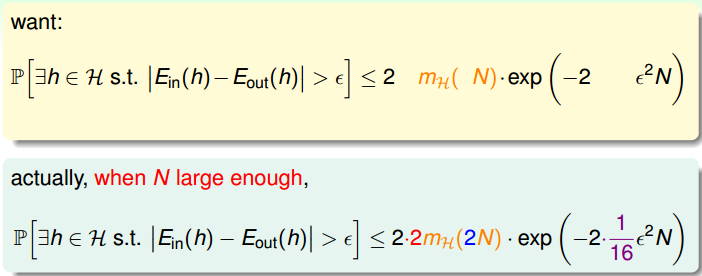
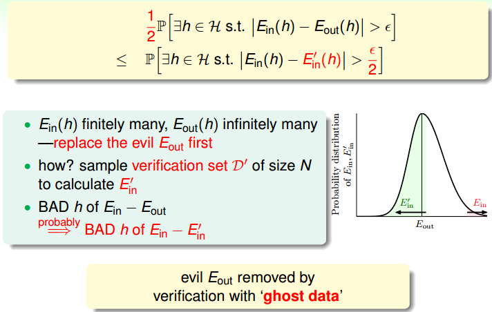
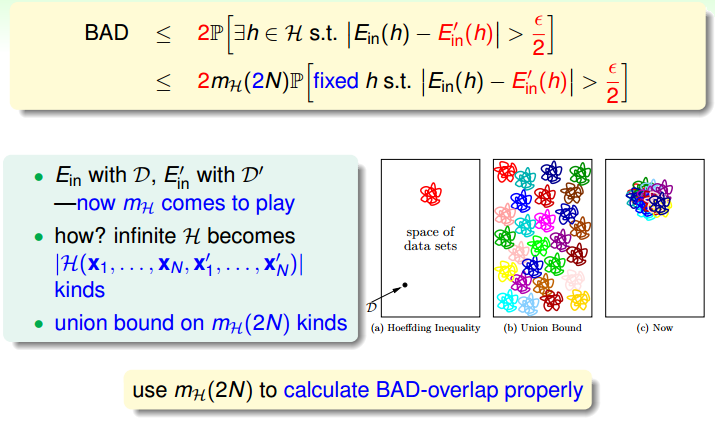
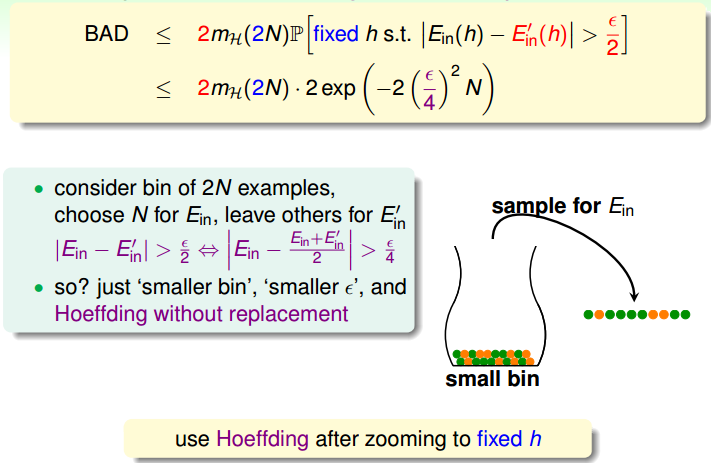
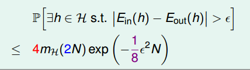

> [机器学习基石上](https://www.coursera.org/learn/ntumlone-mathematicalfoundations) (Machine Learning Foundations)---Mathematical Foundations
> [Hsuan-Tien Lin, 林轩田](https://www.coursera.org/instructor/htlin)，副教授 (Associate Professor)，资讯工程学系 (Computer Science and Information Engineering)

## Theory of Generalization

### Restriction of Break Points

- growth function $m_{\mathcal H}(N)$: max number of dichotomies
- 漏出一线曙光的点 break point
- break point $k$ restricts maximum possible $m_{\mathcal H}(N)$ a lot for $N>k$ 

### Bounding Function: Basic Cases

- $B(N,k)$: **maximum possible** $m_{\mathcal H}(N)$ when break point = k 

  

- 表格

  

### Bounding Function: Inductive Cases

- $B(4,3)$ 的估计

  - ![B(B(4,3)-1.png)
  - ![B(B(4,3)-2.png)

- Putting It All Together 

  

- $B(N,k)\leq \sum_{i=0}^{k-1}\left(\begin{array}{c} N \\ i \end{array}\right)$ 

  - 数学归纳法，$C_{N-1}^{\ i}+C_{N-1}^{\ i+1}=C_{N}^{\ i+1}$ 

  - 暴力降解，一步步拆解，直到已知的情形，系数为杨辉三角

  - actually $\leq$ can be $=$ 

  - $B(N,k)≥2B(N−1,k−1)+(B(N−1,k)−B(N−1,k−1))$

    在$B(N-1,k-1)$的基础上，加入另外一个点，正负正负，遍历所有，所以是2倍；$B(N-1,k)$的情形，加入另外一个点，只取正，再除去$B(N-1,k-1)$中的情形。

- can bound $m_{\mathcal H}(N)$ by only **one** break point

### A Pictorial Proof

- Step 1: Replace $E_{out}$ by $E_{in}^{\ '}$ 

  

- Step 2: Decompose $\mathcal H$ by Kind 

  

- Step 3: Use Hoeffding without Replacement 

  

- Vapnik-Chervonenkis (VC) bound 

  

