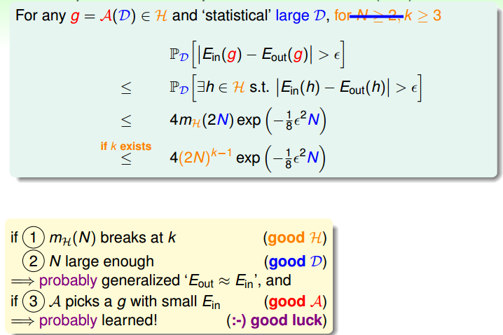
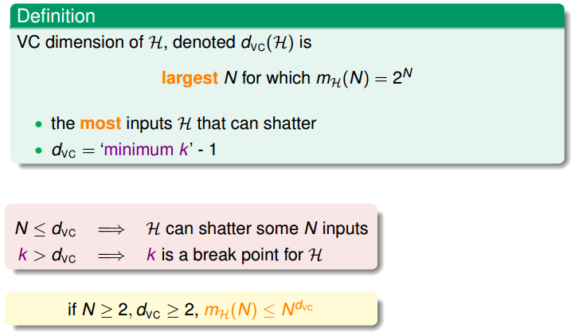
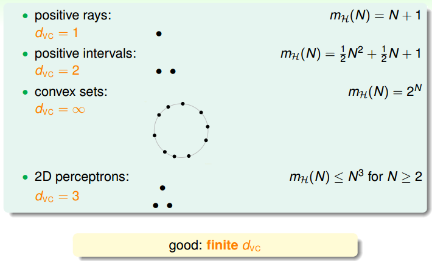
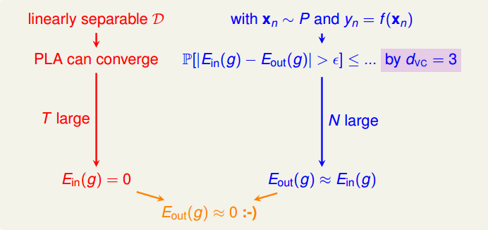
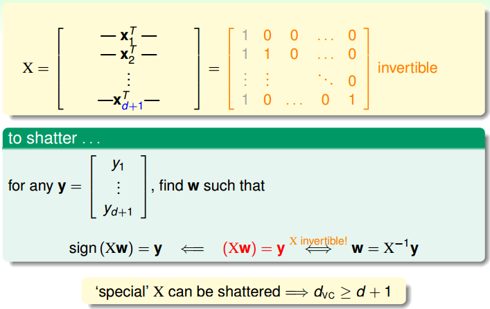
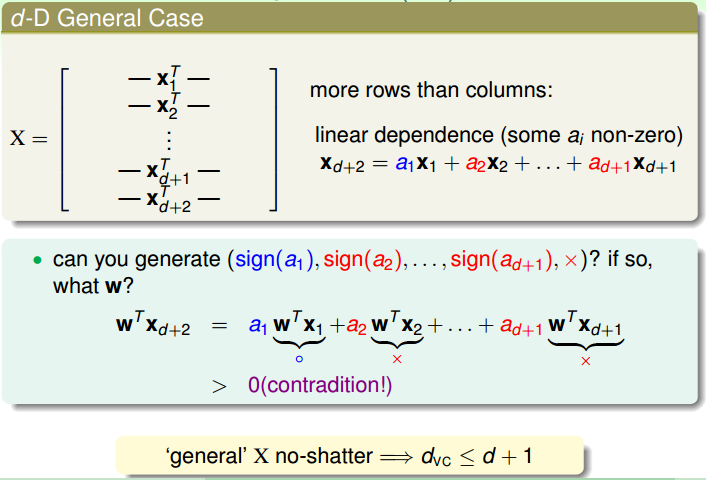
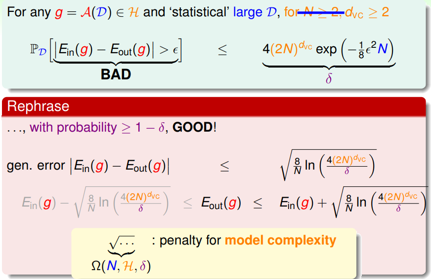
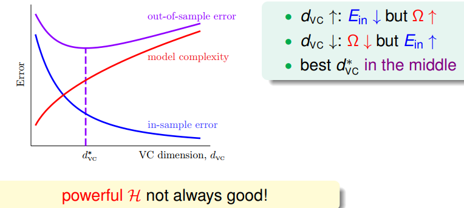
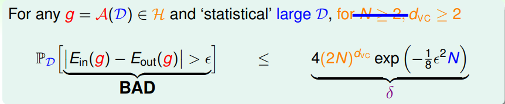
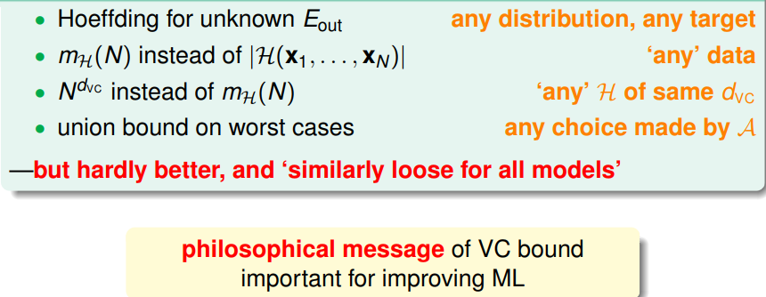

> [机器学习基石上](https://www.coursera.org/learn/ntumlone-mathematicalfoundations) (Machine Learning Foundations)---Mathematical Foundations
> [Hsuan-Tien Lin, 林轩田](https://www.coursera.org/instructor/htlin)，副教授 (Associate Professor)，资讯工程学系 (Computer Science and Information Engineering)

# The VC Dimension

## Recap

## Definition of VC Dimension

### VC Dimension

the formal name of **maximum non-break** point

### the Four VC Dimensions 

### VC Dimension and Learning

- finite $d_{VC}\Longrightarrow g$ can generalize $E_{out}(g)\approx E_{in}(g)$ 
- regardless of learning algorithm $\mathcal A$、input distribution $P$、target function $f$ 

## VC Dimension of Perceptrons

### 2D PLA Revisited

### d-D perceptrons: $d_{VC}=d+1\ ?$ 

#### $d_{VC}\geq d+1$ 

- There are some $d + 1$ inputs we can shatter.
- 每一行代表一个点
- 灰色部分（第一列）视作第 0 维，是常数，代表 threshhold
- $\mathbf X$ 可逆
- 任意的 $\mathbf Y$ 都可以表示出来

#### $d_{VC}\leq d+1$ 

- We cannot shatter **any** set of $d + 2$ inputs.
- linear dependence restricts dichotomy
- 任意一个可以 shatter 的 $d+1$ 向量组再加一维
- $\mathbf X_{d+2}$ 能被前 $d+1$ 个向量线性表出

## Physical Intuition of VC Dimension

### Degrees of Freedom 自由度

- $d_{VC} ≈ free\; parameters$ 

### Penalty for Model Complexity

- with a high probability, $E_{out}\le E_{in}+\Omega (N,\mathcal H,\delta)$ 

- The VC Message 

  

### Sample Complexity

- theory: $N ≈ 10000\ d_{VC}$

- practical: $N ≈ 10\ d_{VC}$ often enough!

- Looseness of VC Bound

  

