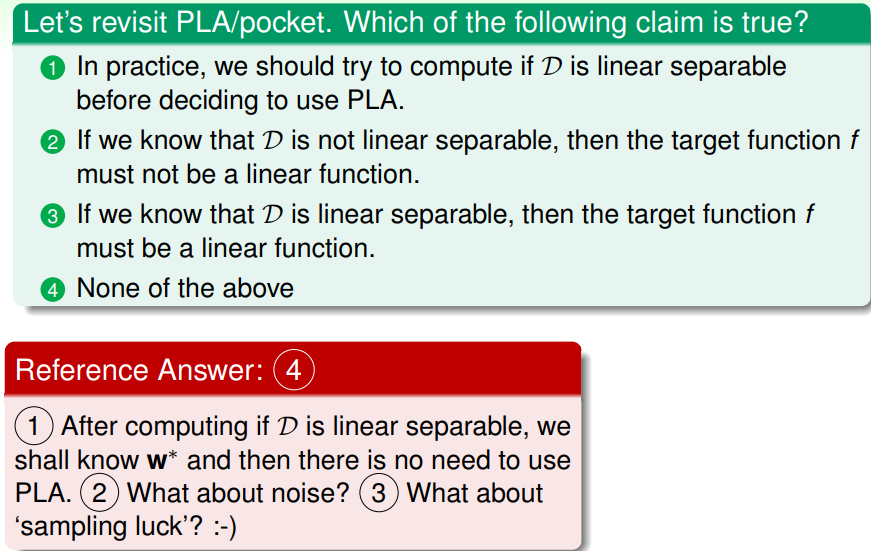
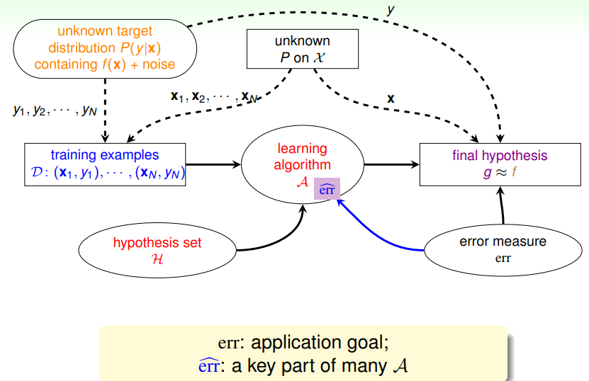

> [机器学习基石上](https://www.coursera.org/learn/ntumlone-mathematicalfoundations) (Machine Learning Foundations)---Mathematical Foundations
> [Hsuan-Tien Lin, 林轩田](https://www.coursera.org/instructor/htlin)，副教授 (Associate Professor)，资讯工程学系 (Computer Science and Information Engineering)

# Noise and Error

## Noise and Probabilistic Target

### The new learning flow

确定的改为概率，保证同一分布下

### 练习题

## Error Measure

- out of sample
- pointwise
- classification
- 0/1 error often for classification; squared error often for regression
- extended VC theory/philosophy works for most $\mathcal H$ and err

## Algorithmic Error Measure

- err is application/user-dependent

- 学习流程图

  

## Weighted Classification

- 不同的情形有不同的权重
- Weighted Pocket Algorithm