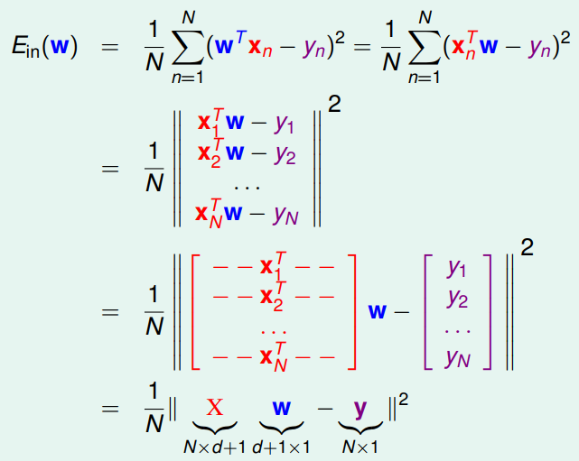
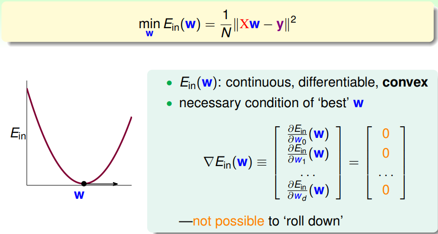
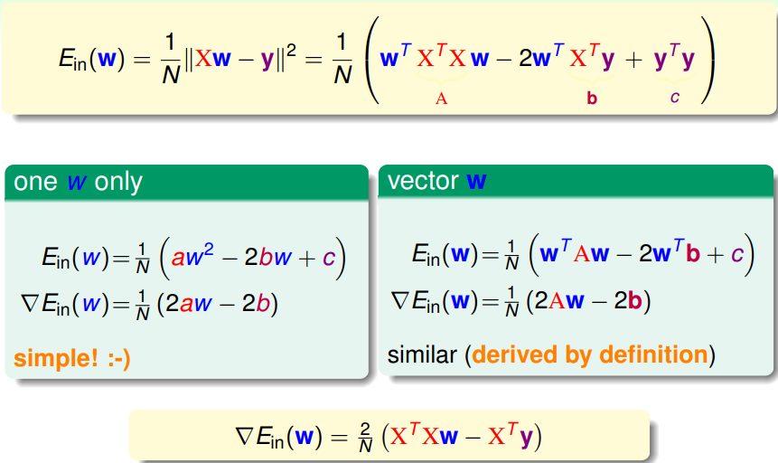
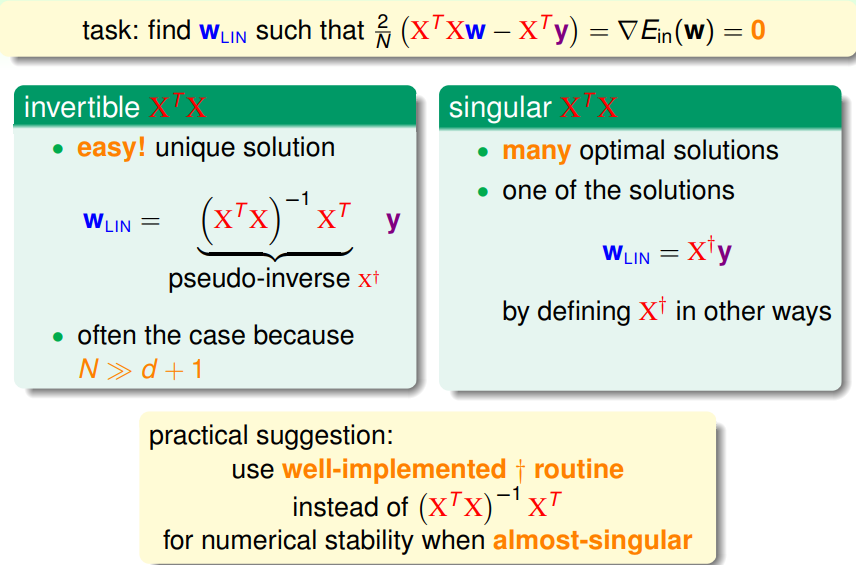
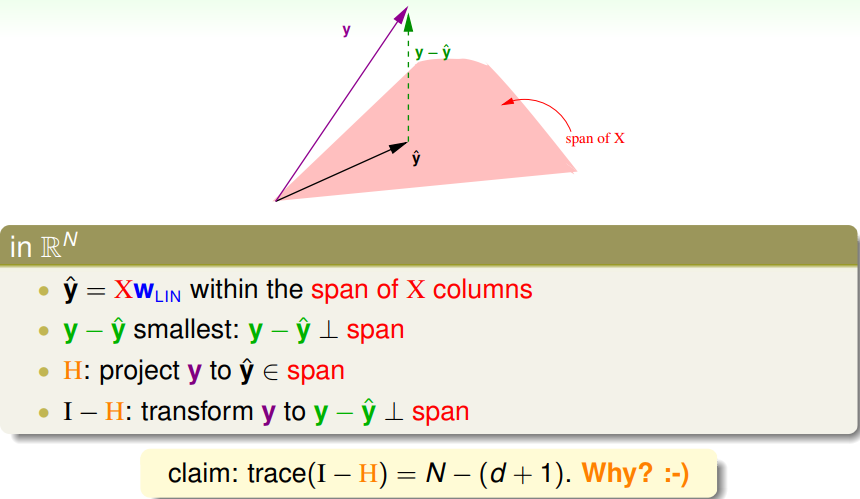
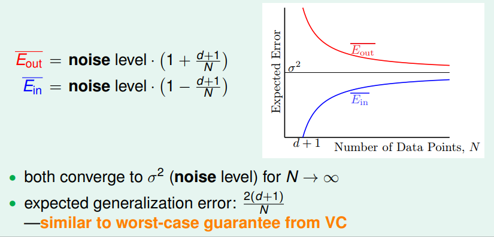
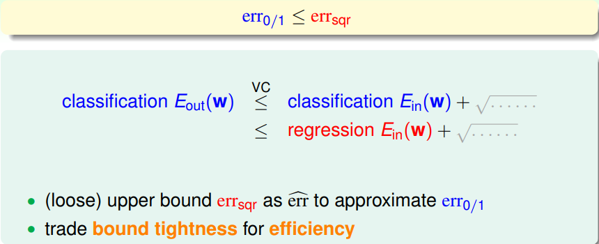

> [机器学习基石上](https://www.coursera.org/learn/ntumlone-mathematicalfoundations) (Machine Learning Foundations)---Mathematical Foundations
> [Hsuan-Tien Lin, 林轩田](https://www.coursera.org/instructor/htlin)，副教授 (Associate Professor)，资讯工程学系 (Computer Science and Information Engineering)

# Linear Regression

## Linear Regression Problem

- hypothesis: $h(\mathbf x) = \mathbf w^T \mathbf x$ 
- find lines/hyperplanes with small residuals

## Linear Regression Algorithm

- Matrix Form of $Ein(\mathbf w)$ 

  

- find $\mathbf w_{LIN}$ such that $\nabla E_{in}(\mathbf w_{LIN}) = 0$ 

  

  

- 伪逆矩阵 pseudo-inverse

  

  矩阵的平方展开、求导，抓住一个或一行的例子，纵观计算过程，推倒式子

## Generalization Issue

- hat matrix $H=XX^{\dagger}$ , $\hat y = Hy$ 

- Geometric View of Hat Matrix

  

  $H$将$y$投影到$\hat y$ 

- The Learning Curve

  

  （平均情况）

## Linear Regression for Binary Classification

- 可以用回归的方法解决分类的问题
- 